----------------

## 제 3절. R을 이용한 그래프 작성과 경제분석

#### 1. 그래프 샘플 보기


```r
example(barplot) #Bar Plot
```

```
## 
## barplt> require(grDevices) # for colours
## 
## barplt> tN <- table(Ni <- stats::rpois(100, lambda = 5))
## 
## barplt> r <- barplot(tN, col = rainbow(20))
```

 

```
## 
## barplt> #- type = "h" plotting *is* 'bar'plot
## barplt> lines(r, tN, type = "h", col = "red", lwd = 2)
## 
## barplt> barplot(tN, space = 1.5, axisnames = FALSE,
## barplt+         sub = "barplot(..., space= 1.5, axisnames = FALSE)")
```

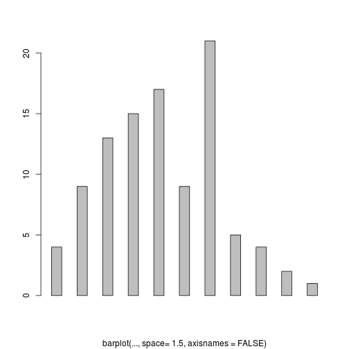 

```
## 
## barplt> barplot(VADeaths, plot = FALSE)
## [1] 0.7 1.9 3.1 4.3
## 
## barplt> barplot(VADeaths, plot = FALSE, beside = TRUE)
##      [,1] [,2] [,3] [,4]
## [1,]  1.5  7.5 13.5 19.5
## [2,]  2.5  8.5 14.5 20.5
## [3,]  3.5  9.5 15.5 21.5
## [4,]  4.5 10.5 16.5 22.5
## [5,]  5.5 11.5 17.5 23.5
## 
## barplt> mp <- barplot(VADeaths) # default
```

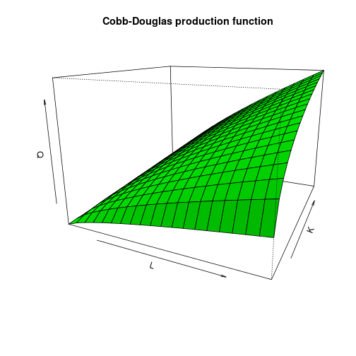 

```
## 
## barplt> tot <- colMeans(VADeaths)
## 
## barplt> text(mp, tot + 3, format(tot), xpd = TRUE, col = "blue")
## 
## barplt> barplot(VADeaths, beside = TRUE,
## barplt+         col = c("lightblue", "mistyrose", "lightcyan",
## barplt+                 "lavender", "cornsilk"),
## barplt+         legend = rownames(VADeaths), ylim = c(0, 100))
```

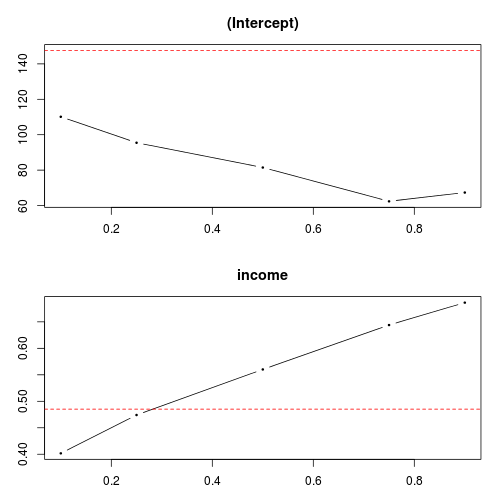 

```
## 
## barplt> title(main = "Death Rates in Virginia", font.main = 4)
## 
## barplt> hh <- t(VADeaths)[, 5:1]
## 
## barplt> mybarcol <- "gray20"
## 
## barplt> mp <- barplot(hh, beside = TRUE,
## barplt+         col = c("lightblue", "mistyrose",
## barplt+                 "lightcyan", "lavender"),
## barplt+         legend = colnames(VADeaths), ylim = c(0,100),
## barplt+         main = "Death Rates in Virginia", font.main = 4,
## barplt+         sub = "Faked upper 2*sigma error bars", col.sub = mybarcol,
## barplt+         cex.names = 1.5)
```

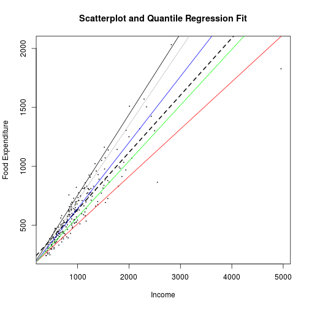 

```
## 
## barplt> segments(mp, hh, mp, hh + 2*sqrt(1000*hh/100), col = mybarcol, lwd = 1.5)
## 
## barplt> stopifnot(dim(mp) == dim(hh))  # corresponding matrices
## 
## barplt> mtext(side = 1, at = colMeans(mp), line = -2,
## barplt+       text = paste("Mean", formatC(colMeans(hh))), col = "red")
## 
## barplt> # Bar shading example
## barplt> barplot(VADeaths, angle = 15+10*1:5, density = 20, col = "black",
## barplt+         legend = rownames(VADeaths))
```

 

```
## 
## barplt> title(main = list("Death Rates in Virginia", font = 4))
## 
## barplt> # border :
## barplt> barplot(VADeaths, border = "dark blue")
```

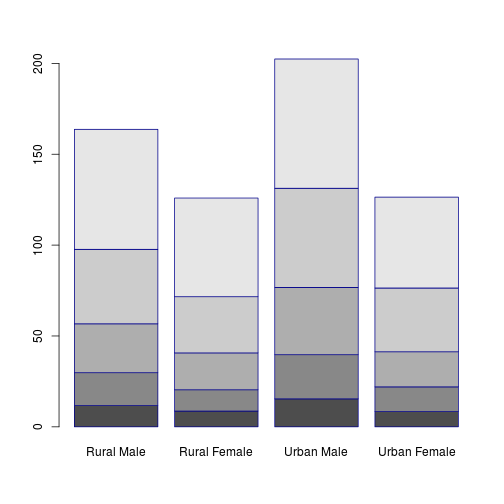 

```
## 
## barplt> # log scales (not much sense here):
## barplt> barplot(tN, col = heat.colors(12), log = "y")
```

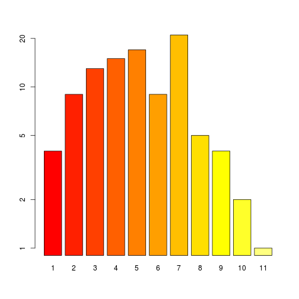 

```
## 
## barplt> barplot(tN, col = gray.colors(20), log = "xy")
```

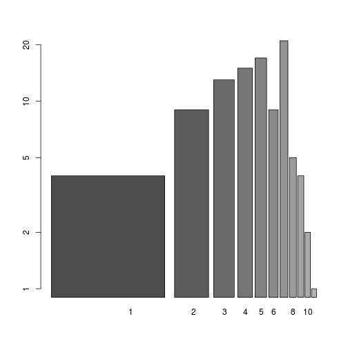 

```
## 
## barplt> # args.legend
## barplt> barplot(height = cbind(x = c(465, 91) / 465 * 100,
## barplt+                        y = c(840, 200) / 840 * 100,
## barplt+                        z = c(37, 17) / 37 * 100),
## barplt+         beside = FALSE,
## barplt+         width = c(465, 840, 37),
## barplt+         col = c(1, 2),
## barplt+         legend.text = c("A", "B"),
## barplt+         args.legend = list(x = "topleft"))
```

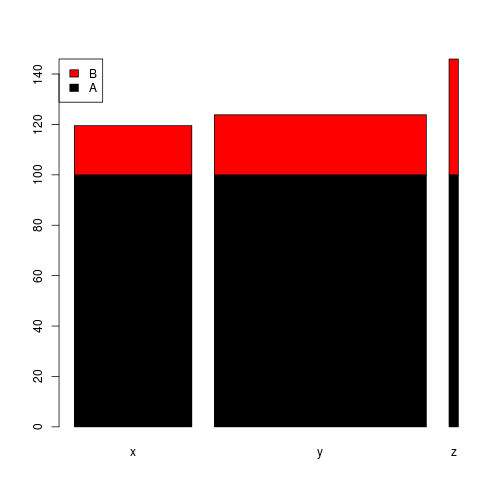 

```r
example(boxplot) #Box Plot
```

```
## 
## boxplt> ## boxplot on a formula:
## boxplt> boxplot(count ~ spray, data = InsectSprays, col = "lightgray")
```

```
## 
## boxplt> # *add* notches (somewhat funny here):
## boxplt> boxplot(count ~ spray, data = InsectSprays,
## boxplt+         notch = TRUE, add = TRUE, col = "blue")
```

```
## Warning: some notches went outside hinges ('box'): maybe set notch=FALSE
```

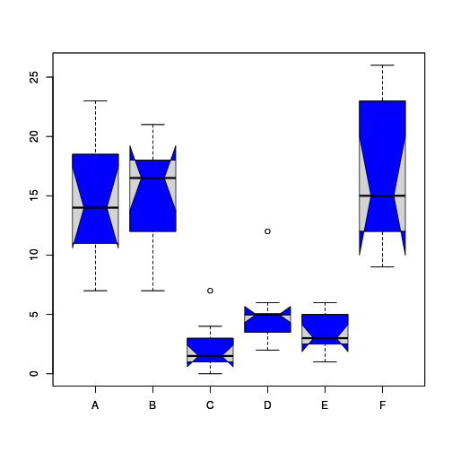 

```
## 
## boxplt> boxplot(decrease ~ treatment, data = OrchardSprays,
## boxplt+         log = "y", col = "bisque")
```

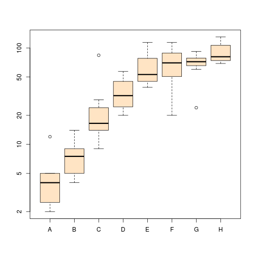 

```
## 
## boxplt> rb <- boxplot(decrease ~ treatment, data = OrchardSprays, col = "bisque")
```

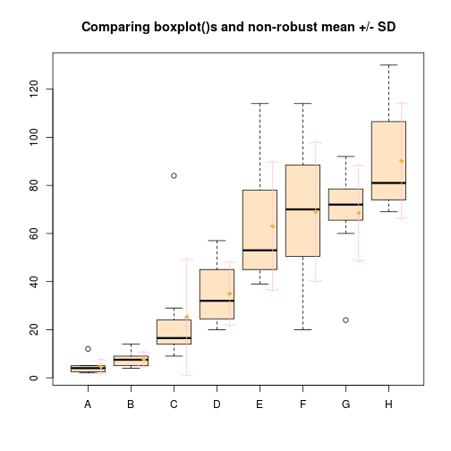 

```
## 
## boxplt> title("Comparing boxplot()s and non-robust mean +/- SD")
## 
## boxplt> mn.t <- tapply(OrchardSprays$decrease, OrchardSprays$treatment, mean)
## 
## boxplt> sd.t <- tapply(OrchardSprays$decrease, OrchardSprays$treatment, sd)
## 
## boxplt> xi <- 0.3 + seq(rb$n)
## 
## boxplt> points(xi, mn.t, col = "orange", pch = 18)
## 
## boxplt> arrows(xi, mn.t - sd.t, xi, mn.t + sd.t,
## boxplt+        code = 3, col = "pink", angle = 75, length = .1)
## 
## boxplt> ## boxplot on a matrix:
## boxplt> mat <- cbind(Uni05 = (1:100)/21, Norm = rnorm(100),
## boxplt+              `5T` = rt(100, df = 5), Gam2 = rgamma(100, shape = 2))
## 
## boxplt> boxplot(as.data.frame(mat),
## boxplt+         main = "boxplot(as.data.frame(mat), main = ...)")
```

 

```
## 
## boxplt> par(las = 1) # all axis labels horizontal
## 
## boxplt> boxplot(as.data.frame(mat), main = "boxplot(*, horizontal = TRUE)",
## boxplt+         horizontal = TRUE)
```

 

```
## 
## boxplt> ## Using 'at = ' and adding boxplots -- example idea by Roger Bivand :
## boxplt> 
## boxplt> boxplot(len ~ dose, data = ToothGrowth,
## boxplt+         boxwex = 0.25, at = 1:3 - 0.2,
## boxplt+         subset = supp == "VC", col = "yellow",
## boxplt+         main = "Guinea Pigs' Tooth Growth",
## boxplt+         xlab = "Vitamin C dose mg",
## boxplt+         ylab = "tooth length",
## boxplt+         xlim = c(0.5, 3.5), ylim = c(0, 35), yaxs = "i")
```

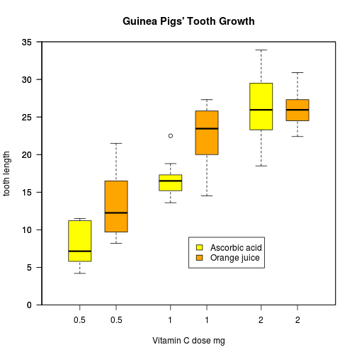 

```
## 
## boxplt> boxplot(len ~ dose, data = ToothGrowth, add = TRUE,
## boxplt+         boxwex = 0.25, at = 1:3 + 0.2,
## boxplt+         subset = supp == "OJ", col = "orange")
## 
## boxplt> legend(2, 9, c("Ascorbic acid", "Orange juice"),
## boxplt+        fill = c("yellow", "orange"))
## 
## boxplt> ## more examples in  help(bxp)
## boxplt> 
## boxplt> 
## boxplt>
```

```r
example(curve)   #Function Plot
```

```
## 
## curve> plot(qnorm) # default range c(0, 1) is appropriate here,
```

 

```
## 
## curve>             # but end values are -/+Inf and so are omitted.
## curve> plot(qlogis, main = "The Inverse Logit : qlogis()")
```

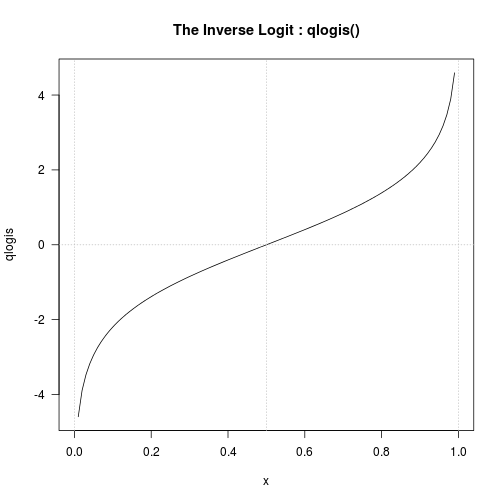 

```
## 
## curve> abline(h = 0, v = 0:2/2, lty = 3, col = "gray")
## 
## curve> curve(sin, -2*pi, 2*pi, xname = "t")
```

 

```
## 
## curve> curve(tan, xname = "t", add = NA,
## curve+       main = "curve(tan)  --> same x-scale as previous plot")
```

 

```
## 
## curve> op <- par(mfrow = c(2, 2))
## 
## curve> curve(x^3 - 3*x, -2, 2)
```

```
## 
## curve> curve(x^2 - 2, add = TRUE, col = "violet")
## 
## curve> ## simple and advanced versions, quite similar:
## curve> plot(cos, -pi,  3*pi)
```

```
## 
## curve> curve(cos, xlim = c(-pi, 3*pi), n = 1001, col = "blue", add = TRUE)
## 
## curve> chippy <- function(x) sin(cos(x)*exp(-x/2))
## 
## curve> curve(chippy, -8, 7, n = 2001)
```

```
## 
## curve> plot (chippy, -8, -5)
```

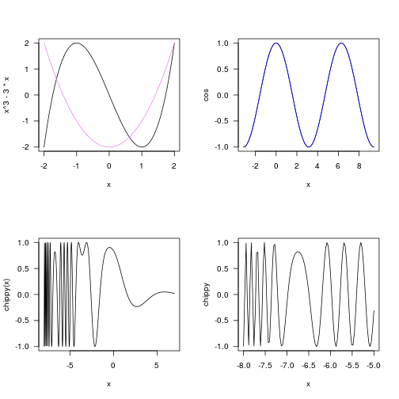 

```
## 
## curve> for(ll in c("", "x", "y", "xy"))
## curve+    curve(log(1+x), 1, 100, log = ll, sub = paste0("log = '", ll, "'"))
```

 

```
## 
## curve> par(op)
```

```r
example(hist)    #Histogram
```

```
## 
## hist> op <- par(mfrow = c(2, 2))
## 
## hist> hist(islands)
```

```
## 
## hist> utils::str(hist(islands, col = "gray", labels = TRUE))
```

```
## List of 6
##  $ breaks  : num [1:10] 0 2000 4000 6000 8000 10000 12000 14000 16000 18000
##  $ counts  : int [1:9] 41 2 1 1 1 1 0 0 1
##  $ density : num [1:9] 4.27e-04 2.08e-05 1.04e-05 1.04e-05 1.04e-05 ...
##  $ mids    : num [1:9] 1000 3000 5000 7000 9000 11000 13000 15000 17000
##  $ xname   : chr "islands"
##  $ equidist: logi TRUE
##  - attr(*, "class")= chr "histogram"
## 
## hist> hist(sqrt(islands), breaks = 12, col = "lightblue", border = "pink")
```

```
## 
## hist> ##-- For non-equidistant breaks, counts should NOT be graphed unscaled:
## hist> r <- hist(sqrt(islands), breaks = c(4*0:5, 10*3:5, 70, 100, 140),
## hist+           col = "blue1")
```

```
## 
## hist> text(r$mids, r$density, r$counts, adj = c(.5, -.5), col = "blue3")
## 
## hist> sapply(r[2:3], sum)
##  counts density 
## 48.0000  0.2156 
## 
## hist> sum(r$density * diff(r$breaks)) # == 1
## [1] 1
## 
## hist> lines(r, lty = 3, border = "purple") # -> lines.histogram(*)
## 
## hist> par(op)
## 
## hist> require(utils) # for str
## 
## hist> str(hist(islands, breaks = 12, plot =  FALSE)) #-> 10 (~= 12) breaks
## List of 6
##  $ breaks  : num [1:10] 0 2000 4000 6000 8000 10000 12000 14000 16000 18000
##  $ counts  : int [1:9] 41 2 1 1 1 1 0 0 1
##  $ density : num [1:9] 4.27e-04 2.08e-05 1.04e-05 1.04e-05 1.04e-05 ...
##  $ mids    : num [1:9] 1000 3000 5000 7000 9000 11000 13000 15000 17000
##  $ xname   : chr "islands"
##  $ equidist: logi TRUE
##  - attr(*, "class")= chr "histogram"
## 
## hist> str(hist(islands, breaks = c(12,20,36,80,200,1000,17000), plot = FALSE))
## List of 6
##  $ breaks  : num [1:7] 12 20 36 80 200 1000 17000
##  $ counts  : int [1:6] 12 11 8 6 4 7
##  $ density : num [1:6] 0.03125 0.014323 0.003788 0.001042 0.000104 ...
##  $ mids    : num [1:6] 16 28 58 140 600 9000
##  $ xname   : chr "islands"
##  $ equidist: logi FALSE
##  - attr(*, "class")= chr "histogram"
## 
## hist> hist(islands, breaks = c(12,20,36,80,200,1000,17000), freq = TRUE,
## hist+      main = "WRONG histogram") # and warning
```

```
## Warning: the AREAS in the plot are wrong -- rather use 'freq = FALSE'
```

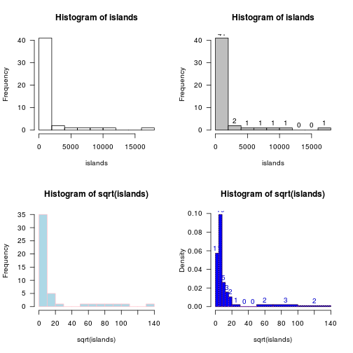  

```
## 
## hist> require(stats)
## 
## hist> set.seed(14)
## 
## hist> x <- rchisq(100, df = 4)
## 
## hist> ## Don't show: 
## hist> op <- par(mfrow = 2:1, mgp = c(1.5, 0.6, 0), mar = .1 + c(3,3:1))
## 
## hist> ## End Don't show
## hist> ## Comparing data with a model distribution should be done with qqplot()!
## hist> qqplot(x, qchisq(ppoints(x), df = 4)); abline(0, 1, col = 2, lty = 2)
```

```
## 
## hist> ## if you really insist on using hist() ... :
## hist> hist(x, freq = FALSE, ylim = c(0, 0.2))
```

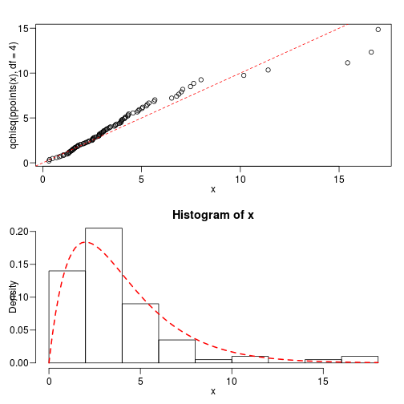 

```
## 
## hist> curve(dchisq(x, df = 4), col = 2, lty = 2, lwd = 2, add = TRUE)
## 
## hist> ## Don't show: 
## hist> par(op)
## 
## hist> ## End Don't show
## hist> 
## hist> 
## hist>
```

```r
example(pairs)   #Scatterplot Matrix
```

```
## 
## pairs> pairs(iris[1:4], main = "Anderson's Iris Data -- 3 species",
## pairs+       pch = 21, bg = c("red", "green3", "blue")[unclass(iris$Species)])
```

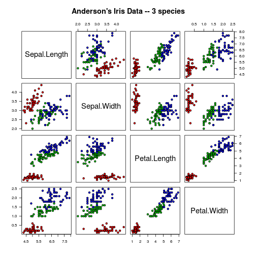 

```
## 
## pairs> ## formula method
## pairs> pairs(~ Fertility + Education + Catholic, data = swiss,
## pairs+       subset = Education < 20, main = "Swiss data, Education < 20")
```

 

```
## 
## pairs> pairs(USJudgeRatings)
```

 

```
## 
## pairs> ## show only lower triangle (and suppress labeling for whatever reason):
## pairs> pairs(USJudgeRatings, text.panel = NULL, upper.panel = NULL)
```

 

```
## 
## pairs> ## put histograms on the diagonal
## pairs> panel.hist <- function(x, ...)
## pairs+ {
## pairs+     usr <- par("usr"); on.exit(par(usr))
## pairs+     par(usr = c(usr[1:2], 0, 1.5) )
## pairs+     h <- hist(x, plot = FALSE)
## pairs+     breaks <- h$breaks; nB <- length(breaks)
## pairs+     y <- h$counts; y <- y/max(y)
## pairs+     rect(breaks[-nB], 0, breaks[-1], y, col = "cyan", ...)
## pairs+ }
## 
## pairs> pairs(USJudgeRatings[1:5], panel = panel.smooth,
## pairs+       cex = 1.5, pch = 24, bg = "light blue",
## pairs+       diag.panel = panel.hist, cex.labels = 2, font.labels = 2)
```

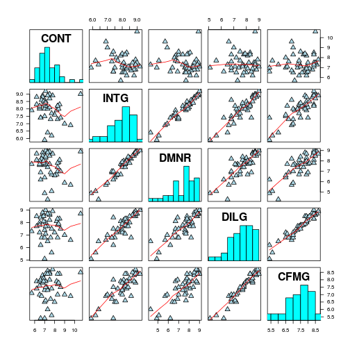 

```
## 
## pairs> ## put (absolute) correlations on the upper panels,
## pairs> ## with size proportional to the correlations.
## pairs> panel.cor <- function(x, y, digits = 2, prefix = "", cex.cor, ...)
## pairs+ {
## pairs+     usr <- par("usr"); on.exit(par(usr))
## pairs+     par(usr = c(0, 1, 0, 1))
## pairs+     r <- abs(cor(x, y))
## pairs+     txt <- format(c(r, 0.123456789), digits = digits)[1]
## pairs+     txt <- paste0(prefix, txt)
## pairs+     if(missing(cex.cor)) cex.cor <- 0.8/strwidth(txt)
## pairs+     text(0.5, 0.5, txt, cex = cex.cor * r)
## pairs+ }
## 
## pairs> pairs(USJudgeRatings, lower.panel = panel.smooth, upper.panel = panel.cor)
```

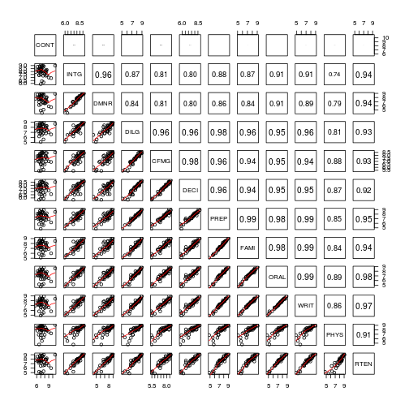 

```
## 
## pairs> pairs(iris[-5], log = "xy") # plot all variables on log scale
```

 

```
## 
## pairs> pairs(iris, log = 1:4, # log the first four
## pairs+       main = "Lengths and Widths in [log]", line.main=1.5, oma=c(2,2,3,2))
```

 

```r
example(persp)   #Perspective Plot   
```

```
## 
## persp> require(grDevices) # for trans3d
## 
## persp> ## More examples in  demo(persp) !!
## persp> ##                   -----------
## persp> 
## persp> # (1) The Obligatory Mathematical surface.
## persp> #     Rotated sinc function.
## persp> 
## persp> x <- seq(-10, 10, length= 30)
## 
## persp> y <- x
## 
## persp> f <- function(x, y) { r <- sqrt(x^2+y^2); 10 * sin(r)/r }
## 
## persp> z <- outer(x, y, f)
## 
## persp> z[is.na(z)] <- 1
## 
## persp> op <- par(bg = "white")
## 
## persp> persp(x, y, z, theta = 30, phi = 30, expand = 0.5, col = "lightblue")
```

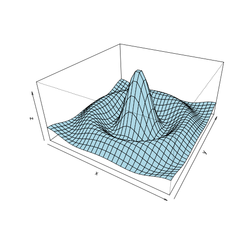 

```
## 
## persp> persp(x, y, z, theta = 30, phi = 30, expand = 0.5, col = "lightblue",
## persp+       ltheta = 120, shade = 0.75, ticktype = "detailed",
## persp+       xlab = "X", ylab = "Y", zlab = "Sinc( r )"
## persp+ ) -> res
```

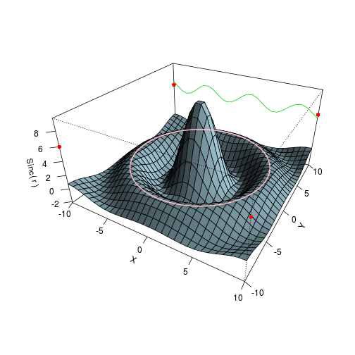 

```
## 
## persp> round(res, 3)
##       [,1]   [,2]   [,3]   [,4]
## [1,] 0.087 -0.025  0.043 -0.043
## [2,] 0.050  0.043 -0.075  0.075
## [3,] 0.000  0.074  0.042 -0.042
## [4,] 0.000 -0.273 -2.890  3.890
## 
## persp> # (2) Add to existing persp plot - using trans3d() :
## persp> 
## persp> xE <- c(-10,10); xy <- expand.grid(xE, xE)
## 
## persp> points(trans3d(xy[,1], xy[,2], 6, pmat = res), col = 2, pch = 16)
## 
## persp> lines (trans3d(x, y = 10, z = 6 + sin(x), pmat = res), col = 3)
## 
## persp> phi <- seq(0, 2*pi, len = 201)
## 
## persp> r1 <- 7.725 # radius of 2nd maximum
## 
## persp> xr <- r1 * cos(phi)
## 
## persp> yr <- r1 * sin(phi)
## 
## persp> lines(trans3d(xr,yr, f(xr,yr), res), col = "pink", lwd = 2)
## 
## persp> ## (no hidden lines)
## persp> 
## persp> # (3) Visualizing a simple DEM model
## persp> 
## persp> z <- 2 * volcano        # Exaggerate the relief
## 
## persp> x <- 10 * (1:nrow(z))   # 10 meter spacing (S to N)
## 
## persp> y <- 10 * (1:ncol(z))   # 10 meter spacing (E to W)
## 
## persp> ## Don't draw the grid lines :  border = NA
## persp> par(bg = "slategray")
## 
## persp> persp(x, y, z, theta = 135, phi = 30, col = "green3", scale = FALSE,
## persp+       ltheta = -120, shade = 0.75, border = NA, box = FALSE)
```

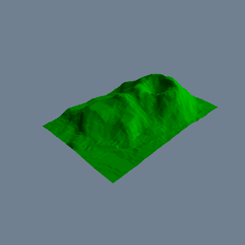 

```
## 
## persp> # (4) Surface colours corresponding to z-values
## persp> 
## persp> par(bg = "white")
## 
## persp> x <- seq(-1.95, 1.95, length = 30)
## 
## persp> y <- seq(-1.95, 1.95, length = 35)
## 
## persp> z <- outer(x, y, function(a, b) a*b^2)
## 
## persp> nrz <- nrow(z)
## 
## persp> ncz <- ncol(z)
## 
## persp> # Create a function interpolating colors in the range of specified colors
## persp> jet.colors <- colorRampPalette( c("blue", "green") )
## 
## persp> # Generate the desired number of colors from this palette
## persp> nbcol <- 100
## 
## persp> color <- jet.colors(nbcol)
## 
## persp> # Compute the z-value at the facet centres
## persp> zfacet <- z[-1, -1] + z[-1, -ncz] + z[-nrz, -1] + z[-nrz, -ncz]
## 
## persp> # Recode facet z-values into color indices
## persp> facetcol <- cut(zfacet, nbcol)
## 
## persp> persp(x, y, z, col = color[facetcol], phi = 30, theta = -30)
```

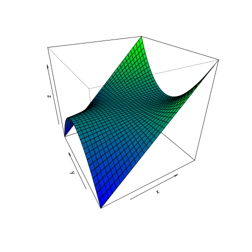 

```
## 
## persp> par(op)
```


###2. 통계 그래프 작성하기

####1) 파이 차트


```r
HairEyeColor #HairEyeColor 데이터 확인
```

```
## , , Sex = Male
## 
##        Eye
## Hair    Brown Blue Hazel Green
##   Black    32   11    10     3
##   Brown    53   50    25    15
##   Red      10   10     7     7
##   Blond     3   30     5     8
## 
## , , Sex = Female
## 
##        Eye
## Hair    Brown Blue Hazel Green
##   Black    36    9     5     2
##   Brown    66   34    29    14
##   Red      16    7     7     7
##   Blond     4   64     5     8
```

```r
pie(HairEyeColor[1, ,1],  #검은머리, 눈색 전부, 남자 데이터 지정
main="Black Hair, Male")  #main=" " 차트 제목 입력
```

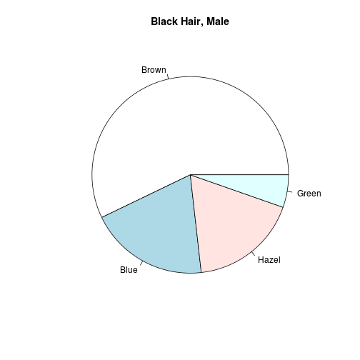 


#### 2) 막대그래프

```r
barplot(HairEyeColor[1, ,1],   #검은머리, 눈색 전부, 남자 데이터 지정
ylim=c(0,  35),                #y축의 최댓값, 최솟값 지정
main= "Black Hair,  Male")     #차트 제목 입력
```

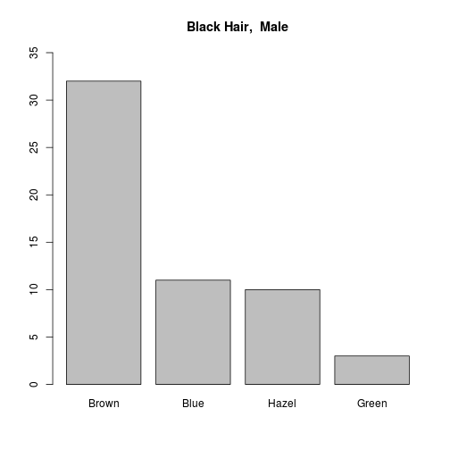 

####여러 기둥 병렬 표시

```r
barplot(HairEyeColor[, , 1],               #남학생 데이터(4x4  분할표)  입력
ylim=c(0, 60), main="Male",                #y축 범위, 차트 제목 입력
beside=T,                                  #기둥 병렬 입력
col=c ("Black", "Brown", "Red", "yellow"), #기둥 색상 입력
legend=rownames(HairEyeColor))             #범례 입력
```

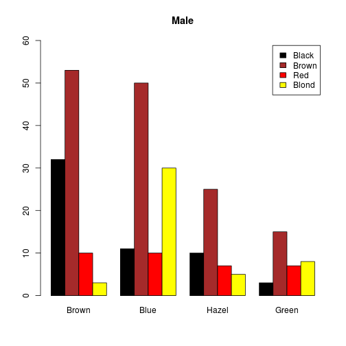 

#### 3) 히스토그램

```r
head(trees, n=15)                             #내용 출력(상위  15개  행) # 지름(Girth), 높이(Height), 용적(Volume)
```

```
##    Girth Height Volume
## 1    8.3     70   10.3
## 2    8.6     65   10.3
## 3    8.8     63   10.2
## 4   10.5     72   16.4
## 5   10.7     81   18.8
## 6   10.8     83   19.7
## 7   11.0     66   15.6
## 8   11.0     75   18.2
## 9   11.1     80   22.6
## 10  11.2     75   19.9
## 11  11.3     79   24.2
## 12  11.4     76   21.0
## 13  11.4     76   21.4
## 14  11.7     69   21.3
## 15  12.0     75   19.1
```

```r
hist(trees$Height, main="Histogram Height",   # 데이터 입력, 차트 제목 입력
ylim=c(0,0.07), labels=T, freq=F)             # y축 범위 설정(0~0.07),기둥 수치표시 여부(T/F), 상대도수 표시여부(T/F)
```

 

#### 4) 산포도

```r
plot(trees$Girth, trees$Height,   # 지름변수(Girth)와 높이변수(Height)의 산포도 생성
main="Plot  Girth  and Height")   # 차트 제목 입력
```

 

```r
pairs(trees, main= "Plot trees")  #산포도 행렬 생성. 모든 변수들 간의 산포도 생성
```

 

#### 5) 상자그림

```r
boxplot(trees,main="Boxplot trees") # trees 데이터의 상자 그림  생성
```

 

```r
# 선분 순서대로 최댓값，3사분위수，중앙값，2사분위수，최솟값(summar() 함수 결과)
# 작은 원은 극단값(outlier)
```

#### 6) 확률밀도함수 그래프

```r
plot(density(trees$Height),       # 확를밀도함수 그래프 생성, density(): 확률밀도함수 추정
main="Density Plot trees$Height") # 차트 제목 입력
```

 


#### 7) Q-Q 그래프
 - 두 변수의 분위수에  대한 산포도
 - 두 변수의 확률분포 형태가 동일한지, 종속 관계에 있는지 판단


##### qqnorm() 함수: 데이터가 정규분포 따르는지 검증

```r
set.seed(123)         # 난수시드 입력(123)
Y<-rchisq(500,df=5)   # 자유도 5개인 카이분포 따르는 난수  500개  생성
qqnorm(Y)             # Q-Q 그래프  생성, 데이터 Y와 정규분포로 지정된 미지의 값 비교
qqline(Y)             # 직선 추가해서 데이터가 선형일 때와 비교
```

 

##### qqplot() 함수: 입력된 두 데이터  분포 형태 동일한지 판단

```r
set.seed (123)         # 난수 시드 입력
Y<-rt(500,df=10)       # 자유도 10 t분포 따르는 따르는 난수 500개 생성
X<-rt(500,df=10)       # 자유도 10 t분포 따르는 따르는 난수 500개 생성
qqplot(x=X,y=Y, main= "Quantile-Quantile Plot")   # Q-Q 그래프 생성
abline(a=0, b=1)       # 절편 0, 기울기 1 직선 입력
```

 

####8) 선 그림표

```r
plot(UKgas, main="Line Chart UKgas") # UKgas 선 그림표  생성
```

 

```r
# 1960년 1분기~1981년 4분기 영국 가스 소비량 시계열 데이터, 단위: 백만 섬(therms)
```

####9) 3차원 그림표
- 데이터: 콥-더글러스 생산함수(Cobb-Douglas production function)
- 노동(L)과 자본(K) 두 변수에 의해 생산량이 결정되는 함수
- Q=f(L, K) = ALαKβ
- A: 생산성을 나타내는 상수, α: 노동소득분배율, β: 자본소득분배율

> 세 가지 변수 지정하기

```r
L<-K<-seq(1, 100, 5)           # 독립변수 L과 K의 값 입력. 1부터 100까지 5씩 증가하는 연속값
fn<-function(L, K) {           # 콥-더글러스 함수 정의
A<-0.6; alpha<-0.7; beta<-0.3  # 생산성 상수 A=0.6, 노동소득분배율 α=0.7, 자본소득분배율 β=0.3 지정
A*(L^alpha)*(K^beta)           # 함수식 계산
}
```

> 세 가지 변수 이용해서 3차원 그림표 생성하기

```r
Q<-outer(L,K,fn)  # 콥-더글러스  함수 관계를  이용하여 두 변수의 외적율 구함
persp(x=L, y=K, z=Q, theta=25, phi=15, expand=0.7, col="green",
# persp(x=, y=, z=,): 3차원 그래프 인수 지정하기
# theta: 방위각(azimuthal). 값이 커질수록 시점이 오른쪽으로  이동
# phi: 여위도(colatitude). 값이 커질수록 시점이 위쪽으로 이동
# expand: 종속변수 확장 정도. 1 보다 클수록 원래보다 확장, 작을수록 축소
# shade: 표면에 그림자 효과 주기
shade=0.2, main="Cobb-Douglas production function")  # 3차원  그림표 생성
```

 

### 3. 생성된 그래프 제어하기
### 4. 그래프에 수식 및 특수문자 입력하기
> 제목, 선 굵기, 간격, 색상 등 변경
> 교재 233pg 참고


