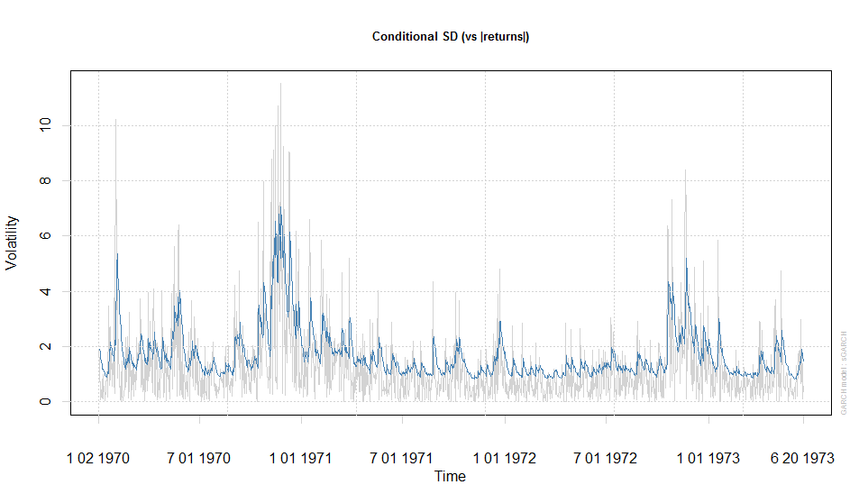
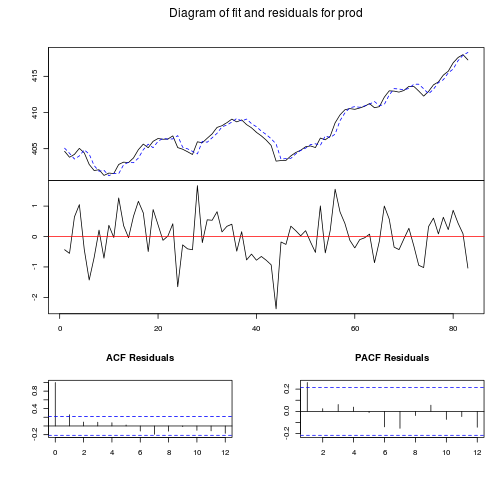
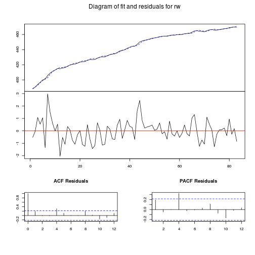

## 제 4절. 기부 패키지

------------------

#### 1. 패널 자료 분석을 위한 plm 패키지

- 패널 자료: 특정 변수를 개체(unit)별로 시간의 흐름에 따라 여러 시점에서 관측한 자료


```r
#install.packages("plm") # plm 패키지  설치
```


```r
library("plm")                  # plm 패키지  실행
```

```
## Loading required package: Formula
```

```r
data(Gasoline, package="plm")   # Gasoline  데이터  로드
```
- **데이터**
- plm 패키지에 포함된  Bakagi  and  Griffln(1983)의  Gasoline
- OECD  19개  국가, 1960~1978 18년간 데이터
- 변수: 국가명(country),  연도(year),  자동차 한  대당 석유소비량(lgaspcar)，1인당  실질소득(lincomep)，실질 석유가격(lrpmg)，1인당  자동차 수(lcarpcap) 로그 변환된 값


```r
head(Gasoline,n=10)   # 상위 10행 보기
```

```
##    country year lgaspcar lincomep   lrpmg lcarpcap
## 1  AUSTRIA 1960    4.173   -6.474 -0.3345   -9.767
## 2  AUSTRIA 1961    4.101   -6.426 -0.3513   -9.609
## 3  AUSTRIA 1962    4.073   -6.407 -0.3795   -9.457
## 4  AUSTRIA 1963    4.060   -6.371 -0.4143   -9.343
## 5  AUSTRIA 1964    4.038   -6.322 -0.4453   -9.238
## 6  AUSTRIA 1965    4.034   -6.295 -0.4971   -9.124
## 7  AUSTRIA 1966    4.048   -6.253 -0.4668   -9.020
## 8  AUSTRIA 1967    4.053   -6.235 -0.5059   -8.934
## 9  AUSTRIA 1968    4.046   -6.207 -0.5224   -8.848
## 10 AUSTRIA 1969    4.046   -6.153 -0.5591   -8.789
```

```r
summary(Gasoline)      # Gasoline의  요약 통계량 반환
```

```
##     country         year         lgaspcar       lincomep    
##  AUSTRIA: 19   Min.   :1960   Min.   :3.38   Min.   :-8.07  
##  BELGIUM: 19   1st Qu.:1964   1st Qu.:3.94   1st Qu.:-6.32  
##  CANADA : 19   Median :1969   Median :4.09   Median :-5.99  
##  DENMARK: 19   Mean   :1969   Mean   :4.30   Mean   :-6.14  
##  FRANCE : 19   3rd Qu.:1974   3rd Qu.:4.56   3rd Qu.:-5.72  
##  GERMANY: 19   Max.   :1978   Max.   :6.16   Max.   :-5.22  
##  (Other):228                                                
##      lrpmg           lcarpcap     
##  Min.   :-2.897   Min.   :-13.47  
##  1st Qu.:-0.652   1st Qu.: -9.31  
##  Median :-0.380   Median : -8.66  
##  Mean   :-0.523   Mean   : -9.04  
##  3rd Qu.:-0.223   3rd Qu.: -8.26  
##  Max.   : 1.125   Max.   : -7.54  
## 
```


```r
pd<-plm(lgaspcar~lincomep+lrpmg+lcarpcap,  # 종속변수(자동차 한 대당 석유소비량) 독립변수(실질소득, 실질석유가, 1인당자동차수) 입력
data=Gasoline,model="pooling")             # 데이터, 모델 종류 입력(pooling 선택)
summary(pd)                                # 결과  반환
```

```
## Oneway (individual) effect Pooling Model
## 
## Call:
## plm(formula = lgaspcar ~ lincomep + lrpmg + lcarpcap, data = Gasoline, 
##     model = "pooling")
## 
## Balanced Panel: n=18, T=19, N=342
## 
## Residuals :
##    Min. 1st Qu.  Median 3rd Qu.    Max. 
## -0.3840 -0.1530 -0.0498  0.1650  0.5970 
## 
## Coefficients :
##             Estimate Std. Error t-value Pr(>|t|)    
## (Intercept)   2.3913     0.1169    20.4   <2e-16 ***
## lincomep      0.8900     0.0358    24.9   <2e-16 ***
## lrpmg        -0.8918     0.0303   -29.4   <2e-16 ***
## lcarpcap     -0.7634     0.0186   -41.0   <2e-16 ***
## ---
## Signif. codes:  0 '***' 0.001 '**' 0.01 '*' 0.05 '.' 0.1 ' ' 1
## 
## Total Sum of Squares:    103
## Residual Sum of Squares: 14.9
## R-Squared      :  0.855 
##       Adj. R-Squared :  0.845 
## F-statistic: 663.999 on 3 and 338 DF, p-value: <2e-16
```

- **분석 결과**
- 실질소득 증가할수록 자동차 한 대당 석유소비량 증가  
- 실질석유가, 1인당자동차수 증가할수록 자동차 한 대당 석유소비량 감소  


------------

### 2. ARCH-GARCH  분석을 위한 rugarch 패키지

- 일반적인 시계열 모형에서 오차항의 조건부 분산은 일정하다고 가정  
- but 금융 시장 변수들(ex: 가격, 수익률)  
- (1) 오차항의 분산이 일정하지 않음: 오차항에 이분산(heteroscedasticity)이 존재  
- (2) 분산의 변동이 군집 현상을 이루는 경향  
- ARCH(Auto Regressive Conditional Heteroscedasticity) 자기회귀 조건부 이분산 모형: 시간에 따른 변동성 측정 위해 고안된 모형


#### 32bit windows version


```r
#install.packages("RODBC")      # 엑셀파일 자료 로드위해 RODBC 패키지 설치
library(RODBC)                 # RODBC 패키지  실행
connect<-odbcConnectExcel("kosdaq100.xls")  #  odbcConnectExcel is only usable with 32-bit Windows
```

```
## Error: could not find function "odbcConnectExcel"
```

```r
# R에 엑셀파일 연결
# 한국거래소(krx.co.kr) 2007.7.2.~2012.7.31. 코스닥(KOSDAQ) 100개 종목 주가 수익률 일별 자료
sqlTables(connect)       # 워크시트 목록 조회
```

```
## Error: object 'connect' not found
```

```r
KOSDAQ100<-sqlFetch(connect, "Returns$")  # Returns 워크시트 데이터를 KOSDAQ100에 할당
```

```
## Error: object 'connect' not found
```

```r
head(KOSDAQ100, n=5)                      # 데이터 상위 5행 출력
```

```
## Error: object 'KOSDAQ100' not found
```

```r
plot(as.ts(KOSDAQ100))                    # as.ts(): 시계열 선 그림표 생성
```

```
## Error: object 'KOSDAQ100' not found
```

#### ubuntu version


```r
#install.packages("xlsx")
library(xlsx)
```

```
## Loading required package: rJava
## Loading required package: xlsxjars
```

```r
KOSDAQ100  <- read.xlsx("KOSDAQ100.xls", sheetName = "Returns")
head(KOSDAQ100, n=5)                      # 데이터 상위 5행 출력
```

```
##    Returns
## 1  1.92051
## 2  1.34880
## 3 -0.09258
## 4  0.71835
## 5  0.16563
```

```r
plot(as.ts(KOSDAQ100))                    # as.ts(): 시계열 선 그림표 생성
```

 


### rugarch


```r
#install.packages("rugarch")  # rugarch 패키지 설치
library(rugarch)             # rugarch 패키지 실행
```

```
## KernSmooth 2.23 loaded
## Copyright M. P. Wand 1997-2009
```

```
## Warning: RGL: unable to open X11 display
## Warning: error in rgl_init
```

```r
ARCH4.spec<-ugarchspec(variance.model=list(garchOrder=c(4, 0)),  # ARCH 모형 설정
mean.model=list(armaOrder=c(0,0)))
# ugarchspec(): rugarch 패키지에 포함된 (G)ARCH 모형 형성 함수
# variance.model=list(): 모델 형태 지정
# garchOrder=c(4, 0): 오차항의  시차 p, 조건부분산의 시차 q 지정
# mean.model=list(): 평균방정식의 형태를 결정
# armaOrder(): 평균방정식에 ARMA 효과를 고려하는 경우 AR 시차변수 p, MA 시차변수 q 지정
```


```r
ARCH4<-ugarchfit(spec=ARCH4.spec, data=KOSDAQ100) # 분석 실행. 분석 모형, 데이터 지정
ARCH4                                             # 분석  결과 출력
```

```
## 
## *---------------------------------*
## *          GARCH Model Fit        *
## *---------------------------------*
## 
## Conditional Variance Dynamics 	
## -----------------------------------
## GARCH Model	: sGARCH(4,0)
## Mean Model	: ARFIMA(0,0,0)
## Distribution	: norm 
## 
## Optimal Parameters
## ------------------------------------
##         Estimate  Std. Error  t value Pr(>|t|)
## mu      0.030441    0.035964  0.84643  0.39731
## omega   0.673907    0.083388  8.08160  0.00000
## alpha1  0.284237    0.045434  6.25600  0.00000
## alpha2  0.226509    0.044305  5.11251  0.00000
## alpha3  0.247130    0.045137  5.47513  0.00000
## alpha4  0.188253    0.042558  4.42344  0.00001
## 
## Robust Standard Errors:
##         Estimate  Std. Error  t value Pr(>|t|)
## mu      0.030441    0.043530  0.69932 0.484352
## omega   0.673907    0.106603  6.32163 0.000000
## alpha1  0.284237    0.062282  4.56369 0.000005
## alpha2  0.226509    0.049587  4.56793 0.000005
## alpha3  0.247130    0.060053  4.11523 0.000039
## alpha4  0.188253    0.068850  2.73425 0.006252
## 
## LogLikelihood : -2338 
## 
## Information Criteria
## ------------------------------------
##                    
## Akaike       3.7032
## Bayes        3.7276
## Shibata      3.7032
## Hannan-Quinn 3.7124
## 
## Weighted Ljung-Box Test on Standardized Residuals
## ------------------------------------
##                         statistic  p-value
## Lag[1]                      6.743 0.009413
## Lag[2*(p+q)+(p+q)-1][2]     6.764 0.013776
## Lag[4*(p+q)+(p+q)-1][5]     9.505 0.012319
## d.o.f=0
## H0 : No serial correlation
## 
## Weighted Ljung-Box Test on Standardized Squared Residuals
## ------------------------------------
##                          statistic  p-value
## Lag[1]                     0.07045 0.790681
## Lag[2*(p+q)+(p+q)-1][11]  10.13494 0.089234
## Lag[4*(p+q)+(p+q)-1][19]  21.59800 0.006182
## d.o.f=4
## 
## Weighted ARCH LM Tests
## ------------------------------------
##             Statistic Shape Scale P-Value
## ARCH Lag[5]     1.508 0.500 2.000  0.2194
## ARCH Lag[7]     3.229 1.473 1.746  0.2878
## ARCH Lag[9]     4.569 2.402 1.619  0.3190
## 
## Nyblom stability test
## ------------------------------------
## Joint Statistic:  1.236
## Individual Statistics:             
## mu     0.1777
## omega  0.6732
## alpha1 0.2963
## alpha2 0.3564
## alpha3 0.2859
## alpha4 0.2299
## 
## Asymptotic Critical Values (10% 5% 1%)
## Joint Statistic:     	 1.49 1.68 2.12
## Individual Statistic:	 0.35 0.47 0.75
## 
## Sign Bias Test
## ------------------------------------
##                    t-value      prob sig
## Sign Bias           3.0753 2.148e-03 ***
## Negative Sign Bias  0.6007 5.482e-01    
## Positive Sign Bias  1.1201 2.629e-01    
## Joint Effect       22.2499 5.787e-05 ***
## 
## 
## Adjusted Pearson Goodness-of-Fit Test:
## ------------------------------------
##   group statistic p-value(g-1)
## 1    20     96.65    2.151e-12
## 2    30    121.44    2.804e-13
## 3    40    137.85    5.826e-13
## 4    50    172.70    1.085e-15
## 
## 
## Elapsed time : 3.423
```


- **결과**
- 표준화된  잔차(stndardized residuals)의  LM  검정(ARCH LM Tests)  결과 시차  10에서  잔차항에  유의미한  ARCH  효과가  존재
- -> ARCH 효과가 강하므로 오차항의  시차변수 뿐 아니라 조건부 분산의  시차변수까지 고려하는  GARCH  분석이 요구됨


#### 동일한 자료를 GARCH 모형을 사용하여 분석


```r
GARCH11.spec<-ugarchspec(variance.model=list(garchOrder=c(1,1)), # GARCH 모형 설정
mean.model=list(armaOrder=c(0,0)))
# variance.model=llist(): 모델 형태 지정
# variance.model=list(garchOrder=c(1,1): 오차항의 시차 p, 조건부분산의 시차 q 지정. 4,0->1,1로 변경
# 잔차 제곱의 시차변수 p만 입력하고 GARCH 분석에 사용되는 조건부 분산의 시차변수인 q에 0 입력하면 ARCH 모형으로 설정됨

GARCH11<-ugarchfit(spec=GARCH11.spec, data=KOSDAQ100) # 분석 실행. 분석 모형, 데이터 지정
GARCH11                                            # 분석  결과 출력
```

```
## 
## *---------------------------------*
## *          GARCH Model Fit        *
## *---------------------------------*
## 
## Conditional Variance Dynamics 	
## -----------------------------------
## GARCH Model	: sGARCH(1,1)
## Mean Model	: ARFIMA(0,0,0)
## Distribution	: norm 
## 
## Optimal Parameters
## ------------------------------------
##         Estimate  Std. Error   t value Pr(>|t|)
## mu      0.003164    0.037272  0.084877 0.932359
## omega   0.135220    0.034878  3.876924 0.000106
## alpha1  0.219797    0.037621  5.842454 0.000000
## beta1   0.753936    0.036947 20.406071 0.000000
## 
## Robust Standard Errors:
##         Estimate  Std. Error   t value Pr(>|t|)
## mu      0.003164    0.044340  0.071348 0.943121
## omega   0.135220    0.054125  2.498264 0.012480
## alpha1  0.219797    0.064474  3.409076 0.000652
## beta1   0.753936    0.066167 11.394489 0.000000
## 
## LogLikelihood : -2328 
## 
## Information Criteria
## ------------------------------------
##                    
## Akaike       3.6845
## Bayes        3.7007
## Shibata      3.6845
## Hannan-Quinn 3.6906
## 
## Weighted Ljung-Box Test on Standardized Residuals
## ------------------------------------
##                         statistic p-value
## Lag[1]                      6.268 0.01229
## Lag[2*(p+q)+(p+q)-1][2]     6.326 0.01801
## Lag[4*(p+q)+(p+q)-1][5]     9.259 0.01423
## d.o.f=0
## H0 : No serial correlation
## 
## Weighted Ljung-Box Test on Standardized Squared Residuals
## ------------------------------------
##                         statistic p-value
## Lag[1]                   0.007755  0.9298
## Lag[2*(p+q)+(p+q)-1][5]  0.758338  0.9115
## Lag[4*(p+q)+(p+q)-1][9]  3.676323  0.6441
## d.o.f=2
## 
## Weighted ARCH LM Tests
## ------------------------------------
##             Statistic Shape Scale P-Value
## ARCH Lag[3]   0.05973 0.500 2.000  0.8069
## ARCH Lag[5]   1.25324 1.440 1.667  0.6595
## ARCH Lag[7]   3.60897 2.315 1.543  0.4065
## 
## Nyblom stability test
## ------------------------------------
## Joint Statistic:  0.7972
## Individual Statistics:             
## mu     0.1111
## omega  0.4086
## alpha1 0.4139
## beta1  0.3860
## 
## Asymptotic Critical Values (10% 5% 1%)
## Joint Statistic:     	 1.07 1.24 1.6
## Individual Statistic:	 0.35 0.47 0.75
## 
## Sign Bias Test
## ------------------------------------
##                    t-value      prob sig
## Sign Bias           1.7758 0.0760065   *
## Negative Sign Bias  0.3243 0.7457946    
## Positive Sign Bias  1.6613 0.0969105   *
## Joint Effect       16.6841 0.0008207 ***
## 
## 
## Adjusted Pearson Goodness-of-Fit Test:
## ------------------------------------
##   group statistic p-value(g-1)
## 1    20     104.4    8.393e-14
## 2    30     122.2    2.084e-13
## 3    40     130.1    9.685e-12
## 4    50     157.1    2.926e-13
## 
## 
## Elapsed time : 0.9978
```


- **분석결과**
- 분산방정식에 포함된 모수 추정치값이 모두 0에 가까워 모수의 추정치가 모두 유의
- 표준화된 잔차의 LM검정결과 ARCH모형에 비해 잔차항에 존재하는 arch효과가 현저히 줄어듬(모든 시차 에서P값이 증가함)
- ARCH모형보다 GARCH모형이 ARCH 효과를 더 잘 반영해줌을 의미


#### 조건부 표준편차 선 그림표 그리기
> GARCH 모형에 존재하는 변동성 밀집 효과 파악 목적


```r
plot(GARCH11)
```

```
## Error: menu() cannot be used non-interactively
```

```r
#Make a plot selection (or 0 to exit): 

# 1:   Series with 2 Conditional SD Superimposed
# 2:   Series with 1% VaR Limits
# 3:   Conditional SD (vs |returns|)
# 4:   ACF of Observations
# 5:   ACF of Squared Observations
# 6:   ACF of Absolute Observations
# 7:   Cross Correlation
# 8:   Empirical Density of Standardized Residuals
# 9:   QQ-Plot of Standardized Residuals
#10:   ACF of Standardized Residuals
#11:   ACF of Squared Standardized Residuals
#12:   News-Impact Curve

#Selection: 3
```



- (그림) 02_Rplot_KOSDAQ100_2


### 3. 분위수회귀 분석을 위한 quantreg 패키지
- 분위수회귀추정법(method of quantile regression estimation)
- 이상점 (outlier) 이나 오차항 분포에  민감하게 반응하지  않는  준모수적  방법 (semiparametric  method)
- 최소제곱추정법이 주어진 회귀 변수(regressor) 집합의 조건부 평균함수만을 추정하는데 반해 
- 조건부 분위수함수들을 추정, 종속변수의 조건부 분포의 특성을 알려주는 장점


```r
#install.packages("quantreg")  # quantreg  패키지 설치, 실행
library(quantreg)
```

```
## Loading required package: SparseM
## 
## Attaching package: 'SparseM'
## 
## The following object is masked from 'package:base':
## 
##     backsolve
```


```r
data(engel, package="quantreg")
# 데이터  불러오기
# quantreg 패키지에  포함된  engel. 벨기에 235개 가구의 식료품 지출비, 소득 자료
head(engel, n=10)  # 상위  10행 출력
```

```
##    income foodexp
## 1   420.2   255.8
## 2   541.4   311.0
## 3   901.2   485.7
## 4   639.1   403.0
## 5   750.9   495.6
## 6   945.8   633.8
## 7   829.4   630.8
## 8   979.2   700.4
## 9  1309.9   831.0
## 10 1492.4   815.4
```


```r
res1<-rq(formula=foodexp~income, data=engel, tau=0.5)
# rq(): 분위수회귀 분석
# formula( ~ ): 종속변수(foodexp)~독립변수(income) 지정
# tau=분위수 지정

res1  #요약 통계량 출력
```

```
## Call:
## rq(formula = foodexp ~ income, tau = 0.5, data = engel)
## 
## Coefficients:
## (Intercept)      income 
##     81.4822      0.5602 
## 
## Degrees of freedom: 235 total; 233 residual
```

```r
summary(res1, se='nid') # 결과 자세히 보기
```

```
## 
## Call: rq(formula = foodexp ~ income, tau = 0.5, data = engel)
## 
## tau: [1] 0.5
## 
## Coefficients:
##             Value    Std. Error t value  Pr(>|t|)
## (Intercept) 81.48225 19.25066    4.23270  0.00003
## income       0.56018  0.02828   19.81032  0.00000
```


####여러개의 분위수를 동시에 고려해서 분석

```r
taus<-c(0.1, 0.25, 0.5, 0.75, 0.9)             # 분위수 지정
res2<-rq(foodexp~income, data=engel, tau=taus) # taus변수로부터 분위수 받음
res2                                           # 결과 출력
```

```
## Call:
## rq(formula = foodexp ~ income, tau = taus, data = engel)
## 
## Coefficients:
##             tau= 0.10 tau= 0.25 tau= 0.50 tau= 0.75 tau= 0.90
## (Intercept)  110.1416   95.4835   81.4822    62.397   67.3509
## income         0.4018    0.4741    0.5602     0.644    0.6863
## 
## Degrees of freedom: 235 total; 233 residual
```

```r
plot.rqs(res2) # 각 분위수 별 추정된 절편, 기울기 출력
```

 


- 분위수 회귀직선의 형태 파악 위해 두 변수의 산포도 생성, 그 위에 회귀선, 분위수 회귀선 표시하기


```r
plot(engel$income, engel$foodexp, xlab="Income",  # 산포도 생성
ylab="Food Expenditure", cex=0.2,    # cex=0.2: 
main="Scatterplot and Quantile Regression Fit")

abline(lm(foodexp~income, data=engel), lty=2, lwd=2)
# abline(): 회귀선 삽입. lm():선형회귀분석수행, lty=선종류, lwd: 선두께

for(i in 1:length(taus))  {                       # 분위수별로 회귀선 삽입 반복
taus<-c(0.1, 0.25, 0.5, 0.75, 0.9)                # 분위수 지정
color<-c("red", "green", "blue", "gray", "black") # 선 색 지정
abline(rq(foodexp~income, data=engel, tau=taus[i]), col=color[i]) } #분위수회귀분석 실시, 회귀선 삽입
```

 


-------------------

### 4. 준비모수추정을 위한 gmm 패키지

####준비모수추정방법
 - 오차항의 분포 함수를 모르는 경우, 회귀모형의 가정이 충족되지 못하여 최우추정량을 적용할 수 없는 경우에 적률조건(moment conditions)만을 이용하여 회귀모형의 모수를 추정


```r
#install.packages ("gmm")  # gmm 패키지  설치, 실행
library(gmm)     
```

```
## Loading required package: sandwich
```

```r
data(Finance,package="gmm")  #  패키지  데이터  로드
```

- **데이터**
- 1993.1.5.~2009.1.30. 20개 회사의 일별 데이터
- 주식수익률(회사명: WMK，UIS, ORB, NHP, AA, TOW)
- 같은 기간 무위험 이자율(risk-free rate, rf), 시장포트폴리오 수익률(returns of market portfolio, rm), HML(Factor High-Minus-Low of Fama-French), SMB(Factor Small-Minus-Big of Fama-French)


```r
head(Finance,n=2)  # 상위 2개행 출력
```

```
##               WMK   UIS   ORB   MAT   ABAX       T   EMR    JCS   VOXX
## 1993-01-05 0.0000 4.840 0.000 1.882 -4.256 -0.1980 0.396 -2.312  3.224
## 1993-01-06 0.4815 3.599 7.696 1.415 12.260  0.9862 1.439 -2.567 -3.224
##              ZOOM   ROG    GGG     PC GCO    EBF     F     FNM     NHP
## 1993-01-05 -5.635 1.744 0.0000 -1.614   0 -0.818 1.418  0.9739 -0.8850
## 1993-01-06  3.553 0.000 0.7782  0.000   0  0.000 0.201 -1.2412 -0.8929
##                 AA    TDW    rf     rm  hml  smb
## 1993-01-05  0.1526  1.350 0.011 -0.149 0.23 0.37
## 1993-01-06 -0.7651 -2.718 0.011  0.141 0.49 0.41
```


- **자본 자산 가격결정모형의 계수 β 추정하기**
- 자본 자산 가격결정모형(Capital Asset Pricing Model, CAPM)
- 균형상태의 자본시장에서 모든 종류의 자본자산과 기대수익률 사이의 관계를 도출하는 데 사용


```r
r<-Finance[,1:3]    # WMK, UIS, ORB 회사의 증권수익률을 r에 할당
rm<-Finance$rm      # 시장 포트폴리오 수익률을 rm에 할당
rf<-Finance$rf      # 무위험 이자율 자료를 rf에 활당
Y<-as.matrix(r-rf)  # 종속변수 행렬 생성: r(회사의 증권수익률) - (rf)무위험 이자율
X<-as.matrix(rm-rf) # 독립변수 행렬 생성: rm(시장 포트폴리오 수익률) - rf(무위험 이자율)

gmm.res<-gmm(Y~X,x=X,type="iterative") # gmm 추정 실행(iterated 방법 사용)
summary(gmm.res)                      # 결과 반환
```

```
## 
## Call:
## gmm(g = Y ~ X, x = X, type = "iterative")
## 
## 
## Method:  iterative 
## 
## Kernel:  Quadratic Spectral
## 
## Coefficients:
##                  Estimate     Std. Error   t value      Pr(>|t|)   
## WMK_(Intercept)  -2.4441e-03   1.9809e-02  -1.2338e-01   9.0181e-01
## UIS_(Intercept)  -9.8199e-02   4.9887e-02  -1.9684e+00   4.9017e-02
## ORB_(Intercept)  -1.9034e-02   5.4376e-02  -3.5004e-01   7.2631e-01
## WMK_X             4.7705e-01   3.0967e-02   1.5405e+01   1.5175e-53
## UIS_X             1.3449e+00   8.1020e-02   1.6600e+01   6.9671e-62
## ORB_X             1.0527e+00   5.6063e-02   1.8776e+01   1.1784e-78
## 
## J-Test: degrees of freedom is 0 
##                 J-test               P-value            
## Test E(g)=0:    2.9415181680898e-25  *******
```

### 5. 단위근·공적분 검정과 VECM 분석을 위한 urea 패키지  


- 단위근(unit root)이 존재하는 불안정 시계열 데이터 분석시 기존 회귀분석 쓰면 R2(설명량) 뻥튀기 문제
- 불안정 시계열을 ‘일차 차분’해서 회귀분석으로 해결 BUT 시계열들 사이의 장기적 관계에 대한 중요 정보들 상실 문제
- 오차수정모형(vector error correction model) 적용해서 해결
- but 시계열들 사이에 공적분(cointegration) 관계 존재할 경우만 사용 가능
- -> 경제변수 간 관계 분석시 불안정 시계열 간 공적분 판단 과정 중요

- **일반적으로 사용되는 공적분 검정법**
- 1) 엥글과 그랜저의 2단계 검정법: ADF의 단위근 검정 아이디어를 이용
개념 이해 쉽고 검정 수행 용이 BUT 표본 수 영향 큼, 설정된 모형 형태 따라 결과 크게 변함->신뢰성 떨어짐
- 2) 요한슨의 검정법: ADF의 단위근 검정을 다변량으로 확장하여 최우추정 통한 검정 수행
일반적으로 요한슨의 검정법 사용


```r
#install.packages("urca")      # urca 패키지 설치, 실행(단위근 검정, 요한슨의 공적분 검정, 오차수정모형 분석)
library(urca)
data(finland,package="urca")  # 패키지 데이터 로드
head(finland, n=10)           # 상위 10행 출력
```

```
##     lrm1   lny    lnmr    difp
## 1  2.849 3.837 0.17311 0.01482
## 2  2.828 3.903 0.10120 0.00000
## 3  2.908 3.897 0.13208 0.00000
## 4  2.934 3.847 0.06999 0.00000
## 5  2.986 3.916 0.06532 0.00000
## 6  3.007 3.986 0.06532 0.01460
## 7  3.016 3.984 0.06532 0.01439
## 8  2.954 3.956 0.06532 0.01418
## 9  3.003 3.990 0.16127 0.00000
## 10 3.042 4.049 0.24349 0.01399
```


- **데이터: 1958년 2분기~1984년 3분기 분기별 핀란드 자료**
- 통화량 Ml(lrm1), 실질임금(lny)，한계 이자율(lnmr)，물가상승률(difp): 물가상승률 제외하고 로그값


- **통화량->물가상승률 관계 검증 전에 단위근 검정 실시: 두 시계열 변수가 안정적인지 불안정적인지 여부 판단**
- 절차: 단위근 존재 판단 -> 두 변수간 공적분 검증 -> 오차수형모형 적용


```r
attach(finland) # 데이터 프레임 안의 변수들에 쉽게 접근하기 위해 사용
                # finland$lrm1 -> lrm1로 사용 가능

adf.m1<-ur.df(lrm1,type="trend", selectlags="AIC")
# 통화량 변수(lrml) ADF 공적분 검정
# type="trend": 절편항과 추세항 추가
# selectlags="AIC": 정보기준에 의해 시차 결정

summary(adf.m1) # 결과 출력
```

```
## 
## ############################################### 
## # Augmented Dickey-Fuller Test Unit Root Test # 
## ############################################### 
## 
## Test regression trend 
## 
## 
## Call:
## lm(formula = z.diff ~ z.lag.1 + 1 + tt + z.diff.lag)
## 
## Residuals:
##      Min       1Q   Median       3Q      Max 
## -0.18829 -0.04098  0.00066  0.03407  0.16862 
## 
## Coefficients:
##              Estimate Std. Error t value Pr(>|t|)    
## (Intercept)  0.466330   0.191497    2.44    0.017 *  
## z.lag.1     -0.156533   0.066907   -2.34    0.021 *  
## tt           0.001443   0.000686    2.10    0.038 *  
## z.diff.lag  -0.404443   0.091558   -4.42  2.5e-05 ***
## ---
## Signif. codes:  0 '***' 0.001 '**' 0.01 '*' 0.05 '.' 0.1 ' ' 1
## 
## Residual standard error: 0.0603 on 100 degrees of freedom
## Multiple R-squared:  0.274,	Adjusted R-squared:  0.253 
## F-statistic: 12.6 on 3 and 100 DF,  p-value: 4.67e-07
## 
## 
## Value of test-statistic is: -2.34 3.772 2.852 
## 
## Critical values for test statistics: 
##       1pct  5pct 10pct
## tau3 -3.99 -3.43 -3.13
## phi2  6.22  4.75  4.07
## phi3  8.43  6.49  5.47
```


- ADF 검정통계량이 -2.3396으로 tau3의 1% 유의수준 임계값 -3.99보다 큼
- 단위근이 존재하는 불안정적 시계열 의미 -> 추가로 공적분 검정 요구됨


```r
adf.p<-ur.df(difp,type="trend", lags=4)
# 물가 변수(difp) ADF 공적분 검정
# lags=4: 시차 직접 입력

summary(adf.p) # 결과 출력
```

```
## 
## ############################################### 
## # Augmented Dickey-Fuller Test Unit Root Test # 
## ############################################### 
## 
## Test regression trend 
## 
## 
## Call:
## lm(formula = z.diff ~ z.lag.1 + 1 + tt + z.diff.lag)
## 
## Residuals:
##      Min       1Q   Median       3Q      Max 
## -0.01976 -0.00855 -0.00179  0.00752  0.04594 
## 
## Coefficients:
##              Estimate Std. Error t value Pr(>|t|)   
## (Intercept)  4.85e-03   2.75e-03    1.76   0.0813 . 
## z.lag.1     -3.62e-01   1.44e-01   -2.52   0.0136 * 
## tt           4.46e-05   5.17e-05    0.86   0.3907   
## z.diff.lag1 -4.45e-01   1.53e-01   -2.92   0.0044 **
## z.diff.lag2 -1.87e-01   1.43e-01   -1.30   0.1955   
## z.diff.lag3 -3.00e-01   1.31e-01   -2.29   0.0243 * 
## z.diff.lag4 -3.88e-02   1.04e-01   -0.37   0.7111   
## ---
## Signif. codes:  0 '***' 0.001 '**' 0.01 '*' 0.05 '.' 0.1 ' ' 1
## 
## Residual standard error: 0.012 on 94 degrees of freedom
## Multiple R-squared:  0.483,	Adjusted R-squared:  0.45 
## F-statistic: 14.6 on 6 and 94 DF,  p-value: 9.98e-12
## 
## 
## Value of test-statistic is: -2.516 2.382 3.512 
## 
## Critical values for test statistics: 
##       1pct  5pct 10pct
## tau3 -3.99 -3.43 -3.13
## phi2  6.22  4.75  4.07
## phi3  8.43  6.49  5.47
```


```r
detach(finland)  # attach 끝내기
```

- ADF 검정통계량이 -2.5159로 tau3의 1% 유의수준 임계값 -3.99보다 큼
- 단위근이 존재하는 불안정적 시계열 의미 -> 추가로 공적분 검정 요구됨


- **두 변수 사이에 공적분 관계 존재하는지 검정**


```r
attach(finland)
data.mat<-cbind(lrm1,difp) # 두 변수(통화량,물가)로 행렬 생성
detach(finland)  

Jo.res<-ca.jo(data.mat, type="trace", ecdet="trend", spec="longrun")
# ca.jo(): 요한슨 공적분 검정
# type="trace“: 통계량 추정 방법 결정
# ecdet=”trend“: 회귀식에 추세변수 추가
# spec=”longrun“: 모형 구조 선택 - 장기 효과

summary(Jo.res) # 결과 반환
```

```
## 
## ###################### 
## # Johansen-Procedure # 
## ###################### 
## 
## Test type: trace statistic , with linear trend in cointegration 
## 
## Eigenvalues (lambda):
## [1] 2.137e-01 5.478e-02 8.327e-17
## 
## Values of teststatistic and critical values of test:
## 
##           test 10pct  5pct  1pct
## r <= 1 |  5.86 10.49 12.25 16.26
## r = 0  | 30.86 22.76 25.32 30.45
## 
## Eigenvectors, normalised to first column:
## (These are the cointegration relations)
## 
##             lrm1.l2  difp.l2 trend.l2
## lrm1.l2    1.000000  1.00000  1.00000
## difp.l2  -17.762750  2.27427  8.26715
## trend.l2  -0.006691 -0.00961 -0.03076
## 
## Weights W:
## (This is the loading matrix)
## 
##          lrm1.l2   difp.l2  trend.l2
## lrm1.d -0.008993 -0.144536 3.836e-18
## difp.d  0.031300  0.007089 2.412e-17
```

- 공적분 없다 가정(r=0) 검정통계량 30.86이 유의수준 1% 임계값 30.45보다 큼 -> 탈락
- 공적분 벡터 하나 이하 가정(r<=1) 검정통계량 5.86이 유의수준 1% 임계값 16.26보다 작음 -> 수용
- 결론: 통화량-물가 변수 사이에 공적분 관계 존재함 
- -> 오차수정모형 사용해서 변수 간 관계 분석


```r
VEC.res<-cajools(Jo.res) # 공적분 검정 결과 데이터로 오차수정모형 분석
summary(VEC.res)         # 결과 반환
```

```
## Response lrm1.d :
## 
## Call:
## lm(formula = lrm1.d ~ constant + lrm1.dl1 + difp.dl1 + lrm1.l2 + 
##     difp.l2 + trend.l2 - 1, data = data.mat)
## 
## Residuals:
##      Min       1Q   Median       3Q      Max 
## -0.19058 -0.04187  0.00093  0.03351  0.17104 
## 
## Coefficients:
##           Estimate Std. Error t value Pr(>|t|)    
## constant  0.460411   0.198936    2.31    0.023 *  
## lrm1.dl1 -0.555203   0.097567   -5.69  1.3e-07 ***
## difp.dl1  0.010516   0.522970    0.02    0.984    
## lrm1.l2  -0.153529   0.069664   -2.20    0.030 *  
## difp.l2  -0.168967   0.601068   -0.28    0.779    
## trend.l2  0.001449   0.000696    2.08    0.040 *  
## ---
## Signif. codes:  0 '***' 0.001 '**' 0.01 '*' 0.05 '.' 0.1 ' ' 1
## 
## Residual standard error: 0.0609 on 98 degrees of freedom
## Multiple R-squared:  0.289,	Adjusted R-squared:  0.246 
## F-statistic: 6.64 on 6 and 98 DF,  p-value: 6.46e-06
## 
## 
## Response difp.d :
## 
## Call:
## lm(formula = difp.d ~ constant + lrm1.dl1 + difp.dl1 + lrm1.l2 + 
##     difp.l2 + trend.l2 - 1, data = data.mat)
## 
## Residuals:
##      Min       1Q   Median       3Q      Max 
## -0.02093 -0.00779 -0.00138  0.00629  0.04266 
## 
## Coefficients:
##           Estimate Std. Error t value Pr(>|t|)    
## constant -0.105151   0.038275   -2.75   0.0072 ** 
## lrm1.dl1  0.036906   0.018772    1.97   0.0521 .  
## difp.dl1 -0.834761   0.100620   -8.30  5.9e-13 ***
## lrm1.l2   0.038389   0.013403    2.86   0.0051 ** 
## difp.l2  -0.539855   0.115646   -4.67  9.7e-06 ***
## trend.l2 -0.000278   0.000134   -2.07   0.0408 *  
## ---
## Signif. codes:  0 '***' 0.001 '**' 0.01 '*' 0.05 '.' 0.1 ' ' 1
## 
## Residual standard error: 0.0117 on 98 degrees of freedom
## Multiple R-squared:  0.486,	Adjusted R-squared:  0.454 
## F-statistic: 15.4 on 6 and 98 DF,  p-value: 2.2e-12
```

**첫번째 (Response lrm1.d) : 종속변수 통화량(lrm1), 독립변수 물가상승률(difp) **

**두번째 결과(Response difp.d): 종속변수 물가물가상승률(difp), 독립변수 통화량(lrm1)**

----------

### 6. 벡터자기회귀(VAR)모형 추정을 위한 vars 패키지

- **벡터자기회귀모형(Vector Autoregression, VAR)**
- 상호의존성 가지는 둘 이상의 경제변수들 사이의 관계 분석에 효과적(자기상관구조 모형화)
- ex) 실질 GDP, 통화량, 물가, 이자율, 환율
- 거시경제변수 간 상관관계 연구에 자주 사용됨


```r
#install.packages("vars")   # vars 패키지 설치, 실행
library(vars)
```

```
## Loading required package: MASS
## Loading required package: strucchange
## Loading required package: zoo
## 
## Attaching package: 'zoo'
## 
## The following objects are masked from 'package:base':
## 
##     as.Date, as.Date.numeric
## 
## Loading required package: lmtest
```

```r
data(Canada,package="vars")    #  데이터 로드
```

- **데이터: 1980년 1분기~2000년 4분기, 분기별 다중시계열(multiple time-series) 자료**
- 경제협력개발기구(OECD)  웹페이지(http://www.oecd.org)에서 수집
- 변수: 노동생산성(prod), 고용률(e) 실업률(U), 실질임금(rw)


```r
Canada  #  데이터  출력
```

```
##             e  prod    rw     U
## 1980 Q1 929.6 405.4 386.1  7.53
## 1980 Q2 929.8 404.6 388.1  7.70
## 1980 Q3 930.3 403.8 390.5  7.47
## 1980 Q4 931.4 404.2 394.0  7.27
## 1981 Q1 932.7 405.0 396.8  7.37
## 1981 Q2 933.6 404.4 400.0  7.13
## 1981 Q3 933.5 402.8 400.8  7.40
## 1981 Q4 933.1 402.0 405.7  8.33
## 1982 Q1 932.1 402.1 409.1  8.83
## 1982 Q2 930.6 401.3 411.4 10.43
## 1982 Q3 929.1 401.6 413.0 12.20
## 1982 Q4 928.6 401.6 415.2 12.77
## 1983 Q1 929.1 402.8 414.7 12.43
## 1983 Q2 930.3 403.1 415.7 12.23
## 1983 Q3 931.7 403.1 416.2 11.70
## 1983 Q4 932.1 403.7 418.1 11.20
## 1984 Q1 932.3 404.9 419.7 11.27
## 1984 Q2 932.8 405.6 420.5 11.47
## 1984 Q3 933.7 405.1 420.9 11.30
## 1984 Q4 934.2 406.0 422.1 11.17
## 1985 Q1 934.6 406.4 423.6 11.00
## 1985 Q2 935.6 406.3 424.0 10.63
## 1985 Q3 936.5 406.3 424.2 10.27
## 1985 Q4 937.4 406.8 426.1 10.20
## 1986 Q1 938.4 405.2 426.9  9.67
## 1986 Q2 939.0 404.9 426.7  9.60
## 1986 Q3 939.2 404.6 426.9  9.60
## 1986 Q4 939.7 404.2 428.8  9.50
## 1987 Q1 940.2 405.9 430.1  9.50
## 1987 Q2 941.4 405.8 430.2  9.03
## 1987 Q3 942.3 406.4 430.4  8.70
## 1987 Q4 943.5 407.1 432.0  8.13
## 1988 Q1 944.3 407.9 433.4  7.87
## 1988 Q2 944.8 408.2 434.0  7.67
## 1988 Q3 945.1 408.6 434.5  7.80
## 1988 Q4 945.8 409.1 436.2  7.73
## 1989 Q1 946.9 408.7 438.3  7.57
## 1989 Q2 946.9 409.0 438.8  7.57
## 1989 Q3 947.2 408.3 439.9  7.33
## 1989 Q4 947.7 407.9 441.8  7.57
## 1990 Q1 948.2 407.3 443.2  7.63
## 1990 Q2 948.3 406.8 444.4  7.60
## 1990 Q3 948.0 406.2 444.5  8.17
## 1990 Q4 947.1 405.4 447.0  9.20
## 1991 Q1 946.1 403.3 450.2 10.17
## 1991 Q2 946.2 403.4 451.5 10.33
## 1991 Q3 946.2 403.4 452.3 10.40
## 1991 Q4 946.0 404.0 453.1 10.37
## 1992 Q1 945.5 404.5 454.0 10.60
## 1992 Q2 945.4 404.8 455.0 11.00
## 1992 Q3 945.3 405.3 455.5 11.40
## 1992 Q4 945.4 405.4 456.1 11.73
## 1993 Q1 945.9 405.2 457.2 11.07
## 1993 Q2 945.9 406.5 457.4 11.67
## 1993 Q3 946.3 406.2 457.8 11.47
## 1993 Q4 946.6 406.7 457.6 11.30
## 1994 Q1 946.8 408.6 458.8 10.97
## 1994 Q2 947.6 409.7 459.1 10.63
## 1994 Q3 948.6 410.4 459.2 10.10
## 1994 Q4 949.4 410.5 459.7  9.67
## 1995 Q1 949.9 410.4 459.7  9.53
## 1995 Q2 949.8 410.6 460.0  9.47
## 1995 Q3 950.0 410.9 461.0  9.50
## 1995 Q4 950.3 411.2 461.3  9.27
## 1996 Q1 950.5 410.7 461.4  9.50
## 1996 Q2 950.8 410.8 462.9  9.43
## 1996 Q3 950.9 412.1 464.7  9.70
## 1996 Q4 950.9 413.0 465.1  9.90
## 1997 Q1 951.8 413.0 464.3  9.43
## 1997 Q2 952.6 412.8 464.0  9.30
## 1997 Q3 953.6 413.0 463.5  8.87
## 1997 Q4 954.1 413.6 465.1  8.77
## 1998 Q1 954.5 413.6 466.1  8.60
## 1998 Q2 955.3 413.0 466.6  8.33
## 1998 Q3 956.1 412.3 465.7  8.17
## 1998 Q4 956.8 412.9 465.9  8.03
## 1999 Q1 957.4 413.8 466.4  7.90
## 1999 Q2 958.1 414.2 467.0  7.87
## 1999 Q3 958.7 415.2 467.6  7.53
## 1999 Q4 959.5 415.7 467.7  6.93
## 2000 Q1 960.4 416.9 469.1  6.80
## 2000 Q2 960.8 417.6 469.3  6.70
## 2000 Q3 961.0 418.0 470.0  6.93
## 2000 Q4 961.8 417.3 469.6  6.87
```


- **어떤 경제이론이 데이터에 더 들어맞는지 검증하기**
- (1) 전통적인 경제이론
- 근로자 생산성 증가->임금 상승  

- (2) 효율성 임금 이론 (efficiency wage theory)
- 근로자 임금 증가 -> 우수 인재 유치 활발, 이직 감소-> 생산성 지속 유지 발전 -> 근로자 생산성 증가

- 생산성->임금 or 임금->생산성 중 뭐가 맞는지 검증
- 노동 생산성 변수(prod)와 실질임금(rw)으로 VAR 분석 수행


```r
res<-VAR(Canada[,c(2,3)], lag.max=3, ic="SC", type="none")  # VAR 모형 추정  
# Canada[,c(2,3)]: 두 번째(prod, 생산성), 세 번째(임금) 변수 이용
# lag.max=3: 제한될 최대 시차를 3으로 지정
# ic="sc": Schwarz의 정보기준을 이용하여 자동으로 시차 결정
# type="none“:  상수항, 추세항 제거 모형 지정

summary(res) #결과 반환
```

```
## 
## VAR Estimation Results:
## ========================= 
## Endogenous variables: prod, rw 
## Deterministic variables: none 
## Sample size: 83 
## Log Likelihood: -193.158 
## Roots of the characteristic polynomial:
##    1 0.961
## Call:
## VAR(y = Canada[, c(2, 3)], type = "none", lag.max = 3, ic = "SC")
## 
## 
## Estimation results for equation prod: 
## ===================================== 
## prod = prod.l1 + rw.l1 
## 
##         Estimate Std. Error t value Pr(>|t|)    
## prod.l1  0.99124    0.00421  235.63   <2e-16 ***
## rw.l1    0.00843    0.00389    2.17    0.033 *  
## ---
## Signif. codes:  0 '***' 0.001 '**' 0.01 '*' 0.05 '.' 0.1 ' ' 1
## 
## 
## Residual standard error: 0.708 on 81 degrees of freedom
## Multiple R-Squared:    1,	Adjusted R-squared:    1 
## F-statistic: 1.38e+07 on 2 and 81 DF,  p-value: <2e-16 
## 
## 
## Estimation results for equation rw: 
## =================================== 
## rw = prod.l1 + rw.l1 
## 
##         Estimate Std. Error t value Pr(>|t|)    
## prod.l1  0.03434    0.00517    6.65  3.2e-09 ***
## rw.l1    0.97050    0.00478  203.20  < 2e-16 ***
## ---
## Signif. codes:  0 '***' 0.001 '**' 0.01 '*' 0.05 '.' 0.1 ' ' 1
## 
## 
## Residual standard error: 0.87 on 81 degrees of freedom
## Multiple R-Squared:    1,	Adjusted R-squared:    1 
## F-statistic: 1.07e+07 on 2 and 81 DF,  p-value: <2e-16 
## 
## 
## 
## Covariance matrix of residuals:
##         prod      rw
## prod  0.5015 -0.0345
## rw   -0.0345  0.7563
## 
## Correlation matrix of residuals:
##        prod     rw
## prod  1.000 -0.056
## rw   -0.056  1.000
```

- **첫 번째 결과: 종속변수 생산성(prod)**
- **두 번째 결과: 종속변수 실질임금(rw)**
- **분석결과: 두 방향 모두 유의**


```r
plot(res) # 분석결과 도표 출력. 종속변수 prod(생산성), w(실질임금) 순
```

  
