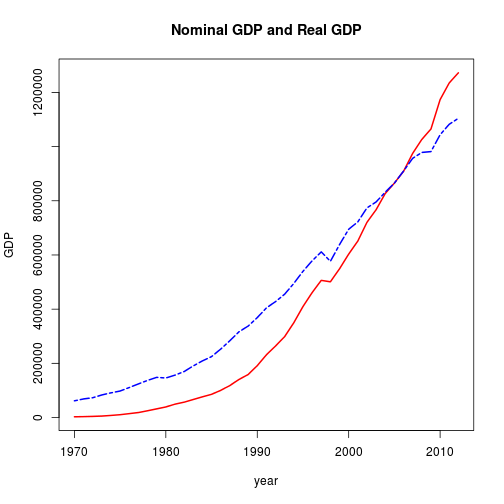
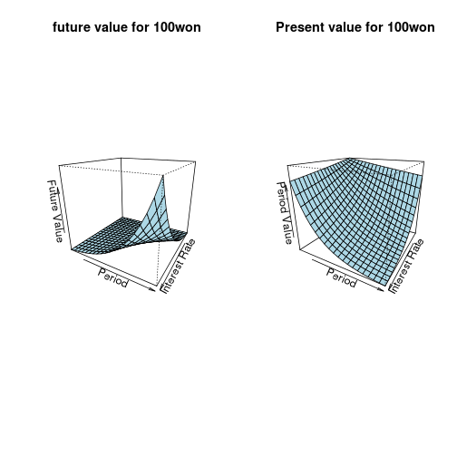
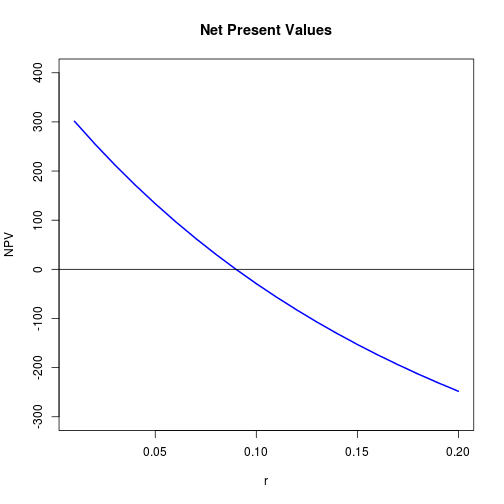

###OECD국가의 자동차 휘발유 소비량 패널분석

>22개국가 2001년~2009년 관측데이터

>변수 : 국가, 연도, 자동차 한대당 석유소비량, 1인 실질소득, 실질석유가격

>자동차한대당 석유소비량(G)= 1인실질소득(I)+실질석유가격(P)+1인당 자동차수(C)+개별특성변수

>plm패키지로 패널분석, 고정효과 추정을 위해 그룹내(within)모형 사용

```r
Gasoline.data<-read.csv(file="data/Gasoline.data.csv",header=T)
head(Gasoline.data, N=10)
```

```
##   country year lgaspcar lincomep     lrpmg lcarpcap
## 1 Austria 2001    1.392    10.07 -0.211956  -0.6540
## 2 Austria 2002    1.514    10.15 -0.193585  -0.7068
## 3 Austria 2003    1.521    10.35 -0.005013  -0.6943
## 4 Austria 2004    1.488    10.48  0.163818  -0.6878
## 5 Austria 2005    1.441    10.52  0.249980  -0.6835
## 6 Austria 2006    1.394    10.57  0.313350  -0.6779
```

```r
library(plm)
```

```
## Loading required package: Formula
```

```r
f.effect<-plm(lgaspcar~lincomep+lrpmg+lcarpcap, data=Gasoline.data, model="within")
summary(f.effect)
```

```
## Oneway (individual) effect Within Model
## 
## Call:
## plm(formula = lgaspcar ~ lincomep + lrpmg + lcarpcap, data = Gasoline.data, 
##     model = "within")
## 
## Balanced Panel: n=22, T=9, N=198
## 
## Residuals :
##    Min. 1st Qu.  Median 3rd Qu.    Max. 
## -0.3700 -0.0425  0.0121  0.0470  0.1600 
## 
## Coefficients :
##          Estimate Std. Error t-value Pr(>|t|)    
## lincomep   0.2308     0.0759    3.04   0.0027 ** 
## lrpmg     -0.4914     0.0708   -6.94  7.4e-11 ***
## lcarpcap  -0.6257     0.1024   -6.11  6.4e-09 ***
## ---
## Signif. codes:  0 '***' 0.001 '**' 0.01 '*' 0.05 '.' 0.1 ' ' 1
## 
## Total Sum of Squares:    3.44
## Residual Sum of Squares: 1.2
## R-Squared      :  0.651 
##       Adj. R-Squared :  0.569 
## F-statistic: 107.696 on 3 and 173 DF, p-value: <2e-16
```

###그래프를 이용한 경제분석

>명목국내총생산(GDP),소득환가지수(GDP-deflator) 자료수집:1970~2012년

```r
GDP<-read.table("data/GDP.txt", header=T, row.names=1)
head(GDP,n=10)
```

```
##      nominal.GDP GDP.deflator
## 1970        2775          4.5
## 1971        3434          5.0
## 1972        4241          5.8
## 1973        5499          6.6
## 1974        7845          8.6
## 1975       10478         10.7
## 1976       14411         13.0
## 1977       18502         14.9
## 1978       24945         18.2
## 1979       32049         21.6
```

>GPD디플레이터 =(명목GDP / 실질GDP)*100

>실질GDP =(명목GDP / GDP디플레이터)*100

```r
real.GDP<-(GDP[,1]/GDP[,2])*100  #실질 GDP 계산
GDP<-cbind(GDP,real.GDP)         #실질 GDP를 세 번째 요소(열)에 추가
head(GDP,n=10)                   #자료 출력(상위 10행)
```

```
##      nominal.GDP GDP.deflator real.GDP
## 1970        2775          4.5    61669
## 1971        3434          5.0    68690
## 1972        4241          5.8    73122
## 1973        5499          6.6    83318
## 1974        7845          8.6    91226
## 1975       10478         10.7    97923
## 1976       14411         13.0   110852
## 1977       18502         14.9   124174
## 1978       24945         18.2   137059
## 1979       32049         21.6   148377
```

>명목GDP, 실질GDP 그래프그리기

```r
plot(rownames(GDP),GDP[,1],type="l",col="red",lwd=2,main="Nominal GDP and Real GDP",xlab="year", ylab="GDP")        #명목GDP

lines(row.names(GDP),GDP[,3],col="blue",lwd=2,lty=6)   #실질GDP

legend(1970,12*10^6,legend=c("Nominal GDP", "Real GDP"), col=c("red","blue"),lwd=2,lty=c(1,6))                  #범례입력
```

 

###그래프를 이용한 경제분석
>화폐의 미래가치 : 현재금액에 특정시점까지의 이자율을 적용한 금액

>FV=I*(1+r)^t

>화폐의 현재가치 : 특정 미래의 금액을 현재가치로 할인율을 적용한 금액

>PV=F/(1+r)^t

>1)100원의 미래가치를 이자율(1~20%)과 기간(1~20)을 적용하여 계산


```r
r<-seq(0.01, 0.2, 0.01)  #이자율 벡터 생성
t<-1:20                  #기간 벡터 생성
FV<-100*(1+r)^t          #미래가치 계산
FV                       #결과출력
```

```
##  [1]  101.0  104.0  109.3  117.0  127.6  141.9  160.6  185.1  217.2  259.4
## [11]  315.2  389.6  489.8  626.1  813.7 1074.8 1442.6 1967.3 2725.2 3833.8
```

>2) 미래의 100원에 대한 현재가치 계산


```r
PV<-100/(1+r)^t        #현재가치계산
PV                     #결과출력
```

```
##  [1] 99.010 96.117 91.514 85.480 78.353 70.496 62.275 54.027 46.043 38.554
## [11] 31.728 25.668 20.416 15.971 12.289  9.304  6.932  5.083  3.670  2.608
```

>3)화폐의 미래,현재가치의 3차원 그래프


```r
FV.fn<-function(r,t) {100*(1+r)^t}#미래가치 계산 함수생성
par(mfcol=c(1,2))        #화면분할 1행2열
z1<-outer(r,t,FV.fn)
persp(r,t,z1,xlab="Interest Rate",ylab="Period",zlab="Future Value",theta=120,phi=20,
expand=0.9,ticktype="simple",col="lightblue", main="future value for 100won")#3차원그래프생성

PV.fn<-function(r,t){100/(1+r)^t} #현재가치 계산 함수생성
z2<-outer(r,t,PV.fn) 
persp(r,t,z2,xlab="Interest Rate",ylab="Period",zlab="Period Value",theta=120,phi=20,
expand=0.9,ticktype="simple",col="lightblue", main="Present value for 100won")#3차원그래프생성
```

 

###현금으름할인(DCF)법에 따른 투자결정
>투자결정규칙:순현재가치법(NPV)= 현재투자금의 미래가치 - 현재투자금

>프로젝트1 : 연이자7% 저축예금 5년(1000원)

>프로젝트2 : 액면 1000원의 채권을 650원에구매

>이자율 1~20%까지 1%씩 증가할때의 순현재가치계산 하고 그래프 생성


```r
r<-seq(0.01,0.2,0.01)  #이자율벡터 1%~20%까지 1씩 증가
PV<-1000/(1+r)^5
PV
```

```
##  [1] 951.5 905.7 862.6 821.9 783.5 747.3 713.0 680.6 649.9 620.9 593.5
## [12] 567.4 542.8 519.4 497.2 476.1 456.1 437.1 419.0 401.9
```

```r
alpha<-650
NPV<-PV-alpha  #순현재가치
plot(r,NPV,type="l",main="Net Present Values", ylim=c(-300,400),lwd=2,col="blue")
abline(h=0)
```

 
