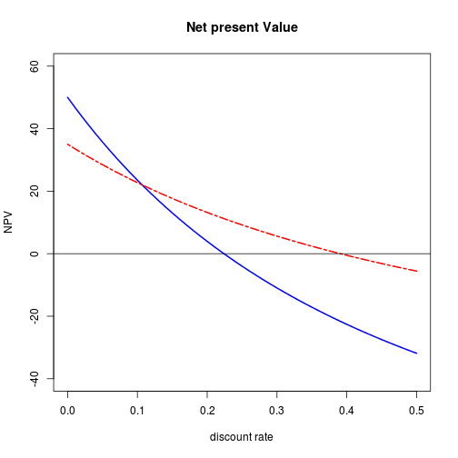

----------------

## 제 3절. 연습문제


### 1. 윤년의 기준판별하기
>연도를 4로 나눠 떨어지면 윤년

>100으로 나누어 떨어지면 윤년이 아님

>100으로 나눠떨어지는 연도중 400으로 나눠 떨어지는 해는 윤년

#### 1) if조건식으로 2012년이 윤년인지 확인 / 결과가 참인 경우 문구를 출력

```r
year<-2012
if(year%%4==0&&year%%100!=0||year%%400==0) cat(year, "is a leap year") 
```

```
## 2012 is a leap year
```


#### 2) if..else 조건식으로 2100년이 윤년인지 확인 / 결과가 참인 경우와 거짓인 경우 각각 문구출력

```r
year<-2100
if(year%%4==0&&year%%100!=0||year%%400==0)
cat(year, "is a leap year") else
cat(year, "isn't a leap year")
```

```
## 2100 isn't a leap year
```


#### 3) ifelse()함수를 사용하여 2035, 2058, 2125, 12500년 윤년확인 / 윤년여부 출력 

```r
year<-c(2035, 2058, 2088, 2125, 12500)
ifelse(year%%4==0&year%%100!=0|year%%400==0,
c(paste(year,"is a leap year")), 
c(paste(year,"isn't a leap year")))
```

```
## [1] "2035 isn't a leap year"  "2058 isn't a leap year" 
## [3] "2088 is a leap year"     "2125 isn't a leap year" 
## [5] "12500 isn't a leap year"
```


------------------------

### 2. 미래투자가치 함수생성 

#### 1) FV= ID X (1+R)^t 공식으로 함수 생성   #투자가치=금액X(1+이율)^기간

```r
FV<-function(ID, R, t) {
fvalue<-ID*(1+R)^t
return(fvalue)
}
```


#### 2) 함수를 이용해 1000000원을 5%의 이율로 10년간 정립하는 경우 미래가치 계산

```r
FV(ID=1000000, R=0.05, t=10)
```

```
## [1] 1628895
```


------------------------

### 3. 1부터 25까지 2씩 증가하는 등차수열 생성후 물음에 답하기

#### 1) repeat 명령문으로 수열생성

```r
x<-1
repeat{
cat(x,"->")
x<-x+2
if(x>25) break
}
```

```
## 1 ->3 ->5 ->7 ->9 ->11 ->13 ->15 ->17 ->19 ->21 ->23 ->25 ->
```


#### 2) while 명령문으로 같은 결과 구하기

```r
x<-1
while(x<=25) {
cat(x,"->")
x<-x+2
}
```

```
## 1 ->3 ->5 ->7 ->9 ->11 ->13 ->15 ->17 ->19 ->21 ->23 ->25 ->
```


#### 3) for명령문으로 같은 결과 구하기

```r
for(i in 1:25) {
if(i%%2!=0) cat(i,"->")
}
```

```
## 1 ->3 ->5 ->7 ->9 ->11 ->13 ->15 ->17 ->19 ->21 ->23 ->25 ->
```


------------------------

### 4. 수요의 가격탄력성 공식으로 함수정의 및 계산

> *탄력성 = [(dQ수요변화)/(dP가격변화)] X [P(가격)/Q(수요)]

#### 1) 변화전 가격과 수요를 Pb,Qb 변화후 가격과 수요Pa, Qa로 입력하여 함수정의

```r
DE<-function(Pb,Pa,Qb,Qa) {
dP<-Pa-Pb
dQ<-Qa-Qb
eta<-(dQ/dP)*(Pb/Qb)
return(eta)
}
```


#### 2) 가격이 100->150 / 수요가 1200->2160으로 변할때 수요의 가격탄력성 계산

```r
DE(Pb=100, Pa=150, Qb=1200, Qa=2160)
```

```
## [1] 1.6
```


### 5. 지수분포 : 지정된 시점에서 어떤사건이 일어나는데 걸리는 시간을 측정하는 확률분포 


#### 1)지수분포를 하는 확률변수 T의 확률밀도함수를 정의해라

```r
EXPDF<-function(t, lambda){ 
+lambda*exp(-lambda*t)  
}
```


#### 2) 10분에 4명의 고객이 방문한다. 한 고객이 방문한 후 새 고객이 다시방문할때까지 걸린시간이 5분일 확률을 정의한 함수를 이용해 계산해라(lambda=0.4)

```r
EXPDF(t=5, lambda=0.4)
```

```
## [1] 0.05413
```


#### 3) 람다=0.4 일때 지수분포 확률밀도 함수 그래프 생성(t는 0부터 20까지 1씩증가하는 등차수열)

```r
plot(EXPDF(t=1:20, lambda=0.4), type="l")
```

 

### 6. 두개의 프로젝트 중 어떤프로젝트에 투자할지 결정 
>프로젝트1 : 100억투자 1년후 40억, 2년후 60억, 3년후 50억 이익

>프로젝트2 : 50억 투자 1년후 30억, 2년후 55억, 3년후 0원

#### 1)현금의 흐름(f), 할인률(r), 사업기간(t) 으로순현재가치를 구하는 함수작성 / 8%할인율을 가정할때 어떤 프로젝트에 투자하는것이 바람직한가?


```r
IV1<-c(-100,40,60,50)
IV2<-c(-50,30,55,0)
NPV<-function(IV,r,t) {   #순현재 가치 함수정의
div<-c()
for(i in 1:length(t)) {
for(j in r) {
div<-append(div, IV[i]/(1+j)^t[i])
}}
div.mat<-matrix(div, nrow=length(r))
return(rowSums(div.mat))
}
NPV(IV1,r=0.08,t=0:3)
```

```
## [1] 28.17
```

```r
NPV(IV2,r=0.08,t=0:3)
```

```
## [1] 24.93
```

#### 2)할인률을 0%부터 50%까지 1%씩 증가시키며 프로젝트의 순현재가지가 어떻게 변화하는지 그래프로 보기


```r
r.seq=seq(0, 0.5, 0.01)             #할인율 벡터 생성
NPV1<-NPV(IV1, r=r.seq, t=0:3)      #할인율 변화에 따른 프로젝트 1의 순현재가치
NPV2<-NPV(IV2, r=r.seq, t=0:3)      #할인율 변화에 따른 프로젝트 2의 순현재가치

plot(r.seq,NPV1, type="l", col="blue",ylim=c(-40,60),lwd=2,main="Net present Value", xlab="discount rate", ylab="NPV")                

lines(r.seq, NPV2, col="red", lwd=2, lty=6)  #프로젝트2

abline(h=0)
```

 

```r
#legend(0.3,50,lwd=2,col=c("blue","red"),lty=c(1,6), legend=c("project 1", "project2)) #범례입력
```
                                                             
                                                             
                                                             
