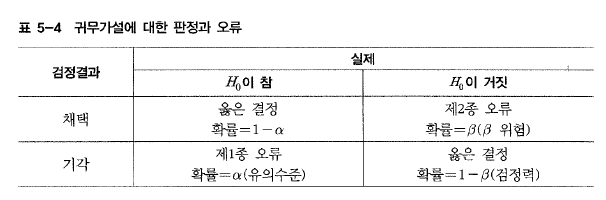

## 제 1절. 확률

### 1. 기본정의
< 사건 A의 발생확률 >

$$P(A) = \lim_{N \to \infty} \frac{N_A}{N}$$

```{r}
# 예제 5-1
# 1부터 6까지의 정수가 나올 가능성이 동일한 주사위를 던지는 임의실험에서 
# 짝수가 나올사건의 확률은 얼마인가?

x <- 1:6
result <- sample(x,size = 5000, replace =T)
head(result,30)
result.even <- result[result%%2 ==0]
length(result.even)/length(result)

```


### 2. 확률의 기본 공리와 법칙

< 확률의공리 >

1. 어떤 사건에대해서도 P(A) 는 다음을 만족한다.
$$0 \le P(A) \le 1$$

2. $P(\Omega) = 1$, $P(\phi) = 0$  여기서 $\Omega$는 표본공간， $\phi$은 공집합이다.

3. $P(\overline A) = 1 - P(A)$

< 확률의 덧셈법칙 >
$$P(A \cup B) = P(A) + P(B) - P(A \cap B)$$

< 조건부확률 >
$$P(A|B) = \frac {P(A \cap B)}{P(B)}$$


< 확률의 곱셈법칙 >
$$P(A \cap B) = P(A|B)P(B) = P(B|A)P(A)$$


< 통계적으로 독립인 두 사건 A와 B의 조건부 확률 >

$$P(A|B) = P(A \cap B) / P(B) = P(A)$$
$$P(B|A) = P(A \cap B) / P(A) = P(B)$$


## 제 2절. 확률변수와 확률분포

< 확률변수 >

확률변수란 임의실혐의 결과에 실수값을 대응시켜주는 함수이며 X,Y 혹은 Z와 같은 영문 대문자로표현한다.

- 이산확률변수 : 확률변수가 취할 수 있는 실수값의 수를
셀 수 있는 변수
- 연속확률변수 : 확률변수가 취할 수 있는 실수값의 수를 셀 수없는 변수

```{r}
# 예제 5-2
# R의 rnorm() 함수를사용하여 평균이 3, 표준편차가 2인 100000개의 정규난수로 이루어진 확률변수 X를 생성해보라

X <- rnorm(n=10^5 , mean=3 , sd=2)
head(X,n=20)

```

- 확률분포(probability distribution) : 어떤 확률변수가 취할 수 있는 모든 가능한 값들에 대응하는 확률을 나타내는 것.

-  이산확률변수의 경우 확률변수 X가 특정한 값을 취할 획률을 나타내는 함수를 확률함수(probability function) P(x) 라 한다.

- 연속확률변수의 경우 확률변수 X가 취하는 값과 확률밀도의 관계를 나타내는 함수를 확률밀도함수(Probability Density Function, PDF) f(x ) 혹은 fx(x) 라고 한다.

- 연속획률변수 X가 a와 b 구간에 속하게 될 확률은

$$\displaystyle P(a \le X \le b) = \int_a^b f(x) \, dx$$

```{r}
# 예제 5-3
# R의 plot() 함수와 density() 함수를 사용하여 예제 5-2에서 생성한 확률변수 X의 확률밀도함수 그래프를 그려보라

plot(density(X), main="Probability Density Function")
```

- 누적분포함수(cumulative distribution function, CDF) Fx(xo) : 확률변수 X가 $-\infty$부터 특정한 값$x_0$ 사이에 속하게 될 확률, 혹은 확률변수 X가 특정한 값 $x_0$를 넘지 않을 확률을 나타내는 함수

< 누적분포함수 >
$$\displaystyle F_X(x_0) = \int_a^b f(x) \, dx$$

```{r}
# 예제 5-4
# R의 plot() 함수와 ecdf() 함수를 사용하여 예제 5-2에서 생성한 확률변수 X의 누적분포함수 그래프를 그려보라.

plot (ecdf(X), main="Probability Density Function")
```

- 확률변수 X의 기댓값은 $E(X)$ 혹은 $\mu_X$로 표현하며,  획률변수가 취할 수있는 모든 값들과 그들의 발생획률을 각각 곱한 후 그 값들을 합함으로써 계산된다. 

< x의 기댓값 >  ; 평균

$$\displaystyle E(X) = \int_{-\infty}^\infty xf(X)dx$$


< g(x) 의 기댓값 >

$$\displaystyle E[g(X)] = \int_{-\infty}^\infty g(x)f(X)dx$$

분산(variance) $\sigma_X^2$도 확률변수 X의 임의의 함수$g(X) = (x- E(X))^2$ 에 대한 기댓값으로부터 구할 수 있다.

< X의 분산 >

$$\sigma_X^2 = Var(X) = E[(X-E(X))^2]$$


- 결합확률밀도함수(joint PDF) f(x , ν) : 두 확률변수 X와 Y가 있을 때 확률변수 X가 특정한 값 x 를, 확률변수 Y가 특정한 값 y를 동시에 취하는 확률을 나타내는 x와 y의 확률분포함수.

< 결합확률밀도함수 >

$$f(x,y) =  P(X=x \cap Y=y)$$

```{r}
# 예제 5-5
# 어떤 벤처기업이 획기적인 신기술을 개발하여 국제 인증을 받음과 동시에 파산할 확률을나타내는 결합확률밀도함수가 다음과 같다고 가정할 때， R의 persp(x, y, z) 함수를 사용하여 결합확률밀도함수 f(x, ν) 의 3차원 그래프를 그려보라.

x<- 1: 10
y<-x
fn<-function(x,y) {0.1*exp(-0.1*(x+y))}
z<-outer(x,y, fn) #  결합확률이 입력된 행렬 z 생성 (함수 fn을 이용하여 변수 x와 y의 외적을 구함)
persp (x, y , z , main="Joint PDF of x and y")

```


- 두 확률변수 X와 Y의 결합확률밀도함수를 이용하여 두 확률변수의 관계를 분석할수 있다.

< 함수 $g(X,Y)$의 기댓값 >

$$\displaystyle E(g(X,Y)] = \int_{-\infty}^\infty \int_{-\infty}^\infty g(x,y)f(x,y)dydx$$

< 공분산 >

$$\sigma_{XY} = E[g(X,Y)] = E[[X - E(X)][Y-E(Y)]]$$

두 확률변수 X와 Y의 공분산이 0 이라는 의미는 두 확률변수 간에 선형 상관(linear correlation) 이 존재하지 않는다는 것.

공분산은 두 확률변수 간에 어떤 상관관계가 존재하는지를 알려줄 수는 있지만 어느 정도의 상관관계가 존재하는지 정확히 알려줄 수 없는 단점을 지닌다.

- 상관계수(correlation coefficient) : 공분산을 두 확률변수의 표준편차의 곱으로 나누어 두 확률변수의 선형 상관관계를 나타내는 지표를 정의한 것.

< 상관계수 >

$$\rho = \frac{\sigma_{XY}}{\sigma_X \sigma_Y}$$

상관계수는 $-1 \le \rho \le 1$의 조건을만족하며, 

$\rho=0$은 두 확률변수 X와 Y 사이에 선형 상관관계가 없음을,

$\rho=1$은 완전한 정의 선형 상관관계가 존재함을,

그리고 $\rho=-1$ 은 완전한 역의 선형 상관관계가 존재함을 의미한다


```{r}
# 예제 5-6
# 한국은행 경제통계 시스템 (http://ecos.bok.or.kr)에서 수집된 1970 년에서 2011 년까지의 M1(단위 : 십억 원)과 GDP 디플레이터(2005=100) 에 대한 시계열 자료가 디렉터리 경로 “c:/Rdata/M1. GDPd. txt"에 그림 5-8과 같이 저장되어 있다. 두 자료를 이용하여 통호방과 물가의 기댓값， 분산， 그리고 공분산을 계산해보자

M1GDPd<-read.table("M1GDPd.txt", header=T, row.names= 1)
head (M1GDPd, n=5)
colMeans(M1GDPd)  # 개별 변수의 기댓값
var(M1GDPd$M1);var(M1GDPd$GDP.def)  # 개별 변수의 분산
cov(M1GDPd$M1 ,M1GDPd$GDP.def)  # 두 변수의 공분산
```

- 주변확률분포(marginal probability distribution) : 두 획률변수의 결합획률분포로부터 각 획률변수에 대한 분포를 구할 수 있는데， 각 확
률변수에 대한 분포를 주변확률분포(marginal probability distribution) 라고 정의한다.
- 주변확률밀도함수(marginal PDF) : Y(혹은 X)가 취할 수 있는 모든 값들에 대한 결합함수의 합이 확률변수 X(혹은Y)의 주변확률이며, 그 확률을 나타내는 함수를 주변확률밀도함수(marginal PDF)라 한다.

< 주변확률밀도함수 >

$$f(x) = \sum_y f(x,y)$$
$$f(y) = \sum_x f(x,y)$$

- 조건부확률밀도함수(conditional PDF) : 확률변수 Y가 어떤 특정한 값 y를 취한 것이 전제가 된 상태에서 확률변수X가 어떤 특정한 값 x를 취할 조건부확률

< 조건부확률밀도함수 >

$$f(x|y) = \frac{f(x,y)}{f(y)}$$

## 제 3절. 정규분포화 관련 분포

### 1. 정규분포와 표준정규분포

< 정규분포의 확률밀도함수 >
확률변수 X의 확률밀도함수가 다음과 같다면 X는 정규분포를 갖는다.

$$f(x) = \frac{1}{\sqrt{2\pi\sigma^2}} exp[-\frac{(x-\mu)^2}{2\sigma^2}], -\infty < x < \infty$$


< 정규분포 >

확률변수 X가 평균$\mu$, 분산 $\sigma^2$인 정규분포를 갖는다면 다음과 같이 표기할 수 있다.
$$X \sim N(\mu, \sigma^2)$$


```{r}
# 예제 5-7
# 표준편치는 1로 같으나 평균이 3과 7로 서로 다른 두 정규분포와 평균은 5로 갈으나 분산이 1 과 4로 서로 다른 두 정규분포를 각각 하나의 그래프로 생성해보라.

x<-seq(-5, 15, 0.01)  # 등차수열 벡터 생성

par(mfcol=c (2 ,1))
plot (x, dnorm(x, 3 , 1) , type="l", main="Same Variance, Different Mearis")
lines(x, dnorm(x, 7 ,1))  # 평균이 7 , 분산이 l인 밀도함수
plot (x, dnorm(x, 5, 1), type="l", main="Same Mean, Different Variances")
lines(x, dnorm(x, 5 , 2))  # 평균이 5 , 분산이 4인 밀도함수
```

< 두 정규확률변수의 선형결합 >

$$Y = X_1 + X_2 \sim N(\mu_1 + \mu_2, \sigma_1^2 + \sigma_2^2 + 2\rho\sigma_1\sigma_2)$$
$$Y = X_1 - X_2 \sim N(\mu_1 + \mu_2, \sigma_1^2 + \sigma_2^2 - 2\rho\sigma_1\sigma_2)$$

여기서 $\mu_1$,$\mu_2$는 각각 $X_1$과 $X_2$의 평균,

$\sigma_1^2$, $\sigma_2^2$는 각각 $X_1$과 $X_2$의 분산,

그리고 $\rho$는 $X_1$과 $X_2$의 상관계수이다.


```{r}
# 예제 5-8
# 두-펀드 A와 B의 지난 20 년간의 연 평균 펀드 수익률 자료가 표 5-1 과 같다고 할 때，두 수익률 차의 선형결합 Y를 생성한 후 평균과 분산을 계산해보라 . Y의 평균는 두 펀드A, B의 평균 차와. Y의 분산은 ... 와 서로 일치하는가?

A<-c(1.9, 5,10, -4, -1, 9 ,11,12, 8,4 ,21 ,11 ,2, 6,4, -1 ,2, -4 ,7 ,11) # 펀드 A의 수익률
B<-c(10 ,12 ,5, -7 , 1 ,10, 8,14 , 17,6,32 , 6,15, 8, 0,12 ,5,3,16 ,16) # 펀드 B의 수익률
Y <- A-B # 선형 결합 (Y=A-B)
mean(Y)
var(Y)
mean(A)-mean(B)  
var(A) + var(B)-2*cor(A,B)*sd(A)*sd(B)

```

- 표준정규분포(standard normal distribution) : 평균이 0이고 분산이 1 인 정규분포

< 표준정규분포 >

$$Z \sim N(0,1)$$


```{r}
# 예제 5-9
# -3부터 3까지 0.01 씩 증가하는 등차수열 벡터를 생성 후， 개별 원소를 정규분포의 확률함수인 dnorm()에 대응시켜 표준정규분포 그래프를 생성해 보라.
z<-seq (from=-3 , to=3 , by=0.01)
fz<-dnorm(z, mean=0, sd=1)
plot(z, fz , type="l", main="Standard Normal Distribution", xlab = "z" ,ylab= "f(z)")
```


< 정규분포의 표준화 >

X를평균$\mu$와 분산 $\sigma^2$을 갖는 정규확률변수라고 하자. 이때 X를
$$Z = \frac{X-\mu}{\sigma}$$
로 선형변환하면 Z는 표준정규분포 하며, X를 Z로 선형 변환시키는 것을 표준화한다고 한다.

표준정규분포의 구간확률은 확률밀도함수 아래에 위치하는 전체면적 중 그 구간에 속하는 부분면적으로 계산된다.


< 확률변수 Z가 a부터 b 구간에 속할 확률 >

$$P(a < Z <b) = F_Z(b) - F_Z(a)$$
$$ = \int_a^b \frac{1}{\sqrt{2\pi}} exp(-\frac{1}{2}z^2)dz $$


```{r}
# 예제 5-10
# 표준정규분포의 구간 확률을 구하기 위한 R의 pnorm() 함수를 사용하여 표준정규확률변수 Z가 0.90보다 큰 값을 취할 확률을 구하라


z<-0.9
1 - pnorm (z, mean=0, sd=1)
```

### 2. 카이제곱분포

- 카이제곱분포 : 표준정규분포 하는 서로 독립된 확률변수의 제곱 합으
로 정의.

- 확률변수 Z가 표준정규분포를 가질 때 이 변수의 제곱 $Z^2$은 자유도가 1 인 $\chi^2$-분포를 가진다.

- 일반적으로 q개의 서로 독립인 확률변수 $Z_1, Z_2, \dots,Z_q$가 표준정규분포를 가질 때 이 확률변수들의 제곱의 합은 자유도가 q인 $\chi^2$-분포를 갖는다.

< 자유도가 q인 카이제곱분포 >

$$\displaystyle X= \sum_{i=1}^q Z_i^2$$

- $\chi^2$-분포의 모양은 표본의 크기(n)에서 1을 뺀 자유도(degrees of freedom; q = n-1)에 따라 달라지는데, 자유도가 커질수록 정규분포에 가까운 모양을 갖게 된다.

```{r}
# 예제 5-11
# R의 dchisq() 함수를 사용하여 자유도가 각각 1, 10, 30인 카이제곱분포 하는 세 확률밀도함수를 하나의 그래프에 그려 비교해보라

X<-seq(0, 60, by=0.01)
fX1<-dchisq (X, df=1)
fX2<-dchisq (X, df=10)
fX3<-dchisq (X, df=30)
plot(X, fX1 , type="l",xlim=c(0, 60), ylim=c(0, 0.15), ylab=" ", main=" ")
par(new=T)
plot(X, fX2 , type="l",axes=F,xlim=c(0, 60), ylim=c(0, 0.15), ylab=" ", main=" ")
par(new=T)
plot(X, fX3 , type="l",axes=F,xlim=c(0, 60), ylim=c(0, 0.15), ylab="f (X)", main="Chi-square Distribution")
```


- 평균이 0이고 분산이 $\sigma^2$인 정규분포하는 q개의 서로 독립인 확률변수 $x_1, x_2, \dots, x_q$의 제곱을 분산으로 나눈 값을 합하면 표준정규분포 하는 확률변수의 경우처럼 자유도가 q인 $\chi^2$-분포를 갖는다.

< 자유도가 q인 카이제곱분포 >

$$\displaystyle X= \sum_{i=1}^q \frac{x_i^2}{\sigma^2}$$

< 카이제곱분포의 평균과 분산 >

$$E(\chi_q^2) = q, Var(\chi_q^2) = 2q$$


< 표본분산과 카이제곱분포 >

$$\chi_q^2 = \frac{qS^2}{\sigma^2}$$

는 자유도가 q=n-1 인 $\chi_q^2$-분포를 따른다.

```{r}
# 예제 5-12
# 어떤 확률변수가 카이제곱분포(q=5)를 한다면 다음 등식을 만족시켜주는 K는 무엇인가? R의 qchisq() 함수를 사용하여 확인해보라.
# 등식 : 책 참고..

a<-0.1   #확률입력
qchisq(1-a, df=5)
qchisq(a, df=5,lower.tail=F)  # 임계값 도출(동일 결과)
```

### 3. t-분포

- 확률변수 Z가 표준정규분포를 갖고 확률변수 X가 자유도가 q 인 $\chi_q^2$-분포를 가지며 두 확률변수가 서로 독립일 경우 다음 확률변수 T는 t-분포(Student's t-distribution)를 갖게 된다.

< t-분포 >

$$T = \frac{Z}{\sqrt{X/q}}$$


```{r}
# 예제 5-13
# R의 dt()와 dnorm() 함수를 사용하여 자유도가 2인 t-분포와 표준정규분포의 확률밀도함수를 하나의 그래프에 생성해보고 서로 비교해보라.


seq.vec <- seq(from= -3, to=3, by= 0.01) # 등차수열 벡터 생성
ft <- dt(seq.vec, df=2)  # 대응확률 (t-분포, 자유도=2)
fz<-dnorm(seq.vec, mean= 0 , sd=1) # 대응확률(표준정규분포)
plot(seq.vec, ft , type="l" ,xlim=c(-3, 3),ylim=c(0, 0.45), xlab=" ", ylab=" ")
par(new=T)
plot(seq.vec, fz , type="l", xlim=c(-3, 3), ylim=c(0, 0.45), main="Standard normal distribution and t-distribution", axes=F,xlab=" ", ylab="density")
```

- t-분포는 종의 모양을 하며 평균 0을 중심으로 죄우 대칭을 이룬다는 점이 표준정규분포와 유사하나 표준정규분포에 비해 퍼져 있어서 더 큰 분산값을 가지며 분포의 모양은 $\chi_q^2$-분포처럼 자유도에 따라 결정된다. 
- 자유도가 증가되면서 t-분포의 모양은 점점 표준정규분포에 근접하게 된다.
- t-분포는 모집단의 분산을 모르고 표본의 크기가 충분히 크지 못할 때 신뢰구간이나 가설검정을 하는 경우 표준정규분포 대신 사용하게
된다.

```{r}
# 예제 5-14
# 자유도가 10인 t-분포에서 t 가 1.372보다 크고 2.228보다 작을 확률은 얼마인가? R의 pt() 함수를 사용하라.

pt(2.228, df=10) - pt(1.372 , df=10)  # P(1.372 < t10 < 2.228) 계산

```


### 4. F-분포

- 각각 자유도가 $q_1, q_2$인 $\chi_q^2$-분포를 갖는 두 확률변수 $X_1, X_2$의 비율에 의해 정의된다.

< F-분포 >
$$F_{q_1,q_2} = \frac{X_1/q_1}{X_2/q_2}$$

여기서 확률변수$F_{q_1,q_2}$는 자유도가 $q_1,q_2$인 F-분포를 갖는다.

F-분포는 항상 양의 값을가지며 오른쪽 긴 꼬리 비대칭분포 형태를 이루고 있다. 

F-분포의 모양은 분자자유도 $q_1$과 분모지유도 $q_2$에 따라 달라지며, 자유도가 커짐에 따라 대칭분포 형태에 가까워진다.


```{r}
# 예제 5-15
# R의 df() 함수를 사용하여 자유도가 q1=20, q2=10인 F-분포의 확률밀도함수 그래프를 생성해보라

vec.F<-seq(0, 4, by = 0.01)
fF <- df(vec.F,df1=20 ,df2=10)
plot (vec.F, fF , type="l", xlab="F", ylab="f (F)", main="F-distribution")
```


```{r}
# 예제 5-16
# 자유도가 q1 =20, q2=10인 F-분포에서 F가 특정한 값 K보다 클 확률이 0.05 가 되는 임계값 K는 얼마인가? R의 qf() 함수를 사용하라.

a<-0.05  #확률입력
qf(1-a, df1=20, df2=10)  # 임계값도출
qf(a, df1=20, df2=10, lower.tail=F)  # 임계값 도출(동일 결과)
```


## 제 4절. 표본분포와 중심극한정리

### 1. 표본평균의 표본분포

< 표본평균의 표본분포 특성 >

1) $E(\overline x) = \mu$

2) $Var(\overline x) = \sigma^2 /n$ 이다. 따라서 $\overline x$의 표준편차 $\sigma_{\overline x}$는 $\sigma /\sqrt n$이며, 평균의 표준오차(standard error) 라고도 불린다

3) 만일 모집단이 정규분포하면 $\overline x$도 정규분포한다. 그리고 만일 모집단이 정규분포하지 않을 경우에도 표본의 크기 n 이 충분히 커지면(n>30) $\overline x$의 분포는 정규분포에 접근한다.


- 첫 번째 특성은 표본평균의 기댓값은 모집단 평균과 동일함을 보여주며,
- 두 번째 특성은 표본의 크기 n 이 커질수록 표본평균의 분산은 0에 가까워져 표본평균의 값이 모집단 평균에 근접할 확률이 높아짐을 의미한다. 


```{r}
# 예제 5-17
# 10000개의 표준정규난수 모집단으로부터 각각 크기 n=5와 n=50 인 표본을 100회 추출한 후, 추출된 표본평균의 표본분포를 히스토그램으로 생성해보라. 표본크기 n=5와 n=50을 사용한 결과에는 어떤 차이가 존재하는가?

norm.pop <- rnorm(10000, mean=0, sd=1) # 정규난수 모집단 생성
norm.sample.5 <- c()  # n = 5 인 표본평균 벡터 생성(초깃값 NULL)
norm.sample.50 <- c()  # n = 50 인 표본평균 벡터 생성(초깃값 NULL)

for(i in 1 : 100) { # for문 시작 (100회 반복)
  norm.sample.5[i] <-mean(sample(norm.pop, size=5 , replace=T) )
  # n=5 인 표본평균 100 개를 할당
  norm.sample.50[i] <-mean(sample(norm.pop, size=50, replace=T) )     }
  # η = 50 인 표본평균 100개를 할당

par(mfcol=c(1 ,2)) # 그래프 출력 화면 분할 (1 x 2)

hist (norm.sample.5, freq=F ,xlim=c(-2 , 2)) # norm.sample.5의 히스토그램 생성
hist (norm.sample.50, freq=F ,xlim=c(-2 , 2))
```


< 중심극한정리 >

모집단이 어떤 분포를 하여도 표본의 크기가 충분히 크먼 표본평균의 표본분포는 정규분포에 근접하게 된다. 그리고 표본크기가 커질수록 표본분포는 보다 더 정규분포에 가깝게 된다.


```{r}
# 예제 5-18
# 자유도가 1 인 카이제곱분포하는 난수 10000개로 이루어진 모집단으로부터 각각 크기 n=5와 n= 100, n = 10000 인 표본을 100회 추출한 후, 추출된 표본평균의 표본분포를 히스토그램으로 생성해보라. 표본크기 n=5와 n= 100, n= 10000을 사용한 결과에는 어떤 차이가 존재하는가?

set.seed(43210)  # 난수 시드 입력
chi.pop <- rchisq(10000 ,df=1)  # X2 -분포하는 모집단

chi.sample.5 <- c() # η=5 인 표본평균 벡터 생성(초깃값 NULL)
chi.sample.100 <- c()# n = 100 인 표본평균 벡터 생성(초깃값 NULL)
chi.sample.10000 <- c() # n = 10000 인 표본평균 벡터 생성(초깃값 NULL)

for(i in 1 : 100) { # for문 시작 (100회 반복)
chi.sample.5[i] <- mean(sample(chi.pop, size=5, replace=T))
chi.sample.100[i] <- mean(sample(chi.pop, size=100, replace=T) )
chi.sample.10000[i] <- mean(sample(chi.pop, size=10000 , replace=T) )
}

par(mfcol =c(2 ,2))

hist (chi.pop, freq=F)  # 모집단의 상대도수 히스토그램 생성
hist (chi.sample.5 , freq=F)
hist(chi.sample.100 ,freq=F)
hist (chi.sample.10000, freq=F)

```

- 모집단이 정규분포하거나, 모집단이 정규분포하지 않더라도 표본의 크기가 충분히 큰 경우, 표본평균 $\overline X$에서 $\overline X$의 평균을 뺀 값을
$\overline X$의 표준오차로 나누어주는 표준화 과정을 통해 $\overline X$는 표준정규확률변수 Z로 전환될수 있다.

$$Z = \frac{\overline X - \mu_{\overline X}}{\sigma_{\overline X}} = \frac{\overline X - \mu_{\overline X}}{\sigma /\sqrt n}$$


```{r}
# 예제 5-19
# 우리나라 자원봉사자들의 1 인당 연간 평균봉사시간은 19.88시간이며 표준편차가 0.56시간인 정규분포에 따른다고 하자. 자원봉사자 1 인당 연 평균 봉사시간으로 구성된 모집단에서 표본크기가 15인 임의표본을 얻었다면 자원봉사시간의 표본평균이 19.5시간 미만일 확률은 얼마이겠는가?

Z <- (19.5-19.88)/(0.56/sqrt(15))  #표준화
pnorm(Z, mean=0, sd=1)  # P(Z< -2.6281)

```

### 2. 표본분산의 표본분포

- 표본의 분산은 편차를 제곱한 값을 자유도(q= n-1)로 나눈, 즉 기댓값으로 정의된다.

$$\displaystyle S^2 = \frac{1}{q} \sum_{i=1}^n (x_i - \overline X)^2$$

- 분산이 $\sigma^2$ 인 정규분포를 이루는 모집단에서 표본을 추출할 때, 각 표본의 분산 $S^2$의 표본분포는 정규분포와 다르게 항상 양(positive)의 값만을 가지며 비대칭 모양의 오른쪽 긴 꼬리를 가지는 $\chi^2$-분포를 따르게 된다.


< $\chi^2$-분포의 특성 >

1. 자유도가 q=n-l 인 $\chi^2$-분포의 평균과 분산은 다음과 같다.
$$E(\chi_q^2) = q, Var(\chi_q^2) = 2q$$


2. 분산이 $\sigma^2$인 정규분포를 이루는 모집단으로부터 표본크기가 n 인 선택 가능한 모든 임의표본이 추출되었을 때, 각 표본의 분산을 $S^2$이라고 하면

$$\chi_q^2 = \frac{qS^2}{\sigma^2}$$

은 자유도가 q인 $\chi_q^2$-분포를 따른다.


< 표본분산의 표본분포 특성 >

1. $E(S^2) = \sigma^2$

2. $Var(S^2) = \sigma_{S^2}^2 = \frac{2\sigma^4}{q}$ 또는 $\sigma_{S^2} = \sqrt{\frac{2\sigma^2}{q}}$

3. 모집단01 정규분포하면 $qS^2/\sigma^2$은 $\chi^2$-분포하게 된다


```{r}
# 예제 5-20
# 국내 금융시장에서 운용 중인 주식형 펀드 상품들의 수익률은 서로 독립적이며, 표준편차가 2.25인 정규분포한다고 알려져 있다. 주식형 펀드 상품들 중 임의로 19개의 상품을 선택하여 임의표본을 추출하였다고 할 때 수익률의 표준편차가 2.65보다 클 확률은 얼마인가?

chi<-(18*2.65^2)/2.25^2
pchisq(chi, df=18, lower.tail=F)  # P(chi-sq(18)> 24.9689)

```


## 제 5절. 추정

- 표본통계량을 계산하여 모집단의 모수(parameter)를 추론하여 모집단의 특성을 분석하기 위한 방법에는 추정(estimation)과 가설검정 (hypothesis testing) 이 있다.

- 하나의 값으로 추정하는 점추정 (point estimation)
- 모수의 참값이 포함되는 범위 혹은 구간을 추정하는 구간추정(interval estimation)


### 1. 추정의 개념

< 추정량(estimator)과 추정값(estimate) >

**추정량**은 표본정보를 이용하여 알지 못하는 모수의 참값을 추정하는 방법이며, 알지 못하는 모수가 $\theta$ 라면 일반적으로 추정량을 $\widehat \theta$로 표기한다. 

그리고 **추정값**은 수치로 계산된 $\widehat \theta$의 값이다.


### 2. 구간추정

- **점추정량**은 언제나 표본오차(sampling error)를 수반하기 때문에 전적으로 신뢰할 수 없다. 
- 반면 **구간추정**은 점추정과 달리 모수가 빈번히 포함되는 범위를 제공하여 연구의 목적에 따라 원하는 만큼의 신뢰성을 가지고 모수가 존재할 범위를 추정할 수 있게 된다.


< 신뢰구간 >  

$\alpha$ ==  **'오차'**

$\theta$가 알지 못하는 모수라고 할 때, 표본 정보에 근거하여 일정한 확률 $(1-\alpha)$ 범위 내에 모수가 포함될 가능성이 있는 구간, 즉 다음을 만족하는 확률변수 A와 B를 구할 수 있다.
$$P(A < \theta < B) = 1 - \alpha$$
만약 확률변수 A 와 B에 대한 측정값을 a와 b 라고 하며, 구간 $a<\theta<b$는 $\theta$에 대한 $100(1-\alpha)$ **신뢰구간**이며. $(1-\alpha)$는 **신뢰수준** 그리고 $\alpha$는 **유의수준**이라고 한다.


1) 모평균의 신뢰구간 추정

***모집단 분산 $\sigma^2$을 모르는 경우 : 대표본일 때

모집단 자료 대신 표본 자료를 사용해야 하는 경우 표본크기가 충분히 크면 중심극한정리(CLT)에 의해서
$$(\overline X - \mu)/(S/\sqrt n)$$
가 근사적으로 표준정규분포에 따르게 되며, 표본 표준편차 S는 모집단 표준편차 $\sigma$을 대신할 수 있는 추정량의 역할을 하여 신뢰구간을 추정할 수 있다.

< $\sigma^2$을 모르며 n이 충분히 클 때 $\mu$에 대한 $100(1-\alpha)$ 신뢰구간 >

$$\overline{X} \pm z_{\alpha/2} \frac{S}{\sqrt n} = ( \overline{X} - z_{\alpha/2} \frac{S}{\sqrt n} ,  \overline{X} + z_{\alpha/2} \frac{S}{\sqrt n} )$$


```{r}
# 예제 5-21
# 핵폐기물 수용능력의 한계로 정부가 추가로 핵폐기물 처리시설을 건설하고자 한다. 정부는 지역 주민들의 반발이 가장 적은 곳을 우선적으로 고려하기 위해 후보지역 중 한 지역의 주민 185명을 대상으로 설문조사를 진행하였으며, 다음과 같은 결과를 얻었다. 설문조사 결과를 바탕으로 지역 주민 전체의 선호도에 대한 99% 신뢰구간를 구하라.

# 책 표 참고....

z <- qnorm(0.005, 0, 1, lower.tail=F)   # Za/2=0.005
LCL <- 3.25 - z*(0.44/sqrt(185)) #신뢰하한
UCL <- 3.25 + z*(0.44/sqrt(185))  #신뢰상한
LCL;UCL

```

***모집단 분산 $\sigma^2$을 모르는 경우 : 소표본일 때

- 모집단 분산을 모르는 상태에서 표본크기가 충분히 크지 않은 경우 $\mu$에 대한 신뢰구간을 추정하기 위해서는 모집단이 정규분포를 이룬다는 가정이 전제되어야 한다.

- 표본통계량은 정규분포가 아니라 자유도 q=n-1 의 t-분포를 따르게 된다.

< t-분포 >

모집단을 모르고 표본의 크기가 충분히 크지 않을 때, 확률변수

$$t = \frac{\overline{X} - \mu}{S/\sqrt n}$$

는 자유도 q의 t-분포를 이룬다.

< $\sigma^2$을 모르며 n이 충분히 크지 않을 때 $\mu$에 대한 $100(1-\alpha)$ 신뢰구간 >

$$\overline{X} \pm t_{q,\alpha/2} \frac{S}{\sqrt n} = ( \overline{X} - t_{q,\alpha/2} \frac{S}{\sqrt n} ,  \overline{X} + t_{q,\alpha/2} \frac{S}{\sqrt n} )$$  


```{r}
# 예제 5-22
# 나지각 군은 평소 통학을 위해 버스를 이용하는데 이 버스의 배차간격이 너무 불규칙하여 수업시간에 늦기 일쑤였다. 이에 나지각 군은 자신의 평균 통학시간 대한 신뢰구간을 알아보기 위해 지난 20일 간 통학시간을 기록하여 다음과 같은 결과를 얻었다 평균 통학시간에 대한 95% 신뢰구간을 계산해보라.

# 책 표 참고....

time<-c(75, 66, 60,80,83,95,70,58,65,73,57,64,72,75,64,65,90,85,71,77)
n<-length(time)  
S<-sd(time)  #모집단표준편차
t19 <- qt(0.025, df =19, lower.tail =F)   # t(q,a/2) = t(19, 0.025)
average <- mean(time)   #표본평균
LCL <- average-t19* (S/sqrt(n) )   #신뢰하한
UCL <- average+t19* (S/sqrt(n))   #신뢰상한
LCL;UCL

```

2) 모분산의 신뢰구간 추정

< 정규모집단의 분산 $\sigma^2$에 대한 $100(1-\alpha)$ 신뢰구간 >

$$(\frac{qS^2}{\chi_{(q,\alpha/2}^2)} ,
\frac{qS^2}{\chi_{(q,1-\alpha/2}^2)}  )$$


```{r}
# 예제 5-23
# K 자동차 타이어 제조업체에서는 겨울철 한파가 심해짐에 따라 제동거리가 보다 짧아진 새로운 스노우 타이어를 개발하는데 성공하였으며 이 타이어의 성능이 고르게 발휘되고 있는지 알아 보기 위해 눈길에서 50km로 진행 중인 차량의 제동거리 측정 실험을 10회 반복하였다. 실험 결과가 다음과 같을 때， 모분산에 대한 99% 신뢰구간를 계산해보라.

# 책 표 참고...

breaking <- c(31.3, 33.1, 29.2, 34.4, 34.1, 28.7, 36.5, 31.7, 32.3, 29.6)
df<-length(breaking) - 1  #자유도계산
S.sq <-var(breaking)  # 표본분산 S^2
l.chi <- qchisq(0.005, df=df, lower.tail=F)
u.chi <- qchisq(0.995, df=df, lower.tail=F)
LCL<- (df*S.sq) /l.chi  #신뢰하한
UCL<-(df*S.sq)/u.chi   #신뢰상한
LCL;UCL

```


## 제 6절. 가설검정

- 가설 (hypothesis) : 모집단 모수에 대한 주장이나 예상.
- 가절검정 (hypαhesis testing) : 가설의 타당성 여부를 검토하는 통계적 방법

### 1. 가설검정의 기본개념

- 가설검정의 첫 번째 단계는 관심의 대상이 되는 모수의 값에 대해 가설을 세우는 일이다.

- 설정된 가설은 잘못되었다는 충분한 증거가 제시되기 전까지 참(true)으로 받아들여지므로 **귀무가설(null hypothesis)** 이라 하고 $H_0$로 표기한다.

- 귀무가설이 잘못되었다는 충분한 증거로 귀무가설을 기각할 때 받아들이는 가설은 대립가설(alternative hypothesis) 이라 하고 $H_1$ 혹은 $H_A$로 표기한다.

- 단순가설(simple hypothesis) : 관심의 대상이 되는 모수의 값 하나만을 설정히는 경우.

- 복합가절(composite hypothesis) : 모수가 속하는 범위를 설정하는 경우.

- 단측대립가설 (one-sided altemative hypothesis) : 귀무가설에서 설정된 값 $\theta_0$을 기준으로 어느 한쪽에 위치히는 모든 값을 포함 히는 대립가설.

- 양측대립가셜 (two-sided altemative hypothesis) : 귀무가설에서 설정된 값만을 제외한 양쪽의 모든 값을 포함하는 대립가설.


< 가설검정의 유형 >
1. 양측검정
$$H_0 : \theta = \theta_0$$
$$H_0 : \theta \ne \theta_0$$

2. 단측검정
$$H_0 : \theta = \theta_0 또는 H_0 : \theta \le \theta_0$$
$$H_0 : \theta > \theta_0$$

3. 단측검정
$$H_0 : \theta = \theta_0 또는 H_0 : \theta \ge \theta_0$$
$$H_0 : \theta < \theta_0$$





### 2. 정규모집단 평균에 대한 가설검정

```{r}
# 예제 5-23
# 

```


```{r}
# 예제 5-23
# 

```

### 3. 정규모집단 분산에 대한 가설검정

```{r}
# 예제 5-23
# 

```


## 제 7 절. 두 모집단 간 비교

### 1. 두 모집단의 평균 차에 대한 추론

- 1) 독립표본

< 두 모집단의 평균 차에 대한 추론 : 독립표본 >

모집단 분산을 모르나， 표본 크기가 충분히 큰 경우의 검정통계량은 다음과 같다.

$$Z = \frac{(\overline X_1 - \overline X_2) - (\mu_1 - \mu_2)_0}{\sqrt{S_1^2 / n_1 + S_2^2 / n_2}}$$

1. 가설설정 : $H_0 : \mu_1 - \mu_2 = (\mu_1 - \mu_2)_0$ 또는 $H_0 : \mu_1 - \mu_2 \le (\mu_1 - \mu_2)_0$

>> $H_1 : \mu_1 - \mu_2 > (\mu_1 - \mu_2)_0$

>결정규칙 : 검정통계량이 임계값 $z_\alpha$ 보다 크면 $H_0$ 를 기각

2. 가설설정 : $H_0 : \mu_1 - \mu_2 = (\mu_1 - \mu_2)_0$ 또는 $H_0 : \mu_1 - \mu_2 \ge (\mu_1 - \mu_2)_0$

>> $H_1 : \mu_1 - \mu_2 < (\mu_1 - \mu_2)_0$

>결정규칙 : 검정통계량이 임계값 $-z_\alpha$ 보다 작으면 $H_0$를기각

3. 가설설정 : $H_0 : \mu_1 - \mu_2 = (\mu_1 - \mu_2)_0$ 

>> $H_1 : \mu_1 - \mu_2 \ne (\mu_1 - \mu_2)_0$

>결정규칙 : 검정통계량이 임계값 $z_{\alpha /2}$ 보다 크거나$-z_{\alpha /2}$ 보다 작으면 $H_0$를 기각


## 

< 두 모집단의 평균 차에 대한 추론 : 독립표본 >

분산을 모르며 표본크기도 크지 않은 경우 : 두 모집단의 분산이 동일하다고 가정

$$Z = \frac{(\overline X_1 - \overline X_2) - (\mu_1 - \mu_2)_0}{S \sqrt{\frac{n_1 + n_2}{n_1n_2}}}$$
여기서 $$S =  \sqrt{\frac{(n_1 - 1)S_1^2 + (n_2 - 1)S_2^2}{n_1 + n_2 - 2}}$$

1. 가설설정 : $H_0 : \mu_1 - \mu_2 = (\mu_1 - \mu_2)_0$ 혹은 $H_0 : \mu_1 - \mu_2 \le (\mu_1 - \mu_2)_0$

>> $H_1 : \mu_1 - \mu_2 > (\mu_1 - \mu_2)_0$

>결정규칙 : 검정통계량이 임계값 $t_{(n_1 + n_2 -2, \alpha)}$ 보다 크면 $H_0$ 를 기각

2. 가설설정 : $H_0 : \mu_1 - \mu_2 = (\mu_1 - \mu_2)_0$ 혹은 $H_0 : \mu_1 - \mu_2 \ge (\mu_1 - \mu_2)_0$

>> $H_1 : \mu_1 - \mu_2 < (\mu_1 - \mu_2)_0$

>결정규칙 : 검정통계량이 임계값 $-t_{(n_1 + n_2 -2, \alpha)}$ 보다 작으면 $H_0$ 를 기각

3. 가설설정 : $H_0 : \mu_1 - \mu_2 = (\mu_1 - \mu_2)_0$ 

>> $H_1 : \mu_1 - \mu_2 \ne (\mu_1 - \mu_2)_0$

>결정규칙 : 검정통계량이 임계값 $t_{(n_1 + n_2 -2, \alpha /2)}$ 보다 크거나 $-t_{(n_1 + n_2 -2, \alpha /2)}$ 보다 작으면 $H_0$ 를 기각


## 
- 2) 짝진 표본


< 두 모집단의 평균 차에 대한 추론 : 짝진표본 >

분산을 모르며 표본 크기가 크지 않은 경우, d는 정규분포한다고 가정.

$$검정통계량: \frac{\overline d - (\mu_1 - \mu_2)_0}{S_d /\sqrt n}$$

1. 가설설정  : $H_0 : \mu_1 - \mu_2 = (\mu_1 - \mu_2)_0$ 또는 $H_0 : \mu_1 - \mu_2 \le (\mu_1 - \mu_2)_0$

>> $H_1 : \mu_1 - \mu_2 > (\mu_1 - \mu_2)_0$

>결정규칙 : 검정통계량이 임계값 $t_{(n -1, \alpha)}$ 보다 크면 $H_0$ 를 기각

2. 가설설정 : $H_0 : \mu_1 - \mu_2 = (\mu_1 - \mu_2)_0$ 또는 $H_0 : \mu_1 - \mu_2 \ge (\mu_1 - \mu_2)_0$

>> $H_1 : \mu_1 - \mu_2 < (\mu_1 - \mu_2)_0$

>결정규칙 : 검정통계량이 임계값 $-t_{(n -1, \alpha)}$ 보다 작으면 $H_0$ 를 기각

3. 가설설정 : $H_0 : \mu_1 - \mu_2 = (\mu_1 - \mu_2)_0$ 

>> $H_1 : \mu_1 - \mu_2 \ne (\mu_1 - \mu_2)_0$

>결정규칙 : 검정통계량이 임계값 $t_{(n -1, \alpha /2)}$ 보다 크거나 $-t_{(n -1, \alpha /2)}$ 보다 작으면 $H_0$ 를 기각


## 

### 2. 두 모집단의 분산비에 대한 추론


< F-분포의 특성 >

각 자유도에 의해 나눈 두 독립적인 $\chi^2$ -분포의 비율은 F-분포한다. 즉 자유도가 $q_1 = n_1 -1$ 인 $\chi^2$변수과 자유도가 $q_2 = n_2 -1$인 $\chi^2$ 변수가 있고 서로 독립적이면, 확률변수
$$F_{q_1, q_2} = \frac{\chi_{q_1}^2 /q_1}{\chi_{q_2}^2 /q_2}$$
는 자유도가 $q_1$ 과 $q_2$ 인 F-분포에 따른다.


##


< 두 정규모집단의 분산비에 대한 추론 >

$$검정통계량: S_1^2 /S_2^2$$

1. 가설설정 : $H_0 : \sigma_1^2 / \sigma_2^2 = 1$ 혹은 $H_0 : \sigma_1^2 / \sigma_2^2 \le 1$ ,  $H_1 : \sigma_1^2 / \sigma_2^2 > 1$

>결정규칙 : 검정통계량이 임계값 $F_{(q_1, q_2, \alpha)}$  보다 크면 $H_0$ 를 기각


2. 가설설정 : $H_0 : \sigma_1^2 / \sigma_2^2 = 1$ 혹은 $H_0 : \sigma_1^2 / \sigma_2^2 \ne 1$ 

>결정규칙 : 검정통계량이 임계값 $F_{(q_1, q_2, \alpha /2)}$  보다 크거나 $F_{(q_1, q_2,1 - \alpha /2)}$ 보다 작으면 $H_0$ 를 기각


## 제 8 절. 분산분석 (analysis of variance , ANOVA)


- < 표본 간 변동(SSB), 표본 내 변동(SSE)과 총 변동(SST) >

J개의 표본을 고려하는 경우 표본 간 변동은 표본 간 제곱합으로 SSB로 표기된다.

$\displaystyle SSB = \sum_{j=i}^J n_j (\overline X_j - \overline X)^2$

J개 표본 내 변동은 표본 내 제곱합으로 오차제곱의 합이라 하며 SSE로 표기된다.

$\displaystyle SSE = SS_1 + SS_2 + \dots + SS_j = \sum_{j=1}^J\sum_{i=1}^{n_j} (x_{ij} - \overline X_j)^2$

총 변동은 총 제곱합으로 SST로 표기되며 SSB와 SSE의 합과 같다.

$\displaystyle SST =  \sum_{j=1}^J\sum_{i=1}^{n_j} (x_{ij} - \overline X_j)^2 = SSB + SSE$


## 제 9 절. 카이제곱 검정

```{r}


```


