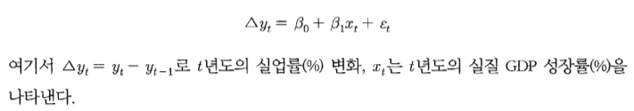
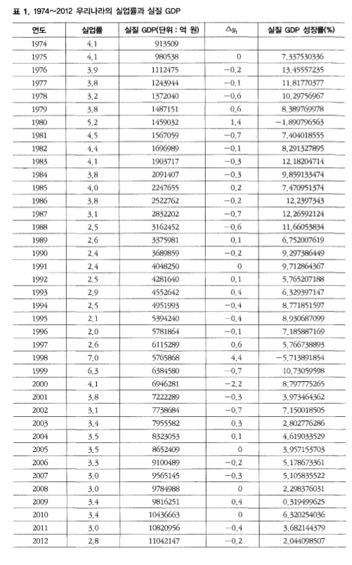
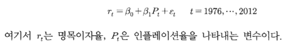
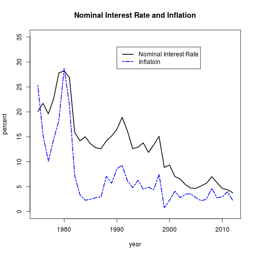

제 7장 회귀분석 - 사례분석
========================================================

* 텍스트 : 응용 계량경제학 - R 활용 / 박범조
* 발제자 : 김무성

--------------------------------------------------------

# 사례분석 1 - 오쿤의 법칙

 * 오쿤의 법칙(Okun's law)
   - 실업 = 노동력이 완전히 고용되지 않은 상태 = 생산 활동을 하지 않고 있는 상태
   - 실업의 증가 -> 생산의 감소 
   - 생산산출량 감소 -> 실엄 증가
   - 실업률과 산출량의 관계를 실증적으로 분석, 규명한 것이 '오쿤의 법칙'
   - 경제학자 오쿤(A.Okun)은 1947~1960년까지 미국 자료를 이용하여 회귀분석. 경제가 잠재성장률보다 실징성장률이 3% 증가할 때 실업률이 1% 감소하는 것을 발견.
 * 오쿤의 계수(Okun's coefficient)
   - 실업률 1% 상승할 때 감소하는 경제성장률의 정도
 

## 모형 (케이스스터디) 
 
  * 모형의 단순화를 위해 잠재성장률을 고려하지 않았다.
 





## 1. 우리나라의 경우에도 오쿤의 법칙이 성립하는가?

### 데이터 파악

```r
okun <- read.table('./Okun.txt', header=T, row.names=1)
str(okun)
```

```
## 'data.frame':	38 obs. of  2 variables:
##  $ dY           : num  0 -0.2 -0.1 -0.6 0.6 1.4 -0.7 -0.1 -0.3 -0.3 ...
##  $ real.GDP.rate: num  7.34 13.46 11.82 10.3 8.39 ...
```

```r
head(okun)
```

```
##        dY real.GDP.rate
## 1975  0.0         7.338
## 1976 -0.2        13.456
## 1977 -0.1        11.818
## 1978 -0.6        10.298
## 1979  0.6         8.390
## 1980  1.4        -1.891
```

### 회귀분석

```r
# gmm 패키지 실행
library(gmm)
```

```
## Loading required package: sandwich
```

```r
# 모델 식 정의
equation <- dY ~ real.GDP.rate
# 도구변수 정의
ist.variables <- ~real.GDP.rate
# GMM 추정 실행
gmm.res <- gmm(g=equation, x=ist.variables, data=okun)
# 결과 출력
summary(gmm.res)
```

```
## 
## Call:
## gmm(g = equation, x = ist.variables, data = okun)
## 
## 
## Method:  twoStep 
## 
## Kernel:  Quadratic Spectral
## 
## Coefficients:
##                Estimate   Std. Error  t value    Pr(>|t|) 
## (Intercept)     0.972847   0.494711    1.966494   0.049242
## real.GDP.rate  -0.146870   0.061408   -2.391692   0.016771
## 
## J-Test: degrees of freedom is 0 
##                 J-test                P-value             
## Test E(g)=0:    6.13978559821405e-29  *******
```

### 해석

 * 실질 경제성장률의 계수 beta_1의 추정치는 -0.14687
 * = 실질 GDP 성장률이 1% 증가하면 실업률이 0.14687% 감소함
 * p-value는 0.016771. 5% 유의수준.
 * 우리나라도 어느정도 오쿤의 법칙이 성립한다고 볼 수 있다.


## 2. 우리나라의 경우 오쿤의 계수는 얼마일까?
 * 오쿤의 계수 = 1% 상승할 때 감소하는 경제성장률 정도.
 * 오쿤의 계수 = 계수 추정치 Beta_1의 역수
 * 우리나라 오쿤의 계수 = 1/-0.14687 = -6.808742 
 * 즉, 실업률 1% 증가하면 실질 GDP 성장률 6.808742% 감소

--------------------------------------------------------

# 사례분석 2 - 피셔효과

  * 이자율은 명목이자율(nominal interest rate)과 실질이자율(real interest rate)로 구분.
  * 명목이자율 = 은행에서 저축하거나 채권을 사면 얻게 되는 이자의 원금에 대한 비율.
  * 실질이자율 = 명목이자율 - 예상 인플레이션율 
  * <=> 명목이자율 = 실질이자율 + 예상 인플레이션
  * 피셔효과
   - 명목이자율 = 실질이자율 + 예상 인플레이션율
   - 예상 인플레이션율에 대한 이자율의 조정현상(=명목이자율에 예상 인플레이션율이 반영된다)을 피셔효과라 한다.
  

## 모형 (케이스스터디)
 
  * 한국은행 경제통계 이스템 웹사이트와 통계청 사이트 등에서 자료 수집
  * 1975~2012년 회사채수익률과 인플레이션율, 소비자물가지수 
   - 단기 명목이자율 = 91일물 CD 시장(유통)수익률
   - 장기 명목이자율 = 회사채 수익률
   




## 데이터 확인


```r
fisher <- read.table('./Fisher.txt', header=T, row.names=1)
str(fisher)
```

```
## 'data.frame':	38 obs. of  2 variables:
##  $ corp.bond.rate: num  20.1 21.7 19.6 22.6 27.8 28.2 26.9 15.9 14.2 15 ...
##  $ inflation     : num  25.3 15.3 10.1 14.5 18.3 28.7 21.4 7.2 3.4 2.3 ...
```

```r
head(fisher)
```

```
##      corp.bond.rate inflation
## 1975           20.1      25.3
## 1976           21.7      15.3
## 1977           19.6      10.1
## 1978           22.6      14.5
## 1979           27.8      18.3
## 1980           28.2      28.7
```

```r
# 그림으로 확인하기
# 명목이자율
plot(rownames(fisher), fisher[,1], type="l", ylim=c(0,35), lwd=2, main="Nominal Interest Rate and Inflation", xlab = "year", ylab="percent")
# 인플레이션
lines(rownames(fisher), fisher[,2], lwd=2, col="blue", lty=6)
# 범례 입력
legend(1990, 33, col=c("black", "blue"), lwd=2, lty=c(1,6), legend=c("Nominal Interest Rate", "Inflatoin"))
```

 

 * 두 변수 사이에 밀접한 관계가 있어 보인다.


## 1. 최수제곱추정


```r
lm.fisher <- lm(corp.bond.rate ~ inflation, data=fisher)
summary(lm.fisher)
```

```
## 
## Call:
## lm(formula = corp.bond.rate ~ inflation, data = fisher)
## 
## Residuals:
##    Min     1Q Median     3Q    Max 
##  -8.42  -3.64   1.26   3.15   5.94 
## 
## Coefficients:
##             Estimate Std. Error t value Pr(>|t|)    
## (Intercept)   7.1113     0.9233    7.70  4.0e-09 ***
## inflation     0.8463     0.0963    8.79  1.7e-10 ***
## ---
## Signif. codes:  0 '***' 0.001 '**' 0.01 '*' 0.05 '.' 0.1 ' ' 1
## 
## Residual standard error: 3.9 on 36 degrees of freedom
## Multiple R-squared:  0.682,	Adjusted R-squared:  0.673 
## F-statistic: 77.3 on 1 and 36 DF,  p-value: 1.73e-10
```

## 2. 최우추정


```r
library(bbmle)
```

```
## Loading required package: stats4
```

```r
y <- fisher[,1]
x <- fisher[,2]
# 대수우도함수 정의(-lnL)
fn <- function(b0, b1, sigma) {
  -sum(dnorm(y, mean=b0+b1*x, sd=sigma, log=T))
}
#최우추정 실행
ML.fisher <- mle2(fn, start=list(b0=7, b1=0.8, sigma=1))
summary(ML.fisher)
```

```
## Maximum likelihood estimation
## 
## Call:
## mle2(minuslogl = fn, start = list(b0 = 7, b1 = 0.8, sigma = 1))
## 
## Coefficients:
##       Estimate Std. Error z value   Pr(z)    
## b0      7.1113     0.8987    7.91 2.5e-15 ***
## b1      0.8465     0.0937    9.03 < 2e-16 ***
## sigma   3.7955     0.4354    8.72 < 2e-16 ***
## ---
## Signif. codes:  0 '***' 0.001 '**' 0.01 '*' 0.05 '.' 0.1 ' ' 1
## 
## -2 log L: 209.2
```
