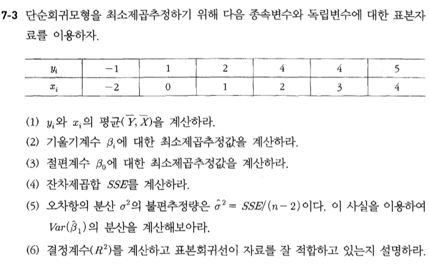
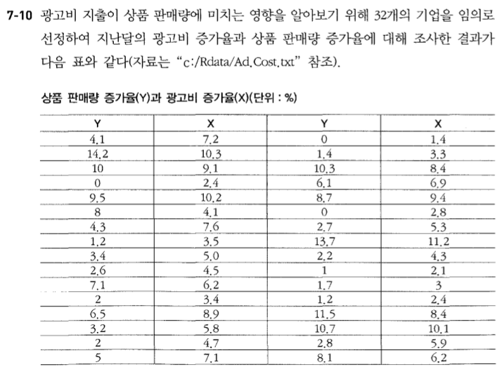
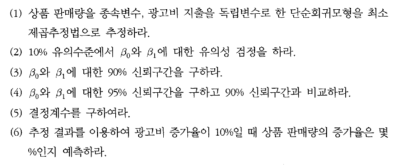
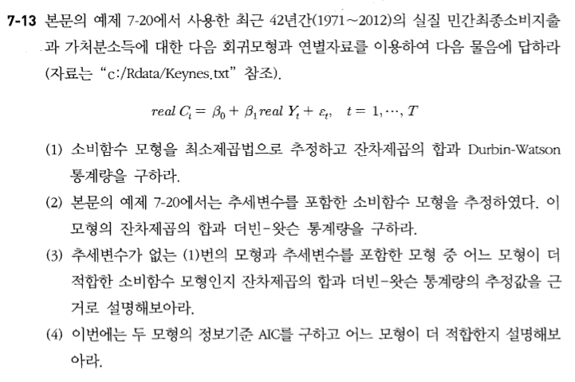
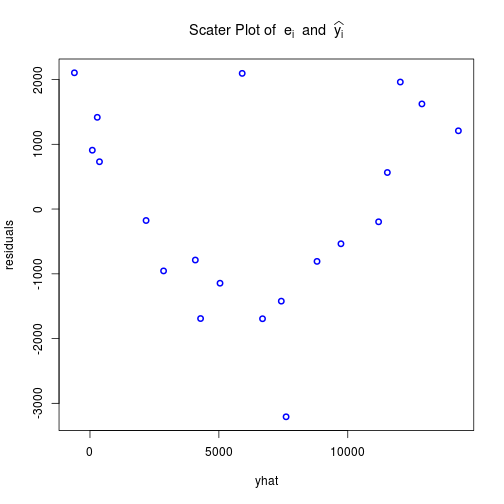

제 7장 회귀분석 연습문제
========================================================

* 텍스트 : 응용 계량경제학 - R 활용 / 박범조
* 발제자 : 김무성

--------------------------------------------------------

# 7-3




```r
y <- c(-1, 1, 2, 4, 4, 5)
x <- c(-2, 0, 1, 2, 3, 4)
lm(y~x)
```

```
## 
## Call:
## lm(formula = y ~ x)
## 
## Coefficients:
## (Intercept)            x  
##        1.13         1.03
```

```r
res <- lm(y~x)
summary(res)
```

```
## 
## Call:
## lm(formula = y ~ x)
## 
## Residuals:
##       1       2       3       4       5       6 
## -0.0714 -0.1286 -0.1571  0.8143 -0.2143 -0.2429 
## 
## Coefficients:
##             Estimate Std. Error t value Pr(>|t|)    
## (Intercept)   1.1286     0.2223    5.08  0.00710 ** 
## x             1.0286     0.0934   11.01  0.00039 ***
## ---
## Signif. codes:  0 '***' 0.001 '**' 0.01 '*' 0.05 '.' 0.1 ' ' 1
## 
## Residual standard error: 0.451 on 4 degrees of freedom
## Multiple R-squared:  0.968,	Adjusted R-squared:  0.96 
## F-statistic:  121 on 1 and 4 DF,  p-value: 0.000387
```

## (1)


```r
mean(y)
```

```
## [1] 2.5
```

```r
mean(x)
```

```
## [1] 1.333
```

## (2)


```r
res$coefficients[2]
```

```
##     x 
## 1.029
```

## (3)


```r
res$coefficients[1]
```

```
## (Intercept) 
##       1.129
```

## (4)


```r
res$residuals[4]
```

```
##      4 
## 0.8143
```

## (5)


```r
sse <- res$residuals[4]
sse
```

```
##      4 
## 0.8143
```

```r
n <- length(x)
n
```

```
## [1] 6
```

```r
sigma2 <- sse / (n - 2) 
sigma2
```

```
##      4 
## 0.2036
```

```r
var_b1 <- sigma2 / sum((x - mean(x))*(x - mean(x)))
var_b1
```

```
##        4 
## 0.008724
```

## (6)


```r
sse <- res$residuals[4]
sse
```

```
##      4 
## 0.8143
```

```r
sst <- sum((y - mean(y))*(y - mean(y)))
sst
```

```
## [1] 25.5
```

```r
r2 <- 1 - (sse / sst)
r2
```

```
##      4 
## 0.9681
```

---------------------------------


# 7-10





```r
ad <- read.table('./Ad.Cost.txt', header=T)
head(ad)
```

```
##      Y    X
## 1  4.1  7.2
## 2 14.2 10.3
## 3 10.0  9.1
## 4  0.0  2.4
## 5  9.5 10.2
## 6  8.0  4.1
```

```r
str(ad)
```

```
## 'data.frame':	32 obs. of  2 variables:
##  $ Y: num  4.1 14.2 10 0 9.5 8 4.3 1.2 3.4 2.6 ...
##  $ X: num  7.2 10.3 9.1 2.4 10.2 4.1 7.6 3.5 5 4.5 ...
```

```r
summary(ad)
```

```
##        Y               X        
##  Min.   : 0.00   Min.   : 1.40  
##  1st Qu.: 1.93   1st Qu.: 3.48  
##  Median : 3.75   Median : 5.85  
##  Mean   : 5.16   Mean   : 5.97  
##  3rd Qu.: 8.25   3rd Qu.: 8.40  
##  Max.   :14.20   Max.   :11.20
```

## (1)


```r
ad.res <- lm(Y~X, data=ad)
summary(ad.res)
```

```
## 
## Call:
## lm(formula = Y ~ X, data = ad)
## 
## Residuals:
##    Min     1Q Median     3Q    Max 
## -3.034 -1.342 -0.350  0.951  5.334 
## 
## Coefficients:
##             Estimate Std. Error t value Pr(>|t|)    
## (Intercept)   -2.801      0.817   -3.43   0.0018 ** 
## X              1.334      0.124   10.73  8.7e-12 ***
## ---
## Signif. codes:  0 '***' 0.001 '**' 0.01 '*' 0.05 '.' 0.1 ' ' 1
## 
## Residual standard error: 1.93 on 30 degrees of freedom
## Multiple R-squared:  0.793,	Adjusted R-squared:  0.786 
## F-statistic:  115 on 1 and 30 DF,  p-value: 8.73e-12
```

## (2)

* 절편계수의 경우 계산된 p-값이 0.1보다 작으므로 Ho : ßo =0 은 기각되아 βo는 유의성이 있다. 
* 기울기계수 역시 계산된 p-값이 0에 가까워 H1: ß1 =0 은 기각되며 β1 은 유의성이 있다.


## (3)


```r
confint(ad.res, level=0.9)
```

```
##                5 %   95 %
## (Intercept) -4.188 -1.415
## X            1.123  1.545
```

## (4)


```r
confint(ad.res, level=0.95)
```

```
##             2.5 % 97.5 %
## (Intercept) -4.47 -1.133
## X            1.08  1.588
```

## (5)

* 결정계수는 0.7932

## (6)


```r
names(ad.res$coefficients) <- c("results", "y") # 이건 꼼수.
b0 <- ad.res$coefficients[1]
b0
```

```
## results 
##  -2.801
```

```r
b1 <- ad.res$coefficients[2]
b1
```

```
##     y 
## 1.334
```

```r
x <- 10
x
```

```
## [1] 10
```

```r
y <- b0 + (b1 * x)
y
```

```
## results 
##   10.53
```


```r
# 또는 predict 함수 사용
predict(ad.res, data.frame(X = c(10)))
```

```
##     1 
## 10.53
```

---------------------------------

# 7-13



## (1)


```r
Key.df <- read.table(file='./Keynes.txt', header=T)
head(Key.df)
```

```
##   year    C    Y    CPI
## 1 1970 2067 2630  5.383
## 2 1971 2594 3211  6.110
## 3 1972 3100 3947  6.824
## 4 1973 3771 5070  7.043
## 5 1974 5416 7236  8.755
## 6 1975 7242 9600 10.966
```

```r
str(Key.df)
```

```
## 'data.frame':	42 obs. of  4 variables:
##  $ year: int  1970 1971 1972 1973 1974 1975 1976 1977 1978 1979 ...
##  $ C   : num  2067 2594 3100 3771 5416 ...
##  $ Y   : num  2630 3211 3947 5070 7236 ...
##  $ CPI : num  5.38 6.11 6.82 7.04 8.76 ...
```

```r
summary(Key.df)
```

```
##       year            C                Y                CPI        
##  Min.   :1970   Min.   :  2067   Min.   :   2630   Min.   :  5.38  
##  1st Qu.:1980   1st Qu.: 26073   1st Qu.:  37868   1st Qu.: 25.56  
##  Median :1990   Median :106996   Median : 189746   Median : 46.62  
##  Mean   :1990   Mean   :199535   Mean   : 323583   Mean   : 49.62  
##  3rd Qu.:2001   3rd Qu.:355786   3rd Qu.: 550307   3rd Qu.: 75.33  
##  Max.   :2011   Max.   :654858   Max.   :1076610   Max.   :104.00
```

```r
# 실질 자료로 변환
real.C <- (Key.df$C/Key.df$CPI*100)
head(real.C)
```

```
## [1] 38397 42453 45422 53541 61863 66042
```

```r
# 실질 자료로 변환
real.Y <- (Key.df$Y/Key.df$CPI*100)
head(real.Y)
```

```
## [1] 48848 52558 57841 71986 82653 87541
```

```r
# 최소제곱추정(추세변수미포함)
key.res <- lm(real.C ~ real.Y)
summary(key.res)
```

```
## 
## Call:
## lm(formula = real.C ~ real.Y)
## 
## Residuals:
##    Min     1Q Median     3Q    Max 
## -23972 -11005   3903   8887  29263 
## 
## Coefficients:
##             Estimate Std. Error t value Pr(>|t|)    
## (Intercept) 2.13e+03   3.61e+03    0.59     0.56    
## real.Y      6.14e-01   6.44e-03   95.23   <2e-16 ***
## ---
## Signif. codes:  0 '***' 0.001 '**' 0.01 '*' 0.05 '.' 0.1 ' ' 1
## 
## Residual standard error: 13500 on 40 degrees of freedom
## Multiple R-squared:  0.996,	Adjusted R-squared:  0.995 
## F-statistic: 9.07e+03 on 1 and 40 DF,  p-value: <2e-16
```

```r
# 계수 추정치 출력
coef(key.res)
```

```
## (Intercept)      real.Y 
##   2130.4710      0.6137
```

```r
# 잔차 제곱합(SSE)
resid(key.res)
```

```
##      1      2      3      4      5      6      7      8      9     10 
##   6286   8066   7792   7229   9004  10184   6290   3263   1228   3575 
##     11     12     13     14     15     16     17     18     19     20 
##   8805   9296   9104   5417   3618   3463  -5502 -15674 -23972 -17726 
##     21     22     23     24     25     26     27     28     29     30 
## -20864 -23845 -22732 -22255 -19753 -13491  -4380   1462 -12708   4188 
##     31     32     33     34     35     36     37     38     39     40 
##  15240  23919  29263  12951  -9956   5211  12158  11030   8915   5065 
##     41     42 
## -11354  -7810
```

```r
sum(resid(key.res)^2)
```

```
## [1] 7.241e+09
```

```r
# car 패키지 실행
library(car)
# 더비-왓슨 통계량 계산
dwt(key.res)
```

```
##  lag Autocorrelation D-W Statistic p-value
##    1          0.8104        0.3653       0
##  Alternative hypothesis: rho != 0
```

* 잔차제곱합은 6725024439, 
* 더빈-왓슨 통계랑은 0.4345898 이다.

## (2)


```r
t.sq <-(1:42)^2
t.sq
```

```
##  [1]    1    4    9   16   25   36   49   64   81  100  121  144  169  196
## [15]  225  256  289  324  361  400  441  484  529  576  625  676  729  784
## [29]  841  900  961 1024 1089 1156 1225 1296 1369 1444 1521 1600 1681 1764
```

```r
key.res.t <- lm(real.C ~ real.Y + t.sq)
summary(key.res.t)
```

```
## 
## Call:
## lm(formula = real.C ~ real.Y + t.sq)
## 
## Residuals:
##    Min     1Q Median     3Q    Max 
## -22731 -11686   3509   7329  32903 
## 
## Coefficients:
##             Estimate Std. Error t value Pr(>|t|)    
## (Intercept) 8.46e+03   5.08e+03    1.67    0.104    
## real.Y      5.43e-01   4.16e-02   13.06  8.1e-16 ***
## t.sq        4.31e+01   2.49e+01    1.73    0.092 .  
## ---
## Signif. codes:  0 '***' 0.001 '**' 0.01 '*' 0.05 '.' 0.1 ' ' 1
## 
## Residual standard error: 13100 on 39 degrees of freedom
## Multiple R-squared:  0.996,	Adjusted R-squared:  0.996 
## F-statistic: 4.76e+03 on 2 and 39 DF,  p-value: <2e-16
```

```r
coef(key.res.t)
```

```
## (Intercept)      real.Y        t.sq 
##   8464.8677      0.5427     43.0673
```

```r
sum(resid(key.res.t)^2)
```

```
## [1] 6.725e+09
```

```r
dwt(key.res.t)
```

```
##  lag Autocorrelation D-W Statistic p-value
##    1          0.7614        0.4346       0
##  Alternative hypothesis: rho != 0
```

## (3)

* 추세변수를 포함한 모형의 잔차제곱의 합(6725024439)이 추세변수가 없는 모형의 잔차제곱합(7240595246)보다 작으므로 추세변수를 포함한 모형이 자료를 더 잘 적합하고 있음을 의미한다. 또한 더빈-핫슨 통계량의 추정치도 추세변수를 포함하 면서 0.3653292에서 0.4345898로 2에 보다 가깝게 되어 필요한 변수의 누락으로 인해 발생되는 자기상관이 다소 완화됨을 알 수 있다. 결과적으로 추세변수를 포함한 모형 이 더 적합하다.

## (4)


```r
AIC(key.res)
```

```
## [1] 921.7
```

```r
AIC(key.res.t)
```

```
## [1] 920.6
```

* 추세변수를 포함한 모형의 AIC( =920. 631)가 추세변수를 포함하지 않은 모 형의 AIC(=921.7334)보다 작으므로 추세변수를 포함한 모형이 더 적합하다.

---------------------------------

# 7-14


## (1)


```r
Package <- read.table('./Delivery.txt', header=T)
head(Package)
```

```
##   Cost Weight Distance
## 1 2600    590       47
## 2 3900    320      145
## 3 8000    440      202
## 4 9200    660      160
## 5 4400     75      280
## 6 1500     70       80
```

```r
summary(Package)
```

```
##       Cost           Weight       Distance    
##  Min.   : 1000   Min.   : 30   Min.   : 45.0  
##  1st Qu.: 1975   1st Qu.:101   1st Qu.: 93.8  
##  Median : 4700   Median :425   Median :160.0  
##  Mean   : 6335   Mean   :390   Mean   :156.1  
##  3rd Qu.: 9650   3rd Qu.:628   3rd Qu.:216.8  
##  Max.   :15500   Max.   :810   Max.   :280.0
```

```r
p.res <- lm(Cost ~ Weight + Distance, data = Package)
summary(p.res)
```

```
## 
## Call:
## lm(formula = Cost ~ Weight + Distance, data = Package)
## 
## Residuals:
##    Min     1Q Median     3Q    Max 
##  -3207  -1002   -186   1261   2104 
## 
## Coefficients:
##             Estimate Std. Error t value Pr(>|t|)    
## (Intercept) -4704.76     946.10   -4.97  0.00012 ***
## Weight         12.00       1.37    8.77  1.0e-07 ***
## Distance       40.76       4.80    8.48  1.6e-07 ***
## ---
## Signif. codes:  0 '***' 0.001 '**' 0.01 '*' 0.05 '.' 0.1 ' ' 1
## 
## Residual standard error: 1580 on 17 degrees of freedom
## Multiple R-squared:  0.906,	Adjusted R-squared:  0.895 
## F-statistic: 82.3 on 2 and 17 DF,  p-value: 1.81e-09
```

## (2)
* 결정계수는 0.9064
* 조정된 결정계수는 0.8953

## (3)

* 검정통계량은 t17 = b2/ Sb = 40.758/4.804 = 8.484이며 계산된 p-값이 0에 가까우므로 결정규칙에 의해 페를 기각한다. 소포의 배달거리 변수는 통계적으로 유의성이 존재 한다.

## (4)

* H0 : 회귀식이 통계적으로 유의하지 않다. 
* H1 : 회귀식이 통계적으로 유의하다.
* 검정통계량은 F=82.28이며 계산된 p-값이 0에 가까우므로 결정규칙에 의해 페는 기각된다. 모든 독립변수의 모임이 소포의 배달비용에 유의성 있게 영향을 준다.

## (5)


```r
residuals <- resid(p.res)
yhat <- predict(p.res, interval="none")
plot(x=yhat, y=residuals, col="blue", lwd=2, main=expression(list("Scater Plot of"~~e[i]~~and~~widehat(y[i]))))
```

 

* 위의산포도를보면두변수사이에어떤함수관계가존재한다고판단할 수 있으므로 다중회귀모형에 대한 동분산 가정에 위배된다고 판단할 수 있다. 보다 정확한 판단을 위해서는 BPG 검정통계량을 계산해볼 펼요가 있다.
