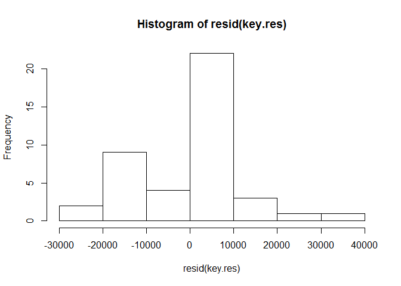
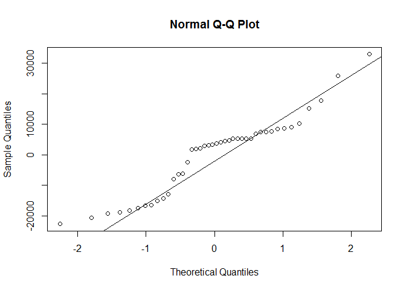
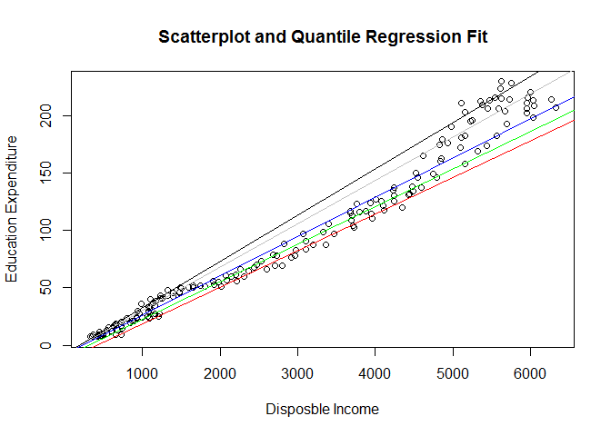
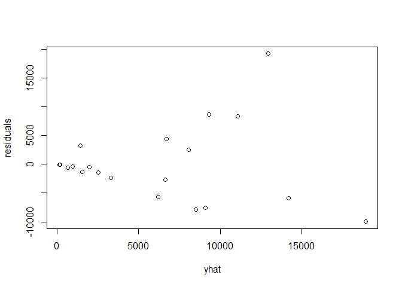
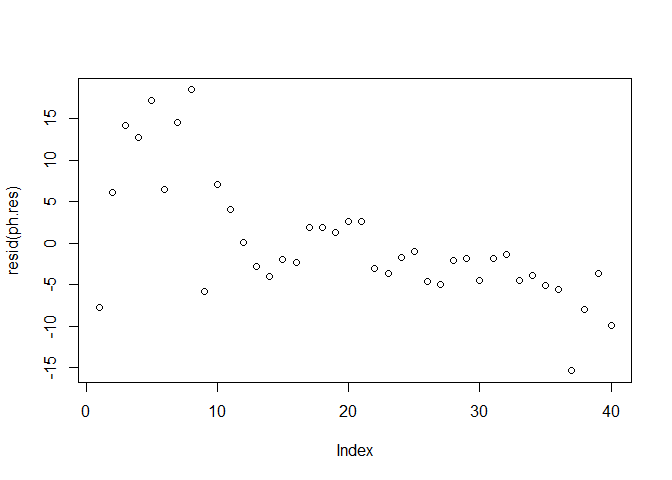

# ch8

# 제 8장 회귀분석을 위한 기본가정의 위배  
=========================================
## 제 1절. 오차항의 비정규분포  
  
최소제곱 추정량은오차항이 비정규분포를 갖는 경우에도 BLUE가 된다. **(Best Linear Unbiased Estimator)**
그러나 오차항이 비정규분포인 경우 회귀모수에 대한 유의성 검정이나 신뢰구간 추정이 유효하지 못하다.

***
### 1. 잔차의 정규성 탐지  
  
  
#### 1) 잔차의 히스토그램에 의한 탐지  


오차항이 정규분포한다면 잔차항의 히스토그램은 1.좌우대칭 2.종모양 3.봉우리는 하나 의 특징을 가진다.
**(오차항 : 모집단, 잔차항 : 표본)**  

*예제8-1*
*Question. 제7장의 예제 7-20에서는 최근 42년간(1971~2005)의 민간최종소비지출, 가처분소득, 소비자물가지수를 이용하여 추세변수가 포함된 케인즈의 소비함수를 추정하였다. 이 결과를 바탕으로 오차항이 정규분포하는지 여부를 잔차의 히스토그램을 통해 살펴보라.*

```r
key<-read.table("C:/psy/Rdata/Keynes.txt",header=T)
real.C<-(key$C/key$CPI*100)
real.Y<-(key$Y/key$CPI*100)
t.sq<-(1:42)^2
key.res<-lm(real.C ~ real.Y + t.sq)
hist(resid(key.res))            #잔차의 히스토그램
```

 

```r
#다른 밖의 방법 , Q-Q plot (정규성 확인, 점들이 직선에 모여있을수록 대상이 정규분포를 따른다.)  
qqnorm(resid(key.res))
qqline(resid(key.res))
```

 

#### 2) 자크-베라(Jarque-Bera)의 검정통계량  

히스토그램은 시각적으로 오차항의 분포형태를 쉽게 알 수 있으나 정확하게 판단할 수 없으므로 오차항의 정규분포 검정이 필요하다.  


왜도와 초과첨도의 추정량.  
$${sk}=\frac{\mu_3}{\sigma^3}$$
$${ek}=\frac{\mu_4}{\sigma^4}-3$$

$자크-베라의 검정통계량은 점근적으로\chi^2_2-분포를 따른다.$

$${LM}=n(\frac{sk^2}{6}+\frac{ek^2}{24})$$

 + 검정통계량 LM > 임계값 : 귀무가설기각(오차항은 정규분포를 따르지 않는다.)

 + 검정통계량 LM < 임계값 : 귀무가설채택(오차항은 정규분포를 따른다.)

*자크-베라 검정을 위한 R 함수 : jarque.bera.test (tseries 패키지)  

**표8-1** jarque.bera.test() 함수

형태|   |jaeque.bera.test(x)
----|---|----------------------------------
인수|x  |수치형 데이터 혹은 시계열 자료형태


**<그 밖의 함수들>**

*shapiro-wilk 정규성검정, 기본 내장함수, shapiro.test()*

*anderson-darling 정규성검정, nortest패키지 내장, ad.test()*


*예제8-2*
*Question. 이번에는 제7장의 예제 7-20에서 소개한 케인즈 소비함소의 회귀분석 결과를 바탕으로 오차항이 정규분포하는지 여부를 자크-베라 통계량을 이용하여 검증해보라.*


```r
#자크베라검정
library(tseries)
jarque.bera.test(resid(key.res))   #자크베라 검정
```

```
## 
## 	Jarque Bera Test
## 
## data:  resid(key.res)
## X-squared = 0.0721, df = 2, p-value = 0.9646
```

```r
qchisq(0.05,df=2,lower.tail=F)     # 5% 유의수준의 임계값
```

```
## [1] 5.991465
```
***
### 2. 오차항이 비정규분포를 갖는 경우의 추정방법

#### 1) 최우추정량

오차항이 비정규분포이면서 분포를 알 때 효율적인 추정량.


*예제8-3*
*Question. 1970년 1분기부터 2012년 3분기까지 우리나라의 분기별 1인당 교육비 지출(edu)과 1인당 처분가능소득(disp.inc)에 대한 회귀모형이 다음과 같을 때, 오차항이 다변량 t-분포를 따른다는 가정 하에 최우추정량을 이용하여 다음 모형을 추정해보고, 동일한 회귀모형을 최소제곱추정량을 이용하여 분석한 결과와 비교해보라

```r
Edu<-read.table("C:/psy/Rdata/Edu.txt",header=T,row.names=1)           
y<-Edu$edu                           #종속변수(edu)를 식별자 y에 할당
x<-Edu$disp.inc                      #독립변수(disp.inc)를 식별자 x에 할당
ls.print(com.ls.res<-lsfit(x,y))     #최소제곱추정결과 출력
```

```
## Residual Standard Error=12.2893
## R-Square=0.9695
## F-statistic (df=1, 169)=5378.706
## p-value=0
## 
##           Estimate Std.Err t-value Pr(>|t|)
## Intercept -12.9349  1.7305 -7.4745        0
## X           0.0366  0.0005 73.3397        0
```

```r
com.fn<-function(b0,b1){             #대수우도함수 입력(자유도14)
   -sum(dt(y-b0-b1*x,df=14,log=T))
}
library(bbmle)
```

```
## Loading required package: stats4
```

```r
summary(mle2(com.fn,start=list(b0=-12,b1=0.03)))  #최우추정 결과출력
```

```
## Maximum likelihood estimation
## 
## Call:
## mle2(minuslogl = com.fn, start = list(b0 = -12, b1 = 0.03))
## 
## Coefficients:
##       Estimate  Std. Error z value     Pr(z)    
## b0 -6.59183374  0.27795135 -23.716 < 2.2e-16 ***
## b1  0.03310117  0.00014995 220.744 < 2.2e-16 ***
## ---
## Signif. codes:  0 '***' 0.001 '**' 0.01 '*' 0.05 '.' 0.1 ' ' 1
## 
## -2 log L: 4265.502
```

#### 2) 로버스트 추정량

오차항이 두터운 꼬리분포를 가져 무한한 분산을 갖게 되면 최소제곱추정량이나 최우추정량 대신 **로버스트 추정량**을 사용한다. 오차항이 두터운 꼬리분포를 갖는 이유는 극단적인 이상치가 빈번히 관측되기 때문이다. 최소제곱추정량의 문제는 이상치에 높은 가중치를 주기 때문에 이상치의 영향을 많이 받는다는 것이다.  이런 경우에 최소제곱추정량은 더이상 불편추정량이 아니다. 이런 문제를 해결하기 위해 이상치에 작은 가중치를 부여하는 로버스트 추정량이 필요하다. 이를 위한 구체적인 방법은 **최소절대편차추정량**, **절사최소제곱추정량**, **M-추정량**등이 있고 최근에는 코엔커와 바셋의 **분위수회귀추정량**이 있다.

**<참고>**
*로버스트성(robustness) : 만약 어떤 추정량의 표본분포가 가정사항이 맞지 않는 것에 대한 영향을 심각하게 받지 않으면 그 추정량은* **로버스트** *하다고 한다.*


**M-추정량**


$${e}={y}-{X}{\beta}$$

최소제곱합이 잔차의 제곱합을 최소화하는 방법이라면 M-추정량은 목적함수의 합을 최소화하는 추정량을 구하는 것으로 정의된다.

$$\Sigma\rho(e)=\Sigma\rho(y-X\hat{\beta_M})$$


*예제 8-4*
*Question. 예제 8-3에서 소개한 우리나라의 분기별 1인당 교육비 지출(edu)과 1인당 처분가능소득(disp.inc)에 대한 회귀모형을 로버스트 M-추정량을 이용하여 추정해보자(목적함수는 Huber의 함수를 사용하도록 한다.)*


```r
library(MASS)
M.res<-rlm(edu~disp.inc,data=Edu,method="M",psi=psi.huber)  #M-추정 실행
summary(M.res)                                              #M-추정 결과 출력
```

```
## 
## Call: rlm(formula = edu ~ disp.inc, data = Edu, psi = psi.huber, method = "M")
## Residuals:
##      Min       1Q   Median       3Q      Max 
## -23.8051  -7.0322   0.9012   6.8134  40.2121 
## 
## Coefficients:
##             Value    Std. Error t value 
## (Intercept) -11.2630   1.6577    -6.7945
## disp.inc      0.0357   0.0005    74.6354
## 
## Residual standard error: 10.16 on 169 degrees of freedom
```

```r
pt(-6.7945,df=169)                                          #절편계수 추정치에 대한 P-값
```

```
## [1] 8.889691e-11
```

```r
pt(74.6374,df=169,lower.tail=F)                             #기울기계수 추정치에 대한 P-값
```

```
## [1] 1.326665e-131
```

#### 3) 분위수회귀추정량

회귀모형의 종속변수에 대한 기대치나 중앙값을 추정하는 기존 방법과는 다르게 다양한 분위수 값을 추정하여 종속변수분포의 특성을 알 수 있게 해주는 강점을 가진다.

*예제8-5*
*Question. 예제 8-3에서 소개한 우리나라의 분기별 1인당 교육비 지출(edu)과 1인당 처분가능소득(disp.inc)에  대한 회귀모형을 분위수회귀추정량을 이용하여 추정해보자(분석에 사용될 분위수는 0.1, 0.25, 0.5, 0.75, 0.9로 한다.)*

```r
library(quantreg)
```

```
## Loading required package: SparseM
## 
## Attaching package: 'SparseM'
## 
## The following object is masked from 'package:base':
## 
##     backsolve
```

```r
taus<-c(0.1,0.25,0.5,0.75,0.9)                 #분위수 벡터 생성
quant.res<-rq(edu~disp.inc,data=Edu,tau=taus)  #분위수회귀분석 실행
quant.res                                      #결과 반환
```

```
## Call:
## rq(formula = edu ~ disp.inc, tau = taus, data = Edu)
## 
## Coefficients:
##                tau= 0.10    tau= 0.25   tau= 0.50   tau= 0.75   tau= 0.90
## (Intercept) -13.15717176 -10.68634121 -8.10155804 -7.63907882 -7.82584656
## disp.inc      0.03185865   0.03280072  0.03426098  0.03782765  0.04036024
## 
## Degrees of freedom: 171 total; 169 residual
```

*예제 8-6*
*Question. 예제 8-3에서 소개한 우리나라의 분기별 1인당 교육비 지출(edu)과 1인당 처분가능소득(disp.inc)에 대한 산포도를 그려보고, 각 분위수에 대한 회귀직선을 그래프에 표시해보라.


```r
plot(x=Edu[,2],y=Edu[,1],xlab="Disposble Income",ylab="Education Expenditure",main="Scatterplot and Quantile Regression Fit")
for( i in 1:length(taus)){
  taus<-c(0.1,0.25,0.5,0.75,0.9)
  color<-c("red","green","blue","gray","black")
  abline(rq(edu~disp.inc,data=Edu,tau=taus[i]),col=color[i])
}
```

 

***

## 제 2절. 다중공선성

독립변수들 간의 상관관계가 심각하게 존재하느냐의 문제이다.


***

### 1. 다중공선성 탐지


#### 1) 상관계수, 결정계수, t-검정에 의한 판단

독립변수 간의 상관게수 추정값이 큰 경우 다중공선성의 존재 가능성을 의심할 수 있다.**(상관계수와 행렬산점도를 그려서 파악가능)**
또한 결정계수가 매우 커서 0.7이상 임에도 불구하고 t-검정을 수행했을 때 부분회귀계수가 통계적 유의성이 없는 경우 다중공선성이 존재할 확률이 매우 높다.

*예제 8-7*
*Question. 그릴리치 자료의 일부를 이용하여 유동성 자산을 포함한 소비함수 모형을 최소제곱추정량을 이용하여 추정해보고 다중공선성 존재 여부를 살펴보자. 이 자료는 1952년 1분기부터 1960년 4분기까지 미국의 소비지출(C),가처분소득(Y), 그리고 유동성 자산(L)에 대한 분기별 관측값들이며, 기준년도는 1954년, 단위는 1조 달러이다.

```r
Gr.df<-read.table("C:/psy/Rdata/Griliches.txt",header=T,row.names=1)
Gr.res<-lm(C~Y+L,data=Gr.df)
summary(Gr.res)
```

```
## 
## Call:
## lm(formula = C ~ Y + L, data = Gr.df)
## 
## Residuals:
##     Min      1Q  Median      3Q     Max 
## -3.3154 -1.2077  0.2768  1.0549  3.2510 
## 
## Coefficients:
##             Estimate Std. Error t value Pr(>|t|)    
## (Intercept) -13.3912     3.6079  -3.712 0.000757 ***
## Y             0.6326     0.0760   8.323  1.3e-09 ***
## L             0.4506     0.1062   4.245 0.000167 ***
## ---
## Signif. codes:  0 '***' 0.001 '**' 0.01 '*' 0.05 '.' 0.1 ' ' 1
## 
## Residual standard error: 1.737 on 33 degrees of freedom
## Multiple R-squared:  0.9951,	Adjusted R-squared:  0.9948 
## F-statistic:  3381 on 2 and 33 DF,  p-value: < 2.2e-16
```

```r
cor(Gr.df)  #상관계수 행렬
```

```
##           C         Y         L
## C 1.0000000 0.9962388 0.9924460
## Y 0.9962388 1.0000000 0.9883131
## L 0.9924460 0.9883131 1.0000000
```

#### 2) 분산팽창인자(VIF)

독립변수들의 상관행렬에 의하면 분산팽창인자는 계수의 완전한(다중공선성이 존재하지 않는 경우)분산에 대산 계수의 실제 분산 비율로 정의된다. 즉 분산팽창인자는

$$VIF(\hat{\beta_k})=\frac{1}{1-R_k^2}$$

$이다. 여기서 R_k^2은 k번째 독립변수를 종속변수로, 나머지 모든 독립변수들을 독립변수로 하는 회귀모형의 결정계수이다.$ 

$R_k^2의값이 1에 가까우면 분산팽창인자의 값은 커지게 되고 다중공선성이 존재할 가능성이 매우 높은 것으로 판단할 수 있다.$

**(일반적으로 VIF가 10 이상이면 다중공선성이 존재한다고 판단한다.)**

*예제8-8*
*Question. 예제8-7에서 소개한 그릴리치 등의 자료를 이용하여 분산팽창인자를 계산해보라.*


```r
library(HH)
```

```
## Loading required package: lattice
## Loading required package: grid
## Loading required package: latticeExtra
## Loading required package: RColorBrewer
## Loading required package: multcomp
## Loading required package: mvtnorm
## Loading required package: survival
## Loading required package: splines
## 
## Attaching package: 'survival'
## 
## The following object is masked from 'package:quantreg':
## 
##     untangle.specials
## 
## Loading required package: TH.data
## Loading required package: gridExtra
```

```r
vif(Gr.df[,c(2,3)])   #분산팽창인자 계산
```

```
##       Y       L 
## 43.0345 43.0345
```


***

### 2. 다중공선성의 해결방안

다중공선성이 존재하는 경우 가장 쉽게 문제를 해결하는 방법은 상관계수가 높은 독립변수 중 하나 혹은 일부를 회귀모형에서 제거하는 것이다. 그러면 나머지 독립변수의 유의성을 높여줄 수 있으나 필요한 변수의 누락으로 인한 모형설정의 오류 때문에 새로운 문제가 발생할 수 있다. 즉, 독립변수의 제거로 인해 최소제곱추정량이 더 이상 최우수선형불편 추정량(BLUE)이 되지 못할 수 있다. 따라서 경제이론에 근거하여 회귀모형에서 중요한 역할을 하는 변수라면 단순히 다중공선성의 문제로 변수를 제거하는 방법은 지양하는 것이 바람직하다. 이런 경우 다음 세 가지 방법을 고려해볼 수 있다.

 + 관측값을 늘려 표본크기를 증가시킨다.
 + 원자료에 대해 차분 혹은 로그변환을 하거나 명목변수는 실질변수를 사용한다.
 + 사전정보를 이용하여 변수를 상관관계가 높은 다른 변수로 대체한다.

***

### 3. 능선추정량

다중공선성의 문제를 해결하기 위한 통계적 기법으로 호얼과 케나드가 제안한 능선회귀방법이 있다.
$\beta의 능선추정량은 다음과 같이 정의된다.$
$$\hat{\beta_R}=(X'X+\lambda{I})^{-1}X'y$$

*예제8-9*
*Question. 예제 8-7에서 소개한 그릴리치 드으이 유동선 자산을 포함한 소비함수모형을 능선추정량을 이용하여 추정해보고, 최소제곱추정 결과와 비교해보라.*

```r
library(MASS)
select(lm.ridge(C~Y+L,Gr.df,lambda=seq(0.01,3,0.0001)))    #람다의 추정량 확인
```

```
## modified HKB estimator is 0 
## modified L-W estimator is 0 
## smallest value of GCV  at 0.1122
```

```r
ridge.res<-lm.ridge(C~Y+L,Gr.df,lambda=0.1122)             #능선추정(GCV 기준 값 사용)
lm(C~Y+L,Gr.df)                                            #최소제곱추정 결과 출력
```

```
## 
## Call:
## lm(formula = C ~ Y + L, data = Gr.df)
## 
## Coefficients:
## (Intercept)            Y            L  
##    -13.3912       0.6326       0.4506
```

```r
ridge.res                                                  #능선추정 결과 출력
```

```
##                       Y           L 
## -13.4984908   0.5992069   0.4951744
```

***

## 제3절. 이분산

오차항 입실론의 분산이 모든 엑스에 관계없이 동일하다는 기본가정인 등분산이 위배되었을 때 이분산이 존재한다고 한다. 자기상관이 시계열 자료에서 흔히 발생하는 것과는 달리 이분산은 횡단면자료에서 자주 발생하게된다.

$$Var(\epsilon_i)=E(\epsilon_i^2)=\sigma_i^2$$

이분산이 존재해도 최소제곱(OLS)추정량은 여전히 불편 추정량이고 일치 추정량이긴 하지만 최소분산을 갖지 못하여 소표본이나 대표본에서 더 이상 효율적 추정량이 아니다. 따라서 독립변수의 통계적 설명력이 떨어지고 추정결과를 이용하여 종속변수에 대한 예측을 할 경우 오류가 발생될 확률이 높아지게 된다. 또한 계수 추정값의 표준오차가 편의되어 t-검정통계량 및 신뢰구간등이 정확하게 계산되지 못한다.

***

### 1. 이분산 탐지

#### 1) $\epsilon_i와 \hat{y_i}의 산포도를 이용$

$이분산의 존재 여부를 판단할 수 있는 가장 쉬운 방법은  \epsilon_i와 \hat{y_i}$의 산포도를 그려보는 것이다.
등분산이 충족되면 잔차들 $e_i$는 일정한 범위 내에 동일하게 분포하게 되나 이분산이 존재하는 경우 잔차들의 퍼짐은 증가 혹은 감소 추세를 나타내게 된다.물론 잔차들의 퍼짐이 증가하다 감소하거나 혹은 감소하다 증가할 때도 이분산이 존재하게 된다. 따라서 잔차의 변동을 나타내주는 $e_i와 \hat{y_i}$의 산포도를 그려보고 이 두 변수 사이에 함수관계가 성립된다고 보이면 이분산이 존재할 가능성이 높다고 판단할 수도 있다.

*예제 8-10*
*Question. 홍보비에 대한 회귀분석을 수행하기 위해 20개 산업부문에 대한 2012년 홍보비(prom.cost)와 판매액(sales)에 대한 횡단면 자료를 얻었다고 가정하자. 회귀 모형을 다음과 같이 설정한 후 분석하여 결과를 도출해보고, 모형에 이분산이 존재하는지 여부를 $e_i 와 hat{y_i}의 산포도를 통해 살펴보라.*


$$prom.cost_i=\beta_0+\beta_1{sales_i}+\epsilon_i$$


```r
prom.df<-read.table("C:/psy/Rdata/Promotion.txt",header=T)    #자료 불러오기
prom.res<-lm(prom.cost~sales,data=prom.df)                    #회귀분석 수행
summary(prom.res)                                             #결과출력
```

```
## 
## Call:
## lm(formula = prom.cost ~ sales, data = prom.df)
## 
## Residuals:
##     Min      1Q  Median      3Q     Max 
## -9983.3 -3454.3  -523.3  2724.4 19229.1 
## 
## Coefficients:
##               Estimate Std. Error t value Pr(>|t|)   
## (Intercept) -527.82365 2528.21589  -0.209  0.83697   
## sales          0.09504    0.02823   3.366  0.00344 **
## ---
## Signif. codes:  0 '***' 0.001 '**' 0.01 '*' 0.05 '.' 0.1 ' ' 1
## 
## Residual standard error: 6885 on 18 degrees of freedom
## Multiple R-squared:  0.3863,	Adjusted R-squared:  0.3522 
## F-statistic: 11.33 on 1 and 18 DF,  p-value: 0.00344
```

```r
residuals<-resid(prom.res)                                    #잔차
yhat<-predict(prom.res,interval="none")                       #종속변수의 예측값
plot(x=yhat,y=residuals)                                      #산포도 생성
```

 


#### 2) Breausch-Pagan-Godfrey 검정통계량

$e_i와 hat{y_i}$의 산포도를 그려보면 이분산의 존재 여부를 쉽게 판단할 수 있으나 판단의 통계적 정확성이 보장되지 못하는 한계가 있다. 따라서 이분산 탐지를 위한 여러 가지 검정통계량 중에서 브로쉬-파간-가드프레이 검정통계량을 설명하고자 한다. 회귀모형 $y=X\beta+\epsilon$을 추정하여 얻은 잔차의 제곱 $e_i^2$을 종소변수로, X를 독립변수(절편항 포함)로 한 선형회귀모형


$$e_i^2=b_0+b_1{x_1i}+ ... +b_K{x_Ki}+\nu_i$$


을 다시 추정한다. 이 때 얻은 결정계서 $R^2$와 n의 곱에 의해 브로쉬-파간-가드프레이의 카이제곱 검정통계량(BPG)을 계산할 수 있다.

$$BPG=n{R^2}$$

**BPG 검정통계랑**이 $\chi_{K}^2$분포의 임계값을 초과하면 등분산을 가정하는 귀무가설은 기각된다.

 + 귀무가설 : 등분산이다
 + 대립가설 : 이분산이다

*예제 8-11*
*Question. 예제 8-10의 홍보비에 대한 회귀분석 결과를 이용하여 BPG 검정통계량을 계산하고 그 결과를 해석해보라.*


```r
library(lmtest)        #lmtest 패키지 실행
```

```
## Loading required package: zoo
## 
## Attaching package: 'zoo'
## 
## The following objects are masked from 'package:base':
## 
##     as.Date, as.Date.numeric
```

```r
bptest(prom.res)       #BPG 검정통계량 계산
```

```
## 
## 	studentized Breusch-Pagan test
## 
## data:  prom.res
## BP = 6.6618, df = 1, p-value = 0.00985
```


***

### 2. 화이트의 이분산-일치 추정량

이분산이 존재하고 표본의 크기가 n인경우 n개의 모수 $\sigma_i^2$(i=1,...,n)를 추정해야 각 계수의 분산을 추정할  수 있다. 하지만 $\sigma_i^2$를 추정할 수 없으며 OLS를 적용하여 계수의 분산을 추정하게 되면 잘못된 분산이 계산되어 계수에 대한 유의성 검정의 판단에 오류가 발생하게 된다.

등분산 가정이 만족되지 못하여 오차항 $\epsilon$의 공분산행렬이 다음과 같다고 하자.

$$E(\epsilon\epsilon')=\Omega$$


여기서 $\Omega$는 양의 정부호행렬(positive definite matrix)이다.

**양정치행렬**
*이차형식 x'Ax에서 0이아닌 모든 x에 대해서 x'Ax > 0 일때 A를 양정치 행렬이라고 한다.*

이분산이 존재하는 경우 OLS추정량 $\hat{\beta}$은 불편추정량으로 다음과 같다.

$$E(\hat{\beta}-\beta)=E[(X'X)^{-1}X'\epsilon]=E[(X'X)^{-1}X']E(\epsilon)=0$$

**불편추정량 : 추정량의 기대값이 모수와 일치하는 추정량 **

그러나 $\hat{\beta}$의 공분산 행렬은

$$E(\hat{\beta}-\beta)(\hat{\beta}-\beta)=E[(X'X)^{-1}(X'\epsilon\epsilon'{X})(X'X)^{-1}]=(X'X)^{-1}X'E(\epsilon\epsilon')X(X'X)^{-1}=(X'X)^{-1}X'\Omega{X}(X'X)^{-1}$$

이 된다. 따라서 $\hat{beta}$은 불편추정량이지만 효율적인 추정량이 아니다.
한편 $\sigma_i^2 ≠\sigma^2$ 이므로 OLS를 적용하여 계수의분산을 추정하게 되면 잘못된 분산이 계산되어 t-검정통계량 및 신뢰구간이 정확하게 계산되지 못한다. 하지만 화이트는 표본이 충분히 크다면 OLS를 이용해도 계수에 대한 유의성 검정을 정확하게 수행할 수 있는 공분산행렬에 대한 **이분산-일치추정량**을 제안했다. 즉, 이분산이 존재하는 경우 $\Omega$는 추정이 불가능하지만

$$\frac{1}{n}X'\Omega{X}=\frac{1}{n}\Sigma\simga_i^2{x_i}{x_i}' $$
은 추정이 가능하다. 이분산이 존재하는 경우에 OLS 추정을 적용하여 얻은 잔차항 $e_i$는 $\epsilon_i$의 일치추정량이고

$$plim=(\frac{1}{n}\Sigma\epsilon_i^2{x_i}{x_i}')=plim(\frac{1}{n}\Sigma\sigma_i^2{x_i}{x_i}')$$

이므로 $\sigma_i^2$대신 $\epsilon_i^2$를 이용하여 계수분산에대한 일치추정량을 구함으로써 OLS를 이용하여 추정 및 계수에 대한 유의성 검정을 수행할 수 있게 된다.

*예제 8-12*햇
*Question. 예제8-10 홍보비에 대한 회귀분석 결과를 이용하여 화이트가 제시한 $hat{\beta}$의 이분산 일치 공분산행렬을 계산해보라.


```r
library(sandwich)                           #sandwich 패키지실행
cov.mat<-vcovHC(prom.res,type="HC")         #베타 추정치의 공분산행렬
```

*예제8-13*
*Question. 예제8-12에서 계산한 회귀계수 $hat{\beta}$의 이분산 일치 공분산행렬을 이용하여 홍보비 회귀모형의 회귀계수에 대한 유의성을 검정해보라*


```r
coeftest(prom.res,vcov=cov.mat)      #회귀계수의 유의성 검정
```

```
## 
## t test of coefficients:
## 
##                Estimate  Std. Error t value Pr(>|t|)  
## (Intercept) -527.823647 1461.395550 -0.3612   0.7222  
## sales          0.095041    0.034707  2.7384   0.0135 *
## ---
## Signif. codes:  0 '***' 0.001 '**' 0.01 '*' 0.05 '.' 0.1 ' ' 1
```

### 3. 일반최소제곱(GLS)추정량

이분산이 존재하는 경우 OLS추정량은 불편추정량이지만 가장 효율적인 선형추정량이 아니므로 BLUE가 아니다.
하지만 오차항의 표준편차를 이용한 가중치를 구하여 변형한 회귀모형에 최소제곱법을 적용함으로써 BLUE를 구할 수 있는데 이를 **일반최소제곱(GLS)추정량**이라고 한다.

$$\hat{\beta_G}=({X^*}'X^*)^{-1}{X^*}'y^*=(X'\Omega^{-1}X)^{-1}X'\Omega^{-1}y$$

이를 GLS 추정량이라고 한다. 이는 다음 속성을 만족하게 되어 BLUE이다.
$$E(\hat{\beta_G})=\beta$$
$$E(\hat{\beta_G}-\beta)(\hat{\beta_G}-\beta)'=({X^*}'X^*)^{-1}=(X'\Omega^{-1}X)^{-1}$$

*예제 8-14*
*Question. 예제 8-10에서 소개한 2012년 홍보비와 판매액에 대한 횡단면 자료와 회귀모형을 GLS추정량을 이용하여 추정해보고 예제 8-10의 겨로가와 비교해보라(GLS추정량을 이용하여 분석을 수행하는 과정에서 이분산 구조를 결정하는 함수는 고정된 가중치를 부여하는 varFixed()를 사용한다.)*

```r
library(nlme)
prom.gls.res<-gls(model=prom.cost~sales,data=prom.df,weights=varFixed(~sales))  #GLS분석실행
prom.gls.res
```

```
## Generalized least squares fit by REML
##   Model: prom.cost ~ sales 
##   Data: prom.df 
##   Log-restricted-likelihood: -190.7332
## 
## Coefficients:
##   (Intercept)         sales 
## -770.63024390    0.09845959 
## 
## Variance function:
##  Structure: fixed weights
##  Formula: ~sales 
## Degrees of freedom: 20 total; 18 residual
## Residual standard error: 20.44673
```

***

## 제 4절. 자기상관

오차항이 서로 상관되지 않는다는(오차항이 서로독립) 가정이 위배되어

$$Cov(\epsilon_i,\epsilon_j)=E(\epsilon_i,\epsilon_j)≠0 (i≠j)$$

인 경우 **자기상관(autocorrelation)**이 서로 존재한다고 한다. 이런 자기상관은 시계열 자료가 가지는 관성 혹은 느린 조정과정, 거미줄 현상, 모형설정의 오류, 자기회귀 조건부 이분산(ARCH)효과 등에 의해서 발생하게 된다.

예를 들어, 종합주가지수(KOSPI) 수익률은 이자율 $I_i$, 경재성장률 $G_i$, 미국의 다우존스지수 수익률 $D_i$에 의해 결정된다고 가정하면 종합지수 수익률 회귀모형은

$$R_i=\beta_0+\beta_1{I_i}+\beta_2{G_i}+\beta_3{D_i}+\epsilon_i$$

에 의해 설정된다.여기서 오차항 $\epsilon_i$는 자기상관이 없다. 하지만 다우존스지수 수익률 변수를 누락하여 모형

$$R_i=\beta_0+\beta_1{I_i}+\beta_2{G_i}+\nu_i$$

을 설정하게 되면 이모형의 오차항 $\nu_i=\beta_3{D_i}+\epsilon_i$은 $D_i$변수와 함수 관계를 갖게 되면서 $D_i$변수의 자기상관으로 인해 $nu_i$에 자기상관이 발생하게 된다. 이와 같이 변수의 누락은 자기상관을 유발하게 된다. 자기상관이 존재하는 경우에도 이분한의 경우처럼 OLS추정량은 여전히 불편추정량이기는 하지만 최소분산을 갖지 못하여 소표본이나 대표본에서 더 이상 효율적 추정량이 아니다. 따라서 자기상관이 존재할 경우 독립변수의 통계적 설명력이 떨어지고 추정 결과를 이용하여 종속변수에 대한 예측을 할 경우 오류가 발생될 확률이 높아지게 된다. 또한 계수 추정값의 표준오차가 편의되어 t-검정통계량 및 신뢰구간 등이 정확하게 계산되지 못한다.

### 1. 자기상관의 탐지

#### 1) $e_i$와 i의 산포도를 이용

자기상관이 존재하는 경우에는 잔차 상호 간에 어떠한 함수관계가 존재하게 된다. 산점도가 구형인 경우 잔차들 간에 함수관계가 성립되지 않아 자기상관이 없다고 볼 수 있으나, 산점도에서 잔차들 간에 선형 혹은 비선형의 함수관계가 성립되는 경우에는 자기상관이 존재한다고 볼 수있다.

*예제8-15*
*Question. 필립스는 그의 1958년 논문에서 1861년부터 1957년까지 명목임금증가율과 실업률에 대한 영국의 자료를 이용하여 Phillips곡선을 도출하였으며, 실업률과 임금변화율 사이에 역의 관계가 존재한다는 사실을 실증적으로 보여주었다. 이 Phillips 곡선이 우리나라에도 성립되는지 알아보기위해 다음가 같은 회귀모형을 설정하고*

$$W_i=\beta_0+\beta_1{U_i}+\epsilon_i$$

*1972년부터 2011년까지의 우리나라 자료를 이용하여 회귀분석을 수행해보라. 그리고 잔차의 산포도를통해 위의 모형에 자기상관이 존재하는지 검토해보라.*


```r
ph.df<-read.table("C:/psy/Rdata/Phillips.txt",header=T,row.names=1)
ph.res<-lm(Wage.rate~Unem.rate,data=ph.df)           #회귀분석 수행
summary(ph.res)                                      #회귀분석 결과 출력
```

```
## 
## Call:
## lm(formula = Wage.rate ~ Unem.rate, data = ph.df)
## 
## Residuals:
##     Min      1Q  Median      3Q     Max 
## -15.406  -4.475  -1.914   2.586  18.500 
## 
## Coefficients:
##             Estimate Std. Error t value Pr(>|t|)   
## (Intercept)   15.159      4.376   3.464  0.00133 **
## Unem.rate     -1.255      1.163  -1.079  0.28760   
## ---
## Signif. codes:  0 '***' 0.001 '**' 0.01 '*' 0.05 '.' 0.1 ' ' 1
## 
## Residual standard error: 7.473 on 38 degrees of freedom
## Multiple R-squared:  0.0297,	Adjusted R-squared:  0.004167 
## F-statistic: 1.163 on 1 and 38 DF,  p-value: 0.2876
```

```r
plot(resid(ph.res))                                  #잔차의 산포도 출력
```

 

#### 2) 더빈-왓슨의 d 통계량

잔차의 산포도를 이용하는 경우보다 명확하게 자기상관의 존재 여부를 판단하기 위해 사용되는 일반적인 검정통계량으로 **더빈-왓슨의 d통계량**이 있다.

$$\frac{\Sigma(e_i-e_{i-1})^2}{\Sigma(e_i^2)}$$

d가 0이나 4에 가까울수록 잔차들은 매우 높은 자기상관을 갖게 됨을 알 수 있다. 

**<자기상관검정>**
1.가설설정= 귀무가설:자기상관이 없다. vs 대립가설:자기상관이 있다.
2.검정통계량$\frac{\Sigma(e_i-e_{i-1})^2}{\Sigma(e_i^2)}$
3.결정규칙= 검정통계량이 (4-$d_L$)보다 크거나 $d_L$보다 작으면 $H_0$기각 , 검정통계량이 $d_U$보다 크고(4-$d_U$)보다 작으면 $H_0$채택, 또한 검정통계량이 $d_L$과 $d_U$사이 혹은 (4-$d_U$)와 (4-$d_L$)사이에 놓이면 미결정이다.

*예제8-16*
*Question. 예제 8-15의 회귀분석 결과를 이용하여 더빈-왓슨의 d검정통계량을 구해복 자기상관 검정을 수행해보라.*

```r
library(car)
```

```
## 
## Attaching package: 'car'
## 
## The following objects are masked from 'package:HH':
## 
##     logit, vif
```

```r
dwt(ph.res)     #더빈-왓슨 검정
```

```
##  lag Autocorrelation D-W Statistic p-value
##    1       0.5895727     0.7458536       0
##  Alternative hypothesis: rho != 0
```

#### 3) 더빈의 h통계량 

독립변수가 오차항과 독립이라는 가정이 위배되어 더빈-왓슨의 d통계량이 정확하지 못하게 될 때, 자기상관의 존재에도 불구하고 자기상관이 없다는 귀무가설이 채택되는 문제가 발생할 수 있다. 이런 경우 표준정규분포를 이루는 **더빈의 h통계량**을 사용한다. 

$$h=\hat{\rho}\sqrt{\frac{n}{1-n{Var(\hat{\beta_1})}}}$$

여기서 $Var(\hat{\beta_1})$은 $\hat{\beta_1}$의 OLS 추정값의 추정된 분산이고 n은 표본크기이다.

*예제8-17*
*Question. 예제8-15에서 소개한 영국의 명목임금증가율과 실업률에 대한 회귀모횽에 시차종속변수를 독립변수로 포함하는 새로운 회귀모형이 다음과 같을 때, 5%유의수준에서 모형에 자기상관이 존재하는지 더빈의 h통계량을 이용하여 검정해보라

$$W_i=\beta_0+\beta_1{W_{t-1}}+\beta_2{U_i}+\epsilon_i$$

```r
attach(ph.df)
Wage.ratel<-c(NA,Wage.rate[1:(length(Wage.rate)-1)])        #시차변수생성
res<-lm(Wage.rate~Wage.ratel+Unem.rate)                     #회귀분석 실행
n<-length(resid(res))                                       #관측값의 수
rho.hat<-1-0.5*dwt(res)[[2]][1]                             #상관계수 추정치 계산
var.b1.hat<-summary(res)$coefficients[2,2]^2                #베타1의 분산 추정치 계산
h.stat<-rho.hat*sqrt(n/(1-n*var.b1.hat))                    #더빈의 h통계량 계산
detach(ph.df)
h.stat;qnorm(0.05,0,1,lower.tail=F)                         #h통계량과 임계값.
```

```
## [1] 0.5164383
```

```
## [1] 1.644854
```


***


### 2. 일반최소제곱(GLS)추정량

자기상관이 존재하면 이분산의 경우처럼 OLS추정량이 효율적인 추정량이 되지 못하며, 일반최소제곱(GLS)추정량이 BLUE가 된다. 따라서 자기상관이 존재할 경우 GLS추정량을 사용하는 것이 바람직하다. 비자기상관 가정이 만족되지 못하여 오차항 $\epsilon$이 일차자기상관을 갖는다고 가정하면 오차항의 공분산행렬은 다음과 같다.

$$E(\epsilon\epsilon')=\Omega=\sigma_v^2\Phi$$

오차항 $\epsilon$의 i번째 요소는

$$\epsilon_i=\rho\epsilon_{i-1}+\nu_i$$
이며 $\nu=(\nu_1,\nu_2,...\nu_n,)'$는 다음과 같은 특성을 갖는다

$$E(\nu)=0, E(\nu\nu')=\sigma_\nu^2{I}$$

*예제8-18*
*Question. 더빈-왓슨의 d통계량에 의한 자기상관 검정 결과 예제8-15에서 소개한 영국의 명목임금증가율과 실업률에 대한 회귀모형에 자기상관이 존재함을 알 수 있었다. 이번에는 예제8-15에서 소개했던 다음 회귀모형을 GLS추정량을 이용하여 추정해보라.

$$W_i=\beta_0+\beta_1{U_i}+\epsilon_i$$


```r
library(nlme)
ph.gls.res<-gls(model=Wage.rate~Unem.rate,data=ph.df,correlation=corARMA(p=1,q=1))
summary(ph.gls.res)
```

```
## Generalized least squares fit by REML
##   Model: Wage.rate ~ Unem.rate 
##   Data: ph.df 
##        AIC      BIC    logLik
##   253.4362 261.6242 -121.7181
## 
## Correlation Structure: ARMA(1,1)
##  Formula: ~1 
##  Parameter estimate(s):
##       Phi1     Theta1 
##  0.9171779 -0.4207589 
## 
## Coefficients:
##                 Value Std.Error   t-value p-value
## (Intercept) 18.711875  6.248182  2.994771  0.0048
## Unem.rate   -2.620433  1.001338 -2.616933  0.0127
## 
##  Correlation: 
##           (Intr)
## Unem.rate -0.595
## 
## Standardized residuals:
##         Min          Q1         Med          Q3         Max 
## -1.63184682 -0.29040081 -0.06913793  0.27939260  2.25254007 
## 
## Residual standard error: 8.940021 
## Degrees of freedom: 40 total; 38 residual
```


