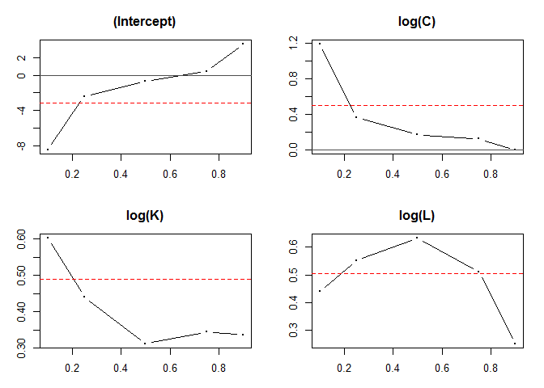

# 8장 사례분석
송치성  
Sunday, February 22, 2015  


<br><br><br><br><br>  

<div id="t1">IT 투자가 생산성에 미치는 효과 분석 : <br>
콥-더글러스 생산함수</div> 
<hr id="line">
<div id="goal_ex">
회귀모형의 분석 사례로 정보기술투자가 생산성에 미치는 효과에 대해 살펴보고,  <br>
이 경우 오차항의 정규분포가정과 동분산가정을 만족하는지 판단해보자.  
</div>

<br><br><br><br><br><br>

<div id="ex_block">
<div id="t2"> 0. 콥-더글러스 생산함수? </div>
정보기술투자가 생산성에 미치는 효과에 대한 분석은 주로 경제학의 생산 이론(production theory)에 근거한다. 생산이론은 과거 60년 이상 동안 기업의 다양한 투입물(자본, 노동, R&D 투자 등)의 생산성을 평가하기 위해 사용되어 왔으며 최근에는 기업의 정보기술(IT) 투자에 대한 생산성 평가를 위해 사용되기도 한다. 이런 생산이론은 기업의 생산물이 기업에 의해 사용되는 다양한 투입물들의 함수임을 가정하는 생산함수(production function) 접근법을 유도하였으며, IT 투자분석에 가장 일반적으로 사용하는 생산함수의 형태는 다음과 같은 <b>콥-더글러스 생산함수</b>이다. 
$$Q_i = A{C_i}^{\beta_1}{K_i}^{\beta_2}{L_i}^{\beta_3}$$
$$(Q_i=생산물, A=양의 상수, C_i=정보기술자본, K_i=비정보기술자본, L_i=노동변수)$$ 

i는 i번째 기업을 의미하고, $\beta$는 추정계수로 총생산에서 각 요소가 차지하는 상대적 분배 분을 의미한다. 즉, $\beta$는 그 요소에 대한 산출의 탄력성으로 간주 할 수 있다. 그리고 A의 크기는 생산량의 수준에 비례적으로 영향을 미치게 되므로 기술 상태를 나타내는 지표로 볼 수 있다. 
<br>
<ul>
<li>$\beta~1~+\beta~2~+\beta~3~>1$ : 규모에 대한 수익체증(increasing returns to scale)  
<li>$\beta~1~+\beta~2~+\beta~3~<1$ : 규모에 대한 수익체감(decreasing returns to scale)  
<li>$\beta~1~+\beta~2~+\beta~3~=1$ : 규모에 대한 수익불변(constant returns to scale)  
</ul>
<br>

 위 등식에 자연로그를 취하고 오차항을 첨부하면 다음과 같은 선형회귀식을 얻을 수 있다.
$$lnQ_i = lnA+{\beta_1}ln{C_i}+{\beta_2}ln{K_i}+{\beta_3}ln{L_i}+\epsilon_i$$
$$(Q_i=생산물, A=양의 상수, C_i=정보기술자본, K_i=비정보기술자본, L_i=노동변수)$$
이 회귀식의 계수에 대한 불편추정값(unbiased estimate)은 오차항이 설명변수와 무관하다는 가정하에 최소제곱추정량에 의해 구해질 수 있다. <br>
</div>

<br><br><br>

<div id="ex_block">
<div id="t2"> 1. 생산함수관련 자료와 회귀모형의 최소제곱추정 </div>
29개 상장기업에 대한 조사 결과 다음과 같은 자료를 얻었다고 가정하자. (자료는 /Rdata/CobbDouglas.txt) 데이터에 자연로그를 취한 후 콥-더글러스 생산함수를 이용하여 도출한 회귀식을 OLS에 의해 추정하는 명령문은 다음과 같다.


```r
cobdou<-read.table("CobbDouglas.txt", header=T)
cobdou #29개 상장기업에 대한 조사 결과
```

```
##            Q    C    K    L
## 1  2388.8490  282  742 3677
## 2  3000.0010 1000 1555 3877
## 3  2090.3460  625 1121 3048
## 4  1187.6170  759  555 1679
## 5  1472.2340  618 1486  214
## 6  2537.0000  945 1900 3198
## 7   927.0781  979 1505  896
## 8  1064.7020  598 1432 1247
## 9   561.2803  526 1895  234
## 10 2061.5270 1057 1150 2933
## 11  202.1950  206  588 3139
## 12  836.5169  882  616 1060
## 13 2283.7950  434 1171 3357
## 14 1285.9620  240  647 1873
## 15 1821.0770  706  760 2683
## 16  715.4850  429 1254  728
## 17 1730.7900  500 1148 4117
## 18 2260.7360  896 1008 3315
## 19 2171.5830  501 1410 3070
## 20  851.6138  403 1349  900
## 21 3277.1650  577 1549 4866
## 22 1897.9570  538 1231 2682
## 23  753.5403  323 1004  857
## 24 2234.9650  599 1779 3066
## 25  523.6145  851 1986  112
## 26 4066.8320  795  972 4711
## 27  744.6221  809  789  883
## 28  671.0359  511 1938  408
## 29 2310.6300  933  705 3499
```

```r
cobdou.res <- lm(data=cobdou, log(Q)~log(C)+log(K)+log(L))
summary(cobdou.res)
```

```
## 
## Call:
## lm(formula = log(Q) ~ log(C) + log(K) + log(L), data = cobdou)
## 
## Residuals:
##     Min      1Q  Median      3Q     Max 
## -1.4002 -0.1796 -0.0589  0.1386  0.9363 
## 
## Coefficients:
##             Estimate Std. Error t value Pr(>|t|)    
## (Intercept) -3.11788    2.06653  -1.509   0.1439    
## log(C)       0.49719    0.19454   2.556   0.0171 *  
## log(K)       0.49015    0.23376   2.097   0.0463 *  
## log(L)       0.50335    0.08717   5.774 5.11e-06 ***
## ---
## Signif. codes:  0 '***' 0.001 '**' 0.01 '*' 0.05 '.' 0.1 ' ' 1
## 
## Residual standard error: 0.4344 on 25 degrees of freedom
## Multiple R-squared:  0.6323,	Adjusted R-squared:  0.5881 
## F-statistic: 14.33 on 3 and 25 DF,  p-value: 1.236e-05
```

<div id="res">결과</div> 
<hr id="res">
추정 결과를 살펴보면 상수항을 제외한 모든 기울기 계수들의 P-값이 유의수준인 0.05보다 작기 때문에 계수가 유의성이 없다는 귀무가설은 기각된다. 따라서 이 회귀모형의 변수 lnC~i~(정보기술자본), lnK~i~(비정보기술자본), lnL~i~(노동)는 통계적으로 유의미하다. 한편 조정결정계수($\bar{R^2}=0.5881$)와 F-통계량의 추정치(14.33)에 의하면 회귀모형은 표본자료를 잘 적합하는 유의미한 모형임을 알 수 있다.

</div>


<br><br><br><br><br>
<div id="ex_block">
<div id="t2">2. 잔차의 비정규성과 분위수회귀(Quantile Regression) 추정</div>
우선 잔차의 정규성 여부를 살펴보기 위해 자크-베라(Jarque-Bera)의 검정통계량(LM통계량)을 계산해보자. R에서는 jarque.bera.test() 함수를 사용하여 자크-베라 검정통계량을 계산할 수 있으며, 이 함수는 'tseries'패키지에서 제공된다. 


```r
#install.packages("tseries")
library(tseries)
```

```
## Warning: package 'tseries' was built under R version 3.1.2
```

```r
jarque.bera.test(resid(cobdou.res)) #자크-베라 검정통계량 계산
```

```
## 
## 	Jarque Bera Test
## 
## data:  resid(cobdou.res)
## X-squared = 18.9904, df = 2, p-value = 7.521e-05
```

```r
qchisq(0.05, df=2, lower.tail=F) # 5%유의수준의 임계값
```

```
## [1] 5.991465
```

<div id="res">결과</div> 
<hr id="res">
자크-베라 검정통계량의 추정값은 18.9904.  
5% 유의수준의 임계값 X^2~(2,0.05)~ = 5.991465.  
따라서, 검정통계량의 추정값이 임계값보다 크므로 5%유의수준에서 콥-더글러스 생산함수 모형의 오차항이 정규분포하지 않는다는 통계적 결론을 내릴 수 있다.

<br><br>
 오차항이 이와 같이 정규분포하지 않는 경우에도 최소제곱추정량은 여전히 BLUE이지만 더 효율적인 비선형 불편추정량이 존재할 수 있다. 따라서 오차항이 비정규분포하는 경우에는 종속변수를 Box-Cox변형을 하여 오차항의 분포가 정규분포에 가까워지도록 하거나 비정규분포에 영향을 덜 받는(즉, 오차항이 비정규분포 할 경우에 최소제곱추정량보다 더 효율적인) 로버스트 추정량을 사용할 수 있다. 
<br>
(오차항이 정규분포X지만 오차항의 제곱이 BLUE함 ->트랜스폼해야함 -> 박스콕스를 써서 트랜스폼 -> 로버스틱하게 함)
<br><br><br>
이번 사례분석에서는 <b>분위수회귀추정량(Quantile Regression Estimator)</b>을 이용하여 위의 회귀모형을 분석하고자 한다. 분위수회귀추정량은 이상점이나 오차항 분포에 민감하게 반응하지 않는 로버스트성을 갖고 있으며, 회귀모형의 종속변수에 대한 기대치나 중앙값을 추정하는 기존의 방법들과는 다르게 다양한 분위수값을 추정하여 종속변수 분포의 특성을 알 수 있게 대주는 추가적인 장점으로 인해 경제이론과 관련된 회귀모형을 추정하기 위한 유용한 방법으로 주목받고 있다. R에서는 rq()함수를 사용하여 분위수회귀분석을 수행 할 수 있으며, 이 함수는 quantreg패키지가 설치 및 실행되어야 한다. 분위수회귀분석을 위한 명령문은 다음과 같다. 


```r
#install.packages("quantreg")
library(quantreg)
```

```
## Warning: package 'quantreg' was built under R version 3.1.2
```

```
## Loading required package: SparseM
```

```
## Warning: package 'SparseM' was built under R version 3.1.2
```

```
## 
## Attaching package: 'SparseM'
## 
## The following object is masked from 'package:base':
## 
##     backsolve
```

```r
taus <- c(0.1,0.25,0.5,0.75,0.9) #분위수 벡터 생성
quant.res <- rq(data=cobdou, tau=taus, log(Q)~log(C)+log(K)+log(L))
quant.res
```

```
## Call:
## rq(formula = log(Q) ~ log(C) + log(K) + log(L), tau = taus, data = cobdou)
## 
## Coefficients:
##              tau= 0.10  tau= 0.25  tau= 0.50 tau= 0.75    tau= 0.90
## (Intercept) -8.4355216 -2.4059476 -0.6846414 0.4157914  3.504471727
## log(C)       1.1908999  0.3635126  0.1655239 0.1217131 -0.002995528
## log(K)       0.6029378  0.4402323  0.3115538 0.3442197  0.336704278
## log(L)       0.4415261  0.5515429  0.6326316 0.5107293  0.251600079
## 
## Degrees of freedom: 29 total; 25 residual
```

```r
plot.rqs(quant.res) #계수 추정치에 대한 그래프 출력
```

 
<div id="res">결과</div> 
<hr id="res">
 위의 분위수회귀 추정 결과를 살펴보면 0.10~0.75 분위수에서 정보기술자본(lnC~i~)의 한 단위 증가는 기업의 생산량에 정(+)의 영향을 주며, 0.9 분위수에서는 오히려 부(-)의 영향을 주는 것으로 나타났다. 또한 분위수가 작아질수록 계수추정치가 커지는 것을 볼 수 있는데, 이는 정보기술자본의 증가가 생산 규모가 큰 기업보다 생산규모가 작은 기업의 생산량증가에 더 큰 영향을 미침을 의미한다.

</div>


<br><br><br><br><br>
<div id="ex_block">
<div id="t2">3. 이분산 검정과 화이트(White) 이분산-일치추정</div>

횡단면자료를 사용하는 생산함수 모형의 경우 자본과 노동 등 투입물의 증가에 따른 생산물의 변화의 정도는 기업마다 다양하게 나타나며, 우리는 앞서 분위수회귀추정을 통해 이를 명확하게 판단할 수 있었다. 이러한 경우 회귀모형의 기본 가정인 동분산 가정이 위배될 가능성이 높다. 따라서 이 모형에 이분산이 존재하는 지를 알아보기 위해 브로쉬-파간-가드프레이(BPG) 검정통계량을 계산해볼 필요가 있다. BPG 검정통계량은 다음과 같은 명령문을 통해 계산할 수 있다.


```r
#install.packages("lmtest")
library(lmtest) #bptest() 함수 사용을 위한 lmtest패키지 실행
```

```
## Warning: package 'lmtest' was built under R version 3.1.2
```

```
## Loading required package: zoo
```

```
## Warning: package 'zoo' was built under R version 3.1.2
```

```
## 
## Attaching package: 'zoo'
## 
## The following objects are masked from 'package:base':
## 
##     as.Date, as.Date.numeric
```

```r
bptest(cobdou.res) # BPG 검정통계량 계산(cobdou.res는 회귀분석 결과임)
```

```
## 
## 	studentized Breusch-Pagan test
## 
## data:  cobdou.res
## BP = 9.0736, df = 3, p-value = 0.02833
```
<div id="res">결과</div> 
<hr id="res">
BPG 검정통계량의 추정값은 9.0736이며, 계산된 P-값은 0.02833으로 5% 유의수준에서 이분산이 존재하지 않는다는 귀무가설은 기각된다. 따라서 생산함수 회귀모형에 이분산이 존재한다는 통계적 결론을 내릴 수 있다.


<br><br><br>
OLS를 적용하여 계수의 분산을 추정하게 되면 잘못된 분산이 계산되어 계수에 대한 유의성 검정의 판단에 오류가 발생하므로 화이트(White) 이분산-일치추정량에 의해 표준오차를 계산해볼 필요가 있다. 화이트 이분산-일치추정은 다음과 같은 명령문을 이용하여 수행할 수 있다.

```r
#install.packages("sandwich")
library(sandwich) 
```

```
## Warning: package 'sandwich' was built under R version 3.1.2
```

```r
cov.mat <- vcovHC(cobdou.res, type="HC") #이분산-일치 공분산행렬 추정
cov.mat
```

```
##             (Intercept)       log(C)        log(K)        log(L)
## (Intercept)   8.6676250 -0.782202813 -0.4853180543 -0.0135093991
## log(C)       -0.7822028  0.081409679  0.0400387356 -0.0044198926
## log(K)       -0.4853181  0.040038736  0.0319643475 -0.0004899066
## log(L)       -0.0135094 -0.004419893 -0.0004899066  0.0059471347
```

```r
coeftest(cobdou.res, vcov=cov.mat) # 회귀계수의 유의성 검정
```

```
## 
## t test of coefficients:
## 
##              Estimate Std. Error t value  Pr(>|t|)    
## (Intercept) -3.117882   2.944083 -1.0590   0.29971    
## log(C)       0.497194   0.285324  1.7426   0.09370 .  
## log(K)       0.490146   0.178786  2.7415   0.01113 *  
## log(L)       0.503346   0.077118  6.5270 7.757e-07 ***
## ---
## Signif. codes:  0 '***' 0.001 '**' 0.01 '*' 0.05 '.' 0.1 ' ' 1
```
<div id="res">결과</div> 
<hr id="res">
추정 결과 5% 유의수준에서 lnK~i~(비정보기술자본)과 lnL~i~(노동) 변수가 통계적으로 유의미하며 10% 유의수준에서 lnC~i~(정보기술자본) 변수가 통계적으로 유의미하다.


<br><br><br><br><br>
<div id="ex_block">
<div id="t2">4. 일반최소제곱(GLS) 추정 </div>
 이번에는 이분산 문제를 해결하기 위해 화이트 이분산-일치추정량 대신 GLS 추정량을 이용하여 생산함수 회귀모형을 추정해보자. 물론 GLS추정량을 이용하기 위해서는 오차항의 공분산 행렬 $\Omega$ 혹은 $\Omega^{-1}$의 분할행렬 P를 알아야 하지만 오차항의 분산 ${\sigma_i}^2$이 독립변수에 의해 영향을 받는다고 가정하여 추정한다. 어떤 독립변수가 ${\sigma_i}^2$에 영향을 미치는지 개략적으로 알아보기 위해 잔차제곱과 각 독립변수의 산포도를 그려보면 잔차제곱은 lnL~i~변수와 함수적 관계를 갖는 것처럼 보인다. 따라서 분산 공변량의 인수로 lnL~i~변수를 고려한다. 오차항의 이분산 구조를 결정하는 옵션 함수는 제곱(power) 구조의 함수인 verPower()를 사용했으며, 값은 nlme 패키지의 예에서 사용된 0.2를 그대로 사용했다. GLS 추정을 위한 명령문의 형태는 다음과 같다.

```r
library(nlme)
cobdou.gls.res <- gls(data=cobdou, model=log(Q)~log(C)+log(K)+log(L), weights=varPower(0.2,~log(L))) #GLS 추정
summary(cobdou.gls.res) #결과 추정
```

```
## Generalized least squares fit by REML
##   Model: log(Q) ~ log(C) + log(K) + log(L) 
##   Data: cobdou 
##       AIC      BIC    logLik
##   50.8817 58.19496 -19.44085
## 
## Variance function:
##  Structure: Power of variance covariate
##  Formula: ~log(L) 
##  Parameter estimates:
##       power 
## -0.07949232 
## 
## Coefficients:
##                  Value Std.Error   t-value p-value
## (Intercept) -3.1606163 2.0581930 -1.535627  0.1372
## log(C)       0.4991939 0.1941339  2.571389  0.0165
## log(K)       0.4916921 0.2334308  2.106371  0.0454
## log(L)       0.5059042 0.0880061  5.748513  0.0000
## 
##  Correlation: 
##        (Intr) log(C) log(K)
## log(C) -0.372              
## log(K) -0.754 -0.256       
## log(L) -0.547 -0.079  0.348
## 
## Standardized residuals:
##        Min         Q1        Med         Q3        Max 
## -3.2432201 -0.4084364 -0.1415903  0.3189931  2.1132976 
## 
## Residual standard error: 0.5089934 
## Degrees of freedom: 29 total; 25 residual
```

<div id="res">결과</div> 
<hr id="res">GLS 추정 결과 5% 유의수준에서 모든변수 lnC~i~(정보기술자본), lnK~i~(비정보기술자본), lnL~i~(노동)가 통계적으로 유의미하다.
<br>
GLS추정 결과를 OLS추정 결과와 비교해보면 이분산성이 제거되면서 표준오차 값이 줄어들고 t-통계량이 커지면서 변수의 유의성이 다소 향상되는 것을 알 수 있다. 이런 결과는 이분산이 존재하는 경우 OLS추정량이 더 이상 가장 효율적인 추정량이 아님을 의미한다.

<br><br><br>
<b>cf) OLS & GLS의 차이점!</b>
OLS - 최소제곱법. 실제 관찰된 값와 추정에 의해 예상된 값의 차이의 제곱을 최소화시키며 선형회귀분석하는 방법.결과값(종속변수)에서 나타나는 에러들을 최소화 시키는 방법이기 때문에 독립변수에는 에러가 발생하지 않거나 무시할만한 수준의 에러가 존재한다고 가정. 자료들 간의 분산이 동일한 경우에 적용할 수 있는 방법.
GLS - OLS와 마찬가지로 선형회귀분석에서 모르는 변수를 추정하는 분석기법. 자료들의 분산이 동일하지 않을 때(이분산성이 존재하는 경우), 또는 자료들 간에 상관관계가 존재할 때 사용. 이러한 상황에서는 OLS보다 GLS가 더 효율적이고 정확한 추정을 제공.
차이점 - 일반적으로 자료들 간의 분산이 동일하지 않은 상태가 일반적인 상황이다. 따라서 동분산성이 존재하는 특수한 상황에서는 OLS를 적용하므로 OLS가 GLS의 특수한 형태로 볼 수 있다. 따라서 OLS를 적용하는 경우 해당 자료에는 동분산성이 존재한다는 가정이 내재되어 있다. OLS는 자료들 간에 상관관계가 존재하지 않는 경우에, GLS는 상관관계가 존재하는 경우에 적용한다. OLS에서는 독립변수의 계수를 가중치 없이 최소제곱법으로 분석하고, GLS에서는 correlated된 자료들 간의 상관계수에 따라 가중치를 부여하여 분석한다.
</div>


<br><br><br><br><br>
<div id="res">사례분석 최종 결론</div> 
<hr id="res">
GLS 추정 결과 5% 유의수준에서 모든변수 lnC~i~(정보기술자본), lnK~i~(비정보기술자본), lnL~i~(노동)가 통계적으로 유의미하며, 콥-더글러스 생산함수에서 계수 추정치의 합이 1보다 크므로 규모에 대한 수익체증(increasing returns to scale)이 존재한다고 할 수 있다. 또한 GLS 추정에 의하면 기업들의 정보기술 투자는 생산성을 향상시키는 것으로 나타난다.
