# Tiemseries_R
Sangyeol_lee  


```r
AR.ts <- scan(file="AR.ex.txt")
plot(AR.ts,type="l")
```

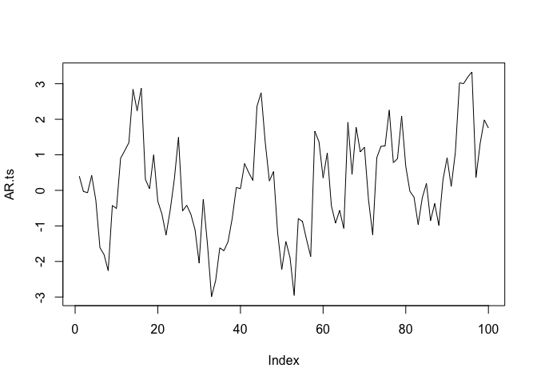 

```r
acf(AR.ts)
```

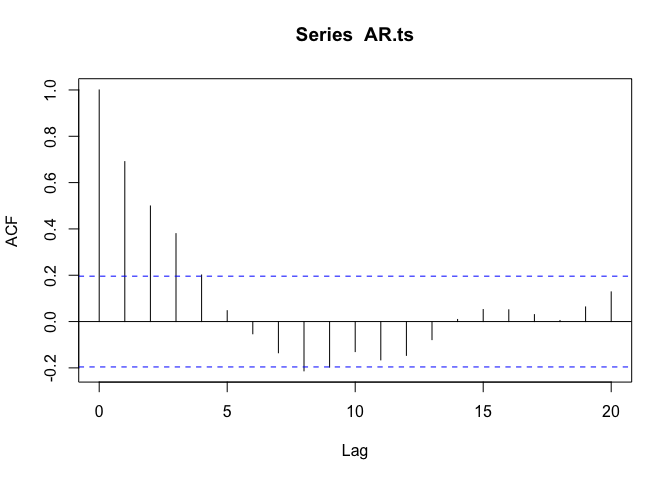 


```r
imp.df <- read.table("Import.txt",header=T, row.names="year")
imp.ts <- ts(imp.df,start=1965)
plot(imp.ts)
```

 

```r
acf(imp.ts)
```

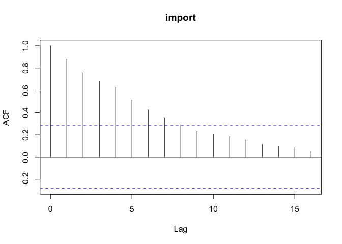 


```r
set.seed(123)
w.noise<-arima.sim(model=list(order=c(0,0,0)), n=200)
plot(w.noise)
```

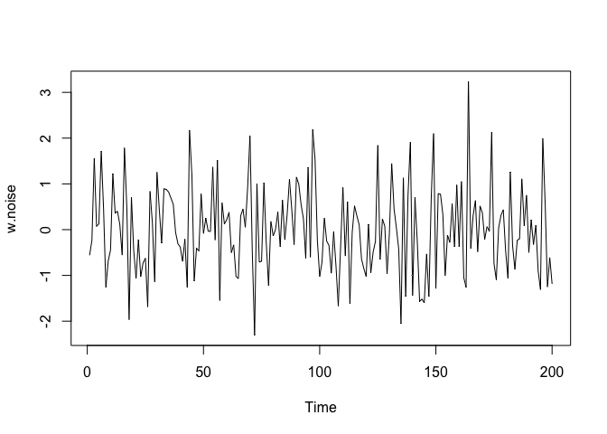 


```r
set.seed(123)
r.walk<-rnorm(100,mean=0.5,sd=sqrt(2))
plot(cumsum(r.walk),type="l")
```

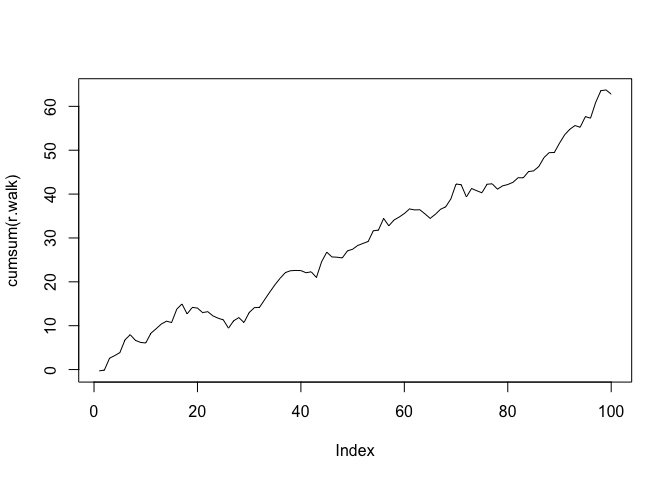 


```r
set.seed(123)
MA2 <- arima.sim(model=list(ma=c(0.6,0.3)),n=200)
plot(MA2)
```

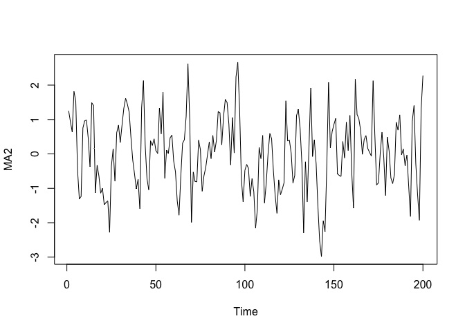 


```r
set.seed(123)
MA3 <- arima.sim(model=list(ma=c(0.5,0.2,0.1)),n=10^4)
arima(MA3,order=c(0,0,3),include.mean=F)
```

```
## 
## Call:
## arima(x = MA3, order = c(0, 0, 3), include.mean = F)
## 
## Coefficients:
##          ma1     ma2     ma3
##       0.4845  0.1959  0.0973
## s.e.  0.0100  0.0109  0.0099
## 
## sigma^2 estimated as 0.9973:  log likelihood = -14176.2,  aic = 28360.4
```


```r
set.seed(123)
AR2<-arima.sim(model=list(ar=c(1,-0.5)),n=200)
plot(AR2)
```

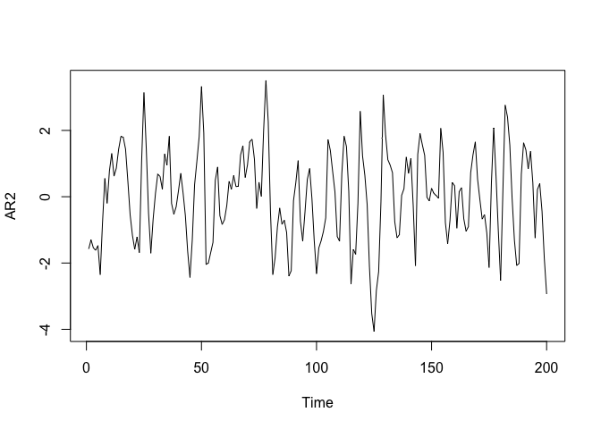 


```r
set.seed(123)
AR1<-arima.sim(model=list(ar=c(0.9)),n=10^4)
arima(AR1,order=c(1,0,0),include.mean=F)
```

```
## 
## Call:
## arima(x = AR1, order = c(1, 0, 0), include.mean = F)
## 
## Coefficients:
##          ar1
##       0.8949
## s.e.  0.0045
## 
## sigma^2 estimated as 0.9982:  log likelihood = -14181.27,  aic = 28366.55
```


```r
set.seed(123)
ARMA11 <-arima.sim(model=list(ar=0.5,ma=0.4),n=200)
plot(ARMA11)
```

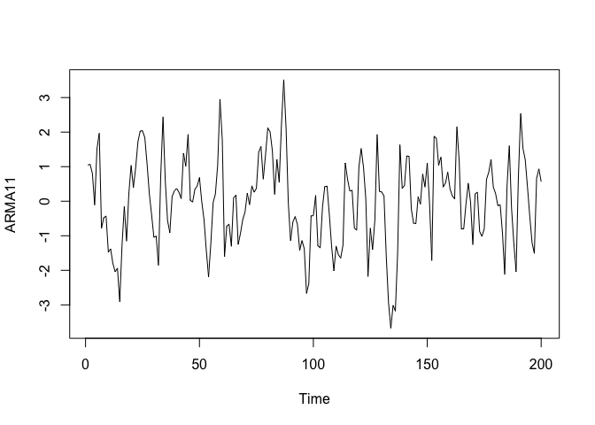 


```r
set.seed(123)
ARMA11 <-arima.sim(model=list(ar=0.6,ma=-0.3),n=10^4)
arima(ARMA11,order=c(1,0,1),include.mean=F)
```

```
## 
## Call:
## arima(x = ARMA11, order = c(1, 0, 1), include.mean = F)
## 
## Coefficients:
##          ar1      ma1
##       0.6114  -0.3262
## s.e.  0.0218   0.0260
## 
## sigma^2 estimated as 0.9975:  log likelihood = -14176.69,  aic = 28359.38
```


```r
set.seed(123)
first.AR1<-arima.sim(model=list(ar=0.7),n=100)
acf(first.AR1,lag.max=20)
```

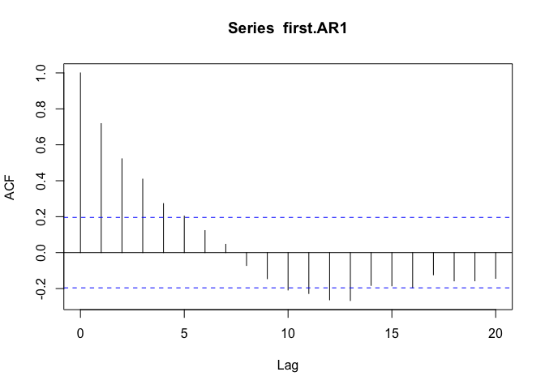 

```r
acf(first.AR1,lag.max=20,type="partial")
```

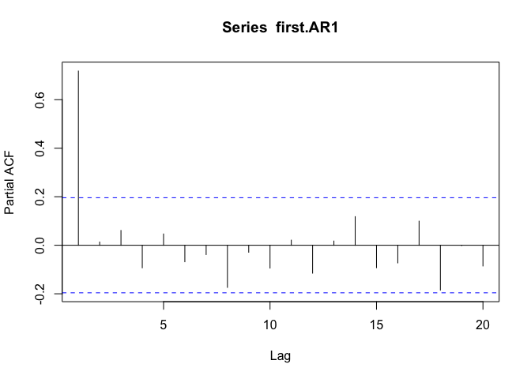 

```r
second.AR1<-arima.sim(model=list(ar=-0.7),n=100)
acf(second.AR1,lag.max=20)
```

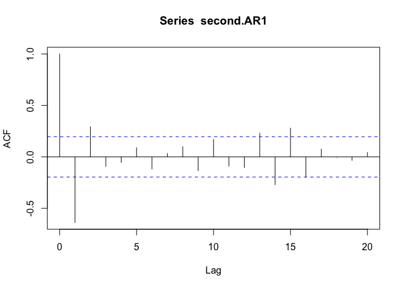 

```r
acf(second.AR1,lag.max=20,type="partial")
```

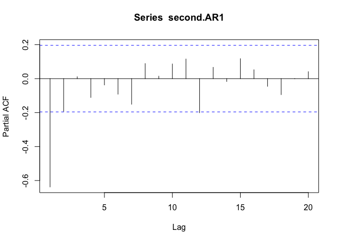 


```r
kospi<-read.table(file="KOSPI.txt",row.names=1)
kospi.ts<-ts(kospi,start=c(1999,12),frequency=12)
returns<-log(kospi.ts/lag(kospi.ts,k=-1))
plot(kospi.ts)
```

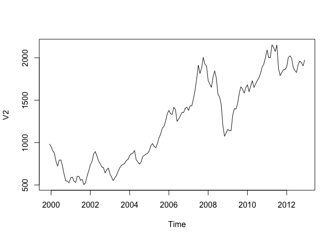 

```r
M<-c(5,10,15)
for(i in 1:length(M)){
 print(Box.test(returns,lag=M[i],type="Ljung-Box")) 
}
```

```
## 
## 	Box-Ljung test
## 
## data:  returns
## X-squared = 18.5819, df = 5, p-value = 0.002299
## 
## 
## 	Box-Ljung test
## 
## data:  returns
## X-squared = 21.1009, df = 10, p-value = 0.0204
## 
## 
## 	Box-Ljung test
## 
## data:  returns
## X-squared = 30.2856, df = 15, p-value = 0.01093
```


```r
trade<-read.table("Property.txt", header=T, row.names=1)
tde.ts<-ts(trade,start=1973)
library(TTR)
```

```
## Warning: package 'TTR' was built under R version 3.1.2
```

```
## Loading required package: xts
```

```
## Warning: package 'xts' was built under R version 3.1.2
```

```
## Loading required package: zoo
```

```
## Warning: package 'zoo' was built under R version 3.1.3
```

```
## 
## Attaching package: 'zoo'
## 
## The following objects are masked from 'package:base':
## 
##     as.Date, as.Date.numeric
```

```r
plot(tde.ts,lwd=2,main="Moving Average")
lines(SMA(tde.ts,n=3),lwd=2,lty=2,col="blue")
lines(SMA(tde.ts,n=6),lwd=2,lty=6,col="red")
legend(1975,170,legend=c("original","3P","6P"),lty=c(1,2,6),col=c("black","blue","red"),lwd=2)
```

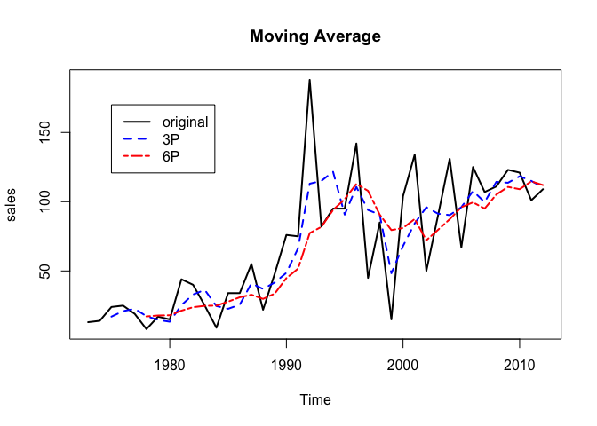 


```r
exp.smt<-function(x,alpha){
  for(i in 1:length(x)){
    if(i==1) res<-x[i] else
      res<-append(res,alpha*x[i]+(1-alpha)*res[i-1],after=i-1)
    }
  res<-ts(res,start=tsp(x)[1],frequency=tsp(x)[3])
  }
plot(tde.ts,lwd=2,main="Exponential Smoothing")
lines(exp.smt(tde.ts,0.4),lwd=2,lty=2,col="red")
lines(exp.smt(tde.ts,0.7),lwd=2,lty=6,col="blue")
legend(1975,170,legend=c("original","0.4E","0.7E"),lty=c(1,2,6),col=c("black","red","blue"),lwd=2)
```

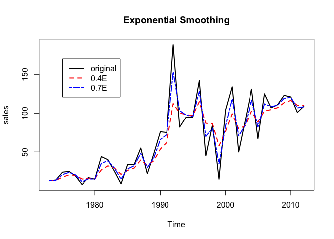 


```r
library(tseries)
```

```
## Warning: package 'tseries' was built under R version 3.1.2
```

```r
adf.test(imp.ts)
```

```
## Warning in adf.test(imp.ts): p-value greater than printed p-value
```

```
## 
## 	Augmented Dickey-Fuller Test
## 
## data:  imp.ts
## Dickey-Fuller = 1.7263, Lag order = 3, p-value = 0.99
## alternative hypothesis: stationary
```

```r
m1gdpd<-read.table("M1GDPd.txt",header=T,row.names=1)
m1.res<-lm(M1~GDP.def,data=m1gdpd)
m1.resid<-resid(m1.res)
adf.test(m1.resid)
```

```
## 
## 	Augmented Dickey-Fuller Test
## 
## data:  m1.resid
## Dickey-Fuller = -0.6837, Lag order = 3, p-value = 0.9637
## alternative hypothesis: stationary
```


```r
DowKos<-read.table("DowKospi.txt",header=T,row.names=1)
lm.res<-lm(Kospi~Dow,data=DowKos)
adf.test(resid(lm.res))
```

```
## 
## 	Augmented Dickey-Fuller Test
## 
## data:  resid(lm.res)
## Dickey-Fuller = -3.4485, Lag order = 6, p-value = 0.04836
## alternative hypothesis: stationary
```

```r
library(tsDyn)
```

```
## Warning: package 'tsDyn' was built under R version 3.1.2
```

```r
VECM.res<-VECM(DowKos,lag=2,include="const",estim="2OLS")
summary(VECM.res)
```

```
## #############
## ###Model VECM 
## #############
## Full sample size: 241 	End sample size: 238
## Number of variables: 2 	Number of estimated slope parameters 12
## AIC 4197.684 	BIC 4242.824 	SSR 12552480
## Cointegrating vector (estimated by 2OLS):
##    Dow     Kospi
## r1   1 -7.286831
## 
## 
##                ECT                Intercept            Dow -1            
## Equation Dow   0.0267(0.0266)     -28.7603(15.3374).   -0.1893(0.0705)** 
## Equation Kospi 0.0105(0.0035)**   -3.0771(2.0045)      0.0463(0.0092)*** 
##                Kospi -1           Dow -2             Kospi -2           
## Equation Dow   0.2689(0.5149)     -0.2325(0.0724)**  -0.6743(0.4702)    
## Equation Kospi -0.1338(0.0673)*   0.0131(0.0095)     0.0396(0.0615)
```


```r
attach(m1gdpd)
M1.r<-diff(M1)/M1[1:length(M1)-1]*100
P.r<-diff(GDP.def)/GDP.def[1:length(M1)-1]*100
detach(m1gdpd)
M1P.df<-data.frame(M1.r,P.r)
library(vars)
```

```
## Warning: package 'vars' was built under R version 3.1.2
```

```
## Loading required package: MASS
```

```
## Warning: package 'MASS' was built under R version 3.1.2
```

```
## Loading required package: strucchange
```

```
## Warning: package 'strucchange' was built under R version 3.1.2
```

```
## Loading required package: sandwich
```

```
## Warning: package 'sandwich' was built under R version 3.1.2
```

```
## Loading required package: urca
```

```
## Warning: package 'urca' was built under R version 3.1.2
```

```
## Loading required package: lmtest
```

```
## Warning: package 'lmtest' was built under R version 3.1.2
```

```r
VAR.res<-VAR(M1P.df,type="const",lag.max=4,ic="SC")
summary(VAR.res)
```

```
## 
## VAR Estimation Results:
## ========================= 
## Endogenous variables: M1.r, P.r 
## Deterministic variables: const 
## Sample size: 40 
## Log Likelihood: -253.933 
## Roots of the characteristic polynomial:
## 0.9319 0.1138
## Call:
## VAR(y = M1P.df, type = "const", lag.max = 4, ic = "SC")
## 
## 
## Estimation results for equation M1.r: 
## ===================================== 
## M1.r = M1.r.l1 + P.r.l1 + const 
## 
##         Estimate Std. Error t value Pr(>|t|)   
## M1.r.l1   0.3400     0.1388   2.449  0.01919 * 
## P.r.l1    0.7548     0.2287   3.300  0.00214 **
## const     6.7261     3.0424   2.211  0.03331 * 
## ---
## Signif. codes:  0 '***' 0.001 '**' 0.01 '*' 0.05 '.' 0.1 ' ' 1
## 
## 
## Residual standard error: 9.741 on 37 degrees of freedom
## Multiple R-Squared: 0.4555,	Adjusted R-squared: 0.4261 
## F-statistic: 15.48 on 2 and 37 DF,  p-value: 1.305e-05 
## 
## 
## Estimation results for equation P.r: 
## ==================================== 
## P.r = M1.r.l1 + P.r.l1 + const 
## 
##         Estimate Std. Error t value Pr(>|t|)    
## M1.r.l1  0.17736    0.05544   3.199  0.00283 ** 
## P.r.l1   0.70577    0.09133   7.728 3.11e-09 ***
## const   -1.35522    1.21501  -1.115  0.27187    
## ---
## Signif. codes:  0 '***' 0.001 '**' 0.01 '*' 0.05 '.' 0.1 ' ' 1
## 
## 
## Residual standard error: 3.89 on 37 degrees of freedom
## Multiple R-Squared: 0.7612,	Adjusted R-squared: 0.7483 
## F-statistic: 58.97 on 2 and 37 DF,  p-value: 3.12e-12 
## 
## 
## 
## Covariance matrix of residuals:
##        M1.r    P.r
## M1.r  94.90 -11.29
## P.r  -11.29  15.13
## 
## Correlation matrix of residuals:
##        M1.r    P.r
## M1.r  1.000 -0.298
## P.r  -0.298  1.000
```


```r
library(urca)
joh.test<-ca.jo(m1gdpd,type="trace",ecdet="trend",spec="longrun")
summary(joh.test)
```

```
## 
## ###################### 
## # Johansen-Procedure # 
## ###################### 
## 
## Test type: trace statistic , with linear trend in cointegration 
## 
## Eigenvalues (lambda):
## [1] 2.344799e-01 1.302677e-01 1.110223e-16
## 
## Values of teststatistic and critical values of test:
## 
##           test 10pct  5pct  1pct
## r <= 1 |  5.58 10.49 12.25 16.26
## r = 0  | 16.27 22.76 25.32 30.45
## 
## Eigenvectors, normalised to first column:
## (These are the cointegration relations)
## 
##                M1.l2 GDP.def.l2  trend.l2
## M1.l2           1.00      1.000     1.000
## GDP.def.l2  28821.46  -1478.937 -7754.209
## trend.l2   -92079.14 -18411.602 14994.958
## 
## Weights W:
## (This is the loading matrix)
## 
##                   M1.l2    GDP.def.l2      trend.l2
## M1.d       1.253978e-02 -3.222910e-02 -5.875118e-17
## GDP.def.d -5.625257e-06 -1.047706e-07 -1.551634e-20
```


```r
library(FinTS)
```

```
## Warning: package 'FinTS' was built under R version 3.1.2
```

```r
ex.returns<-scan("Ex.returns.txt")
for(i in c(2,5,10)) print(ArchTest(ex.returns,lags=i))
```

```
## 
## 	ARCH LM-test; Null hypothesis: no ARCH effects
## 
## data:  ex.returns
## Chi-squared = 90.1565, df = 2, p-value < 2.2e-16
## 
## 
## 	ARCH LM-test; Null hypothesis: no ARCH effects
## 
## data:  ex.returns
## Chi-squared = 178.4118, df = 5, p-value < 2.2e-16
## 
## 
## 	ARCH LM-test; Null hypothesis: no ARCH effects
## 
## data:  ex.returns
## Chi-squared = 200.7127, df = 10, p-value < 2.2e-16
```

```r
library(rugarch)
```

```
## Warning: package 'rugarch' was built under R version 3.1.2
```

```
## Loading required package: parallel
```

```r
ex.spec<-ugarchspec(variance.model=list(garchOrder=c(2,0)),mean.model=list(armaOrder=c(2,0)))
arch2<-ugarchfit(spec=ex.spec,data=ex.returns)
arch2
```

```
## 
## *---------------------------------*
## *          GARCH Model Fit        *
## *---------------------------------*
## 
## Conditional Variance Dynamics 	
## -----------------------------------
## GARCH Model	: sGARCH(2,0)
## Mean Model	: ARFIMA(2,0,0)
## Distribution	: norm 
## 
## Optimal Parameters
## ------------------------------------
##         Estimate  Std. Error  t value Pr(>|t|)
## mu     -0.039515    0.019207  -2.0573 0.039655
## ar1    -0.088603    0.041010  -2.1605 0.030733
## ar2     0.078025    0.041534   1.8786 0.060305
## omega   0.203334    0.020649   9.8471 0.000000
## alpha1  0.179244    0.053122   3.3742 0.000740
## alpha2  0.359123    0.067705   5.3042 0.000000
## 
## Robust Standard Errors:
##         Estimate  Std. Error  t value Pr(>|t|)
## mu     -0.039515    0.018657  -2.1180 0.034179
## ar1    -0.088603    0.050760  -1.7455 0.080894
## ar2     0.078025    0.045323   1.7215 0.085157
## omega   0.203334    0.038858   5.2327 0.000000
## alpha1  0.179244    0.070591   2.5392 0.011111
## alpha2  0.359123    0.087958   4.0829 0.000044
## 
## LogLikelihood : -666.1673 
## 
## Information Criteria
## ------------------------------------
##                    
## Akaike       1.8045
## Bayes        1.8416
## Shibata      1.8043
## Hannan-Quinn 1.8188
## 
## Weighted Ljung-Box Test on Standardized Residuals
## ------------------------------------
##                         statistic p-value
## Lag[1]                      1.157  0.2820
## Lag[2*(p+q)+(p+q)-1][5]     3.671  0.1446
## Lag[4*(p+q)+(p+q)-1][9]     5.150  0.4202
## d.o.f=2
## H0 : No serial correlation
## 
## Weighted Ljung-Box Test on Standardized Squared Residuals
## ------------------------------------
##                         statistic   p-value
## Lag[1]                      2.082 1.490e-01
## Lag[2*(p+q)+(p+q)-1][5]    13.942 8.530e-04
## Lag[4*(p+q)+(p+q)-1][9]    25.974 5.378e-06
## d.o.f=2
## 
## Weighted ARCH LM Tests
## ------------------------------------
##             Statistic Shape Scale   P-Value
## ARCH Lag[3]     8.124 0.500 2.000 4.368e-03
## ARCH Lag[5]    23.334 1.440 1.667 3.088e-06
## ARCH Lag[7]    28.424 2.315 1.543 4.191e-07
## 
## Nyblom stability test
## ------------------------------------
## Joint Statistic:  2.5779
## Individual Statistics:              
## mu     0.06525
## ar1    0.22279
## ar2    0.04989
## omega  1.92494
## alpha1 0.64046
## alpha2 0.44357
## 
## Asymptotic Critical Values (10% 5% 1%)
## Joint Statistic:     	 1.49 1.68 2.12
## Individual Statistic:	 0.35 0.47 0.75
## 
## Sign Bias Test
## ------------------------------------
##                    t-value   prob sig
## Sign Bias          0.85546 0.3926    
## Negative Sign Bias 0.08555 0.9318    
## Positive Sign Bias 0.54303 0.5873    
## Joint Effect       1.15450 0.7639    
## 
## 
## Adjusted Pearson Goodness-of-Fit Test:
## ------------------------------------
##   group statistic p-value(g-1)
## 1    20     45.52    5.787e-04
## 2    30     72.89    1.207e-05
## 3    40     75.46    4.121e-04
## 4    50    107.28    3.070e-06
## 
## 
## Elapsed time : 0.789979
```

```r
#plot(arch2)
spec.E<-ugarchspec(variance.model=list(model="eGARCH",garchOrder=c(1,1)),mean.model=list(armaOrder=c(0,0)))
egarch.res<-ugarchfit(spec=spec.E,data=ex.returns)
egarch.res
```

```
## 
## *---------------------------------*
## *          GARCH Model Fit        *
## *---------------------------------*
## 
## Conditional Variance Dynamics 	
## -----------------------------------
## GARCH Model	: eGARCH(1,1)
## Mean Model	: ARFIMA(0,0,0)
## Distribution	: norm 
## 
## Optimal Parameters
## ------------------------------------
##         Estimate  Std. Error  t value Pr(>|t|)
## mu     -0.021202    0.017430  -1.2164 0.223833
## omega  -0.023265    0.010352  -2.2473 0.024622
## alpha1  0.074230    0.023854   3.1118 0.001860
## beta1   0.982045    0.007717 127.2529 0.000000
## gamma1  0.184233    0.034404   5.3550 0.000000
## 
## Robust Standard Errors:
##         Estimate  Std. Error  t value Pr(>|t|)
## mu     -0.021202    0.017560  -1.2074 0.227281
## omega  -0.023265    0.010751  -2.1640 0.030468
## alpha1  0.074230    0.032508   2.2834 0.022407
## beta1   0.982045    0.008636 113.7130 0.000000
## gamma1  0.184233    0.041538   4.4353 0.000009
## 
## LogLikelihood : -604.8035 
## 
## Information Criteria
## ------------------------------------
##                    
## Akaike       1.6371
## Bayes        1.6680
## Shibata      1.6370
## Hannan-Quinn 1.6490
## 
## Weighted Ljung-Box Test on Standardized Residuals
## ------------------------------------
##                         statistic p-value
## Lag[1]                      1.688  0.1939
## Lag[2*(p+q)+(p+q)-1][2]     1.688  0.3202
## Lag[4*(p+q)+(p+q)-1][5]     3.883  0.2690
## d.o.f=0
## H0 : No serial correlation
## 
## Weighted Ljung-Box Test on Standardized Squared Residuals
## ------------------------------------
##                         statistic p-value
## Lag[1]                      1.192  0.2749
## Lag[2*(p+q)+(p+q)-1][5]     3.220  0.3683
## Lag[4*(p+q)+(p+q)-1][9]     4.658  0.4813
## d.o.f=2
## 
## Weighted ARCH LM Tests
## ------------------------------------
##             Statistic Shape Scale P-Value
## ARCH Lag[3]     3.015 0.500 2.000 0.08251
## ARCH Lag[5]     3.196 1.440 1.667 0.26260
## ARCH Lag[7]     4.207 2.315 1.543 0.31775
## 
## Nyblom stability test
## ------------------------------------
## Joint Statistic:  1.8147
## Individual Statistics:             
## mu     0.1031
## omega  0.4817
## alpha1 0.1356
## beta1  0.8138
## gamma1 0.1662
## 
## Asymptotic Critical Values (10% 5% 1%)
## Joint Statistic:     	 1.28 1.47 1.88
## Individual Statistic:	 0.35 0.47 0.75
## 
## Sign Bias Test
## ------------------------------------
##                    t-value   prob sig
## Sign Bias            0.219 0.8267    
## Negative Sign Bias   1.333 0.1830    
## Positive Sign Bias   1.032 0.3024    
## Joint Effect         3.204 0.3613    
## 
## 
## Adjusted Pearson Goodness-of-Fit Test:
## ------------------------------------
##   group statistic p-value(g-1)
## 1    20     39.94    0.0033326
## 2    30     60.97    0.0004667
## 3    40     67.83    0.0028574
## 4    50     71.71    0.0188649
## 
## 
## Elapsed time : 0.2825649
```

```r
#plot(egarch.res)
spec.GJR<-ugarchspec(variance.model=list(model="gjrGARCH",garchOrder=c(1,1)),mean.model=list(armaOrder=c(0,0)))
gjrgarch.res<-ugarchfit(spec=spec.GJR,data=ex.returns)
gjrgarch.res
```

```
## 
## *---------------------------------*
## *          GARCH Model Fit        *
## *---------------------------------*
## 
## Conditional Variance Dynamics 	
## -----------------------------------
## GARCH Model	: gjrGARCH(1,1)
## Mean Model	: ARFIMA(0,0,0)
## Distribution	: norm 
## 
## Optimal Parameters
## ------------------------------------
##         Estimate  Std. Error  t value Pr(>|t|)
## mu     -0.024157    0.017254  -1.4001 0.161486
## omega   0.003203    0.002258   1.4187 0.155973
## alpha1  0.128469    0.025177   5.1027 0.000000
## beta1   0.904203    0.018847  47.9761 0.000000
## gamma1 -0.086403    0.032735  -2.6394 0.008304
## 
## Robust Standard Errors:
##         Estimate  Std. Error  t value Pr(>|t|)
## mu     -0.024157    0.017670 -1.36713 0.171586
## omega   0.003203    0.003961  0.80881 0.418625
## alpha1  0.128469    0.031666  4.05704 0.000050
## beta1   0.904203    0.025181 35.90848 0.000000
## gamma1 -0.086403    0.044268 -1.95182 0.050959
## 
## LogLikelihood : -605.8932 
## 
## Information Criteria
## ------------------------------------
##                    
## Akaike       1.6400
## Bayes        1.6709
## Shibata      1.6399
## Hannan-Quinn 1.6519
## 
## Weighted Ljung-Box Test on Standardized Residuals
## ------------------------------------
##                         statistic p-value
## Lag[1]                      1.653  0.1985
## Lag[2*(p+q)+(p+q)-1][2]     1.655  0.3271
## Lag[4*(p+q)+(p+q)-1][5]     3.713  0.2922
## d.o.f=0
## H0 : No serial correlation
## 
## Weighted Ljung-Box Test on Standardized Squared Residuals
## ------------------------------------
##                         statistic p-value
## Lag[1]                      1.315  0.2514
## Lag[2*(p+q)+(p+q)-1][5]     2.367  0.5346
## Lag[4*(p+q)+(p+q)-1][9]     3.325  0.7043
## d.o.f=2
## 
## Weighted ARCH LM Tests
## ------------------------------------
##             Statistic Shape Scale P-Value
## ARCH Lag[3]     1.433 0.500 2.000  0.2313
## ARCH Lag[5]     1.518 1.440 1.667  0.5876
## ARCH Lag[7]     2.323 2.315 1.543  0.6493
## 
## Nyblom stability test
## ------------------------------------
## Joint Statistic:  2.316
## Individual Statistics:              
## mu     0.05566
## omega  0.71652
## alpha1 0.26906
## beta1  0.18230
## gamma1 0.36452
## 
## Asymptotic Critical Values (10% 5% 1%)
## Joint Statistic:     	 1.28 1.47 1.88
## Individual Statistic:	 0.35 0.47 0.75
## 
## Sign Bias Test
## ------------------------------------
##                    t-value   prob sig
## Sign Bias           0.4854 0.6276    
## Negative Sign Bias  1.3585 0.1747    
## Positive Sign Bias  1.2062 0.2281    
## Joint Effect        4.0590 0.2552    
## 
## 
## Adjusted Pearson Goodness-of-Fit Test:
## ------------------------------------
##   group statistic p-value(g-1)
## 1    20     37.85     0.006209
## 2    30     57.51     0.001247
## 3    40     71.27     0.001221
## 4    50     69.83     0.026876
## 
## 
## Elapsed time : 0.267837
```

```r
#plot(gjrgarch.res)
```
                                                                           
                                                                           
                                                                           
